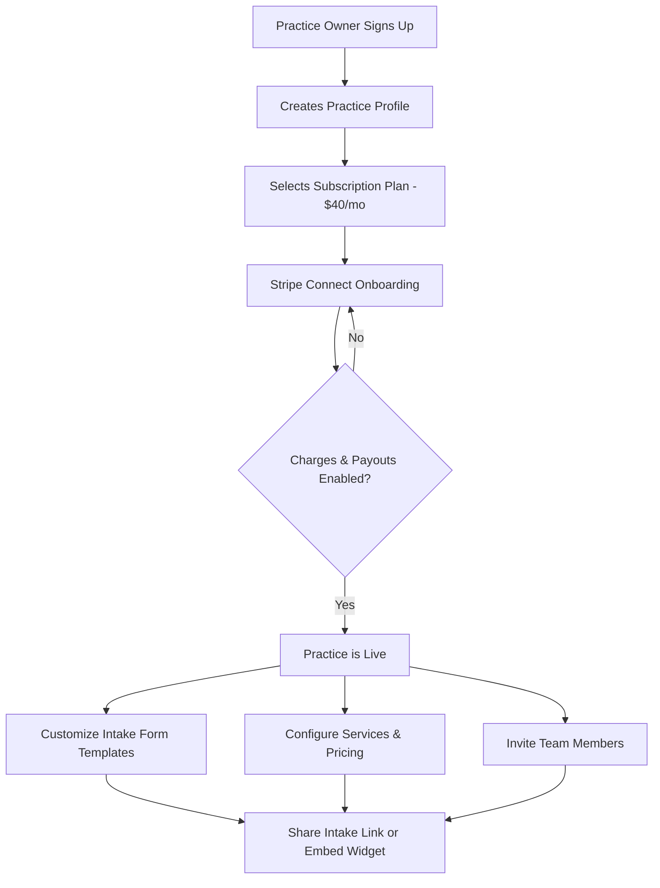
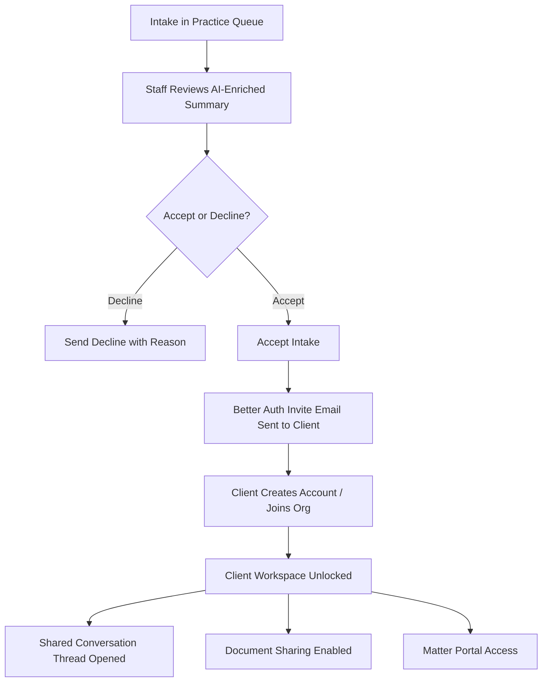
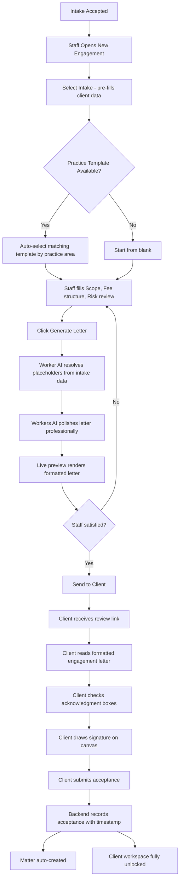
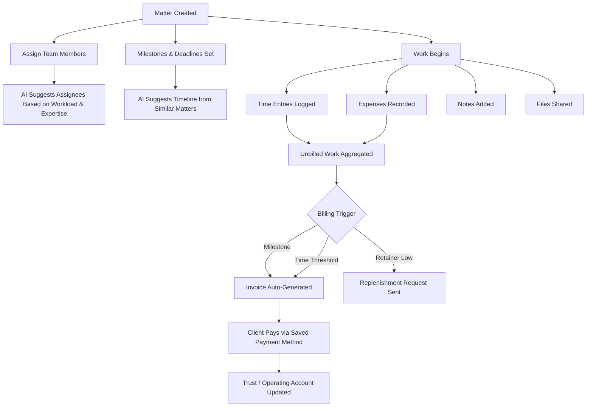
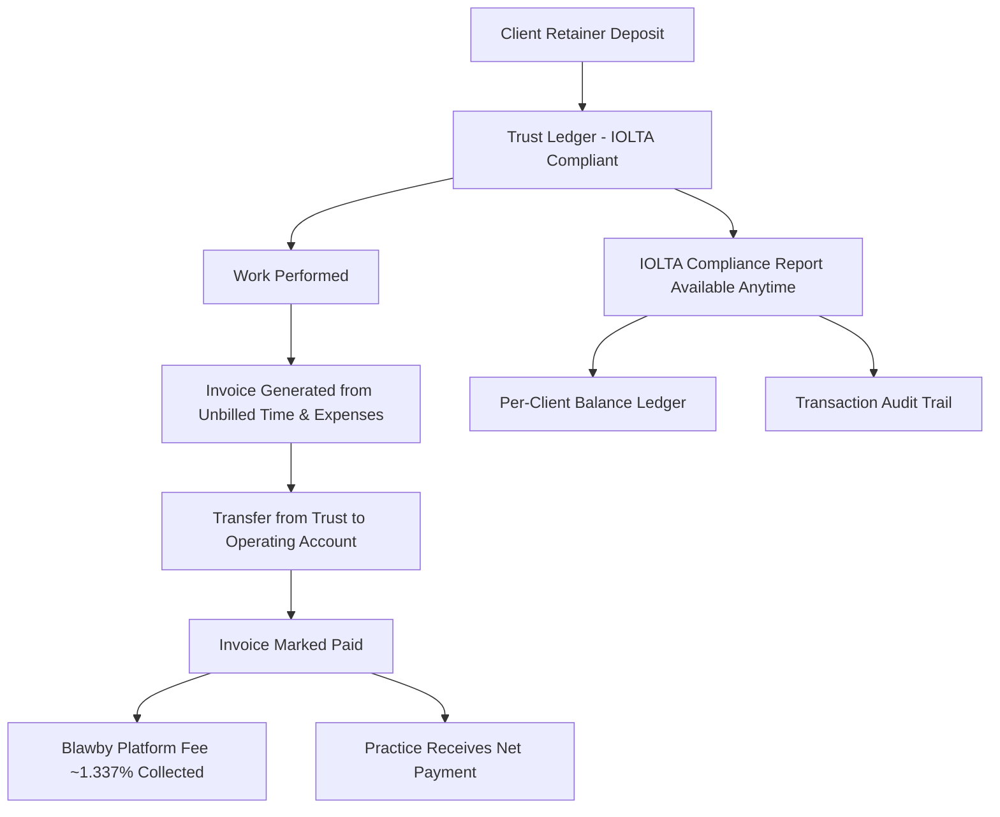
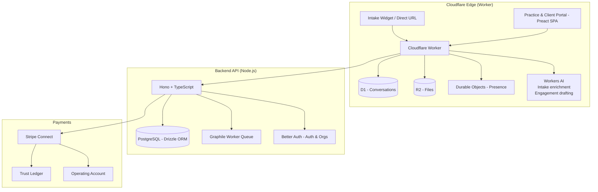

# Blawby — Product Overview

> **A modern, AI-native legal practice management platform.**
> Intake to invoice, automated. Compliance built in. Designed for the way lawyers actually work.

---

## What Blawby Is

Blawby is a legal practice management SaaS that replaces the patchwork of tools law firms use for intake, client communication, matter management, time tracking, billing, and trust accounting. Unlike legacy CMS platforms, Blawby puts AI at the center of every workflow — not as an add-on, but as the operating layer that reduces administrative burden and helps practices deliver better outcomes.

**Core belief:** A lawyer's time is too valuable to spend on administrative work that software can handle.

**Target users:** Solo practitioners and small-to-mid-size law firms that want modern tooling without enterprise pricing or complexity.

---

## Positioning

| Category | Blawby |
|---|---|
| Subscription | $40/month flat |
| Payment Processing Fee | ~1.337% of all payments processed through the platform¹ |
| IOLTA Compliance | Built-in trust account ledger |
| AI Integration | Conversational intake, engagement drafting, matter intelligence |
| Client Onboarding | Fully automated (invite → workspace → engagement) |
| Billing Automation | Metered, retainer, and fixed-fee billing with auto-invoicing |

> ¹ The 1.337% platform fee applies to payments collected via Blawby (intake consultation fees, invoice payments, retainer deposits). Verify exact rate against current Stripe Connect pricing and desired margin before publishing externally.

**Why this pricing works:** At $40/month, Blawby is priced comparably to standalone payment processing tools — but delivers a complete practice management stack with AI automation on top. The platform fee aligns Blawby's incentives with the practice's success: the more revenue a practice collects through Blawby, the more value both parties get.

---

## The Full User Journey

### 1. Practice Signup & Onboarding



The practice owner signs up, subscribes, and connects their Stripe account via Stripe Connect. Once payment processing is enabled, they can customize their intake forms and go live. The AI onboarding assistant guides them through setup conversationally.

---

### 2. Client Intake (Public Chatbot)

```mermaid
flowchart TD
    A[Prospective Client] --> B{Entry Point}
    B -- Direct URL --> C[/public/:practiceSlug]
    B -- Embedded Widget --> D[iframe on Practice Website]
    C & D --> E[AI Intake Conversation]
    E --> F[Client Describes Legal Need]
    F --> G[AI Gathers Structured Info]
    G --> H{Consultation Fee?}
    H -- Yes --> I[Stripe Payment Collected In-Chat]
    H -- No --> J[Intake Submitted]
    I --> J
    J --> K[Practice Notified of New Intake]
    J --> L[AI Enriches Intake with Case Strength, Urgency, Key Facts]
```

The intake is a **conversational AI interview** — not a static form. The chatbot asks questions dynamically, adapts based on responses, and uses AI to infer structure from unstructured input. By the time the intake lands in the practice's queue, it's already enriched with:

- Case strength assessment
- Urgency classification
- Key facts and dates
- Relevant practice area tags
- Contact information

---

### 3. Intake Triage & Client Invitation



When a practice accepts an intake, the system automatically sends the client a **Better Auth invitation** to join the organization's workspace. Once the client accepts, they have a private workspace to communicate, share files, and track their matter — without ever having to ask for a status update.

---

### 4. Engagement (Agreement of Terms)



The **engagement** is the agreement of terms between client and practice: scope, pricing, payment plan, and billing cadence. The full flow is built and live:

1. **Template system** — Practices define reusable templates per practice area and fee type (hourly, fixed, retainer, contingency, pro bono) with 17 named placeholders
2. **AI generation** — Cloudflare Workers AI resolves placeholders from intake data, then polishes the letter to read professionally and remove unfilled tokens
3. **Live preview** — Side-by-side form + formatted letter view with letterhead, fee summary box, and signature blocks
4. **Structured proposal data** — Beyond the letter body, each engagement captures a typed `proposal_data` object: client summary, scope of representation, fee structure, and risk review (conflict status, jurisdiction status, open questions)
5. **Client signature** — Canvas-based signature pad on a clean client-facing review page with acknowledgment checkboxes
6. **Matter auto-creation** — Backend creates the matter on client acceptance; no manual step required

**Note:** The canvas signature satisfies internal record-keeping but is not a court-admissible e-signature (no cryptographic binding). Legally binding e-signature integration is a roadmap item.

---

### 5. Matter Management (Where the Work Happens)



The matter is the **operational hub** for all case activity. The goal is to let lawyers focus entirely on legal work — logging time, expenses, and notes — while Blawby handles the administrative layer automatically.

---

### 6. Billing & Trust Accounting



**Trust accounting is built in, not bolted on.** The ledger tracks deposits, withdrawals, transfers, and refunds per client and per matter, with a full audit trail and IOLTA-formatted compliance reports.

---

## AI Capabilities

Blawby's AI layer is designed to answer the questions practitioners ask every day:

| Query | AI Response |
|---|---|
| "What do I need to do today?" | Prioritized task list from open matters, upcoming milestones, unbilled time |
| "Who should I assign to this matter?" | Suggests team members based on workload, practice area, and case history |
| "This client says they can't afford this — what's a better payment plan?" | Analyzes matter scope and suggests restructured payment schedule |
| "Should I increase my rate for this type of work?" | Compares historical time-to-close and billing efficiency for similar matters |
| "Draft an engagement for this intake" | Generates engagement letter from intake data + practice templates |
| "Summarize this client's history" | Aggregates all matters, invoices, communications, and notes |

These capabilities are exposed via:
- **In-app AI suggestions** throughout the practice and matter views
- **MCP server** (in development) for direct querying of practice data via natural language
- **Conversational intake widget** for public-facing client acquisition

---

## Platform Architecture (High Level)



**Responsibility split:**

| Layer | Owns |
|---|---|
| Cloudflare Worker | Conversations, file storage, real-time presence, AI intake, AI engagement generation |
| Node.js / Hono | Auth, billing, matters, trust accounting, subscriptions, compliance, engagement persistence |
| PostgreSQL / Drizzle | All relational data: matters, invoices, trust ledger, engagements, clients, subscriptions |
| Stripe Connect | Payment processing with IOLTA-compatible fund separation |
| Better Auth | Multi-tenant org auth, session management, invitation-based client onboarding |
| Graphile Worker | Background jobs: emails, webhook processing, async AI enrichment |

---

## Feature Inventory (Current State)

### Intake
- [x] AI conversational intake chatbot (public URL + embeddable widget)
- [x] Custom intake form templates per practice
- [x] In-chat payment collection (Stripe)
- [x] Staff triage queue with accept/decline
- [x] AI enrichment (case strength, urgency, key facts)
- [x] Intake-to-matter conversion
- [ ] AI-assisted intake template builder
- [ ] Intake analytics (conversion rate, case type trends)

### Client Management
- [x] Client profiles with Better Auth-linked accounts
- [x] Invitation-based onboarding from accepted intake
- [x] Shared client workspace (files, conversations, matters)
- [x] Client memos
- [x] Conflict-of-interest checking
- [ ] Client portal mobile app

### Engagement & Contracts
- [x] Engagement letter creation with full proposal_data structure (scope, fees, risk review)
- [x] Practice engagement templates with 17 named placeholders, per practice area and fee type
- [x] AI-powered engagement draft generation — Workers AI resolves placeholders from intake data and polishes letter
- [x] Live side-by-side form + formatted letter preview
- [x] Staff lifecycle management: draft → sent → accepted / declined
- [x] Client-facing review page with acknowledgment checkboxes
- [x] Canvas-based signature pad for client acceptance
- [x] Backend records acceptance with timestamp and IP for compliance
- [x] Matter auto-created on client acceptance
- [x] Conflict status and jurisdiction status tracked per engagement
- [ ] Legally binding e-signature (cryptographically verifiable, court-admissible)
- [ ] PDF generation and download of signed engagement letter
- [ ] Payment method collection at engagement acceptance

### Matter Management
- [x] Matter CRUD with status tracking
- [x] Team assignees
- [x] Time entries with billing rates
- [x] Expenses
- [x] Notes
- [x] Milestones with reordering
- [x] Tasks
- [x] File attachments
- [x] Activity audit log
- [x] Unbilled work aggregation view
- [ ] Automated deadline reminders
- [ ] AI-suggested matter roadmap

### Billing & Invoicing
- [x] Invoice creation from unbilled time and expenses
- [x] Line item management
- [x] Invoice send with payment links
- [x] Refund requests
- [x] Billing transaction ledger
- [x] Stripe Connect payment processing
- [ ] Saved payment method auto-billing
- [ ] Metered billing automation (trigger on milestone/threshold)
- [ ] Retainer replenishment automation

### Trust Accounting (IOLTA)
- [x] Trust deposit and withdrawal recording
- [x] Per-client and per-matter balance tracking
- [x] Full transaction audit trail
- [x] IOLTA compliance report
- [x] Client balance summary view
- [ ] Automated trust-to-operating transfer on invoice approval

### Subscriptions & Onboarding
- [x] Subscription plan management ($40/month)
- [x] Stripe Connect onboarding for practices
- [x] Subscription cancel / billing portal
- [x] Platform fee collection (~1.337% of processed payments)
- [ ] Usage-based billing dashboard for practices

### AI & MCP
- [x] Conversational AI intake (Claude-powered, Cloudflare Worker)
- [x] AI-enriched intake triage (case strength, urgency, key facts, practice area classification)
- [x] AI engagement draft generation (Workers AI — placeholder resolution + professional polish)
- [ ] Matter intelligence queries (natural language)
- [ ] MCP server for practice data querying
- [ ] AI-powered time entry suggestions from notes
- [ ] Proactive deadline and workload alerts

---

## Roadmap Themes

1. **Complete the engagement loop** — Legally binding e-signature, PDF download, and payment method collection at acceptance; the infrastructure and AI generation are built, these are the remaining gaps
2. **Automate billing** — Saved payment methods on file enabling milestone-triggered and threshold-triggered auto-invoicing; retainer replenishment requests
3. **MCP + AI intelligence** — Natural language queries across all practice data ("what do I need to do today?"); proactive suggestions surfaced in the practice dashboard
4. **Intake template builder** — AI-assisted intake form creation and analytics (conversion rates, case type trends)
5. **Mobile** — Client portal and time-entry experience optimized for on-the-go use

---

## Glossary

| Term | Definition |
|---|---|
| **Practice** | A law firm or solo practitioner organization in Blawby |
| **Intake** | A prospective client's initial submission via the AI chatbot |
| **Triage** | Staff review of an intake; results in accept or decline |
| **Engagement** | The formal agreement of terms between practice and client (scope, rates, payment plan) |
| **Matter** | An active legal case or file; created from an accepted engagement |
| **Trust / IOLTA** | Client funds held in trust by the practice; regulated by state bar rules |
| **Retainer** | An advance payment held in trust and drawn down as work is performed |
| **Milestone** | A matter checkpoint that can trigger a billing event |
| **Stripe Connect** | The payment infrastructure enabling Blawby to collect and distribute funds on behalf of practices |
| **MCP** | Model Context Protocol — enables AI models to query live practice data directly |
