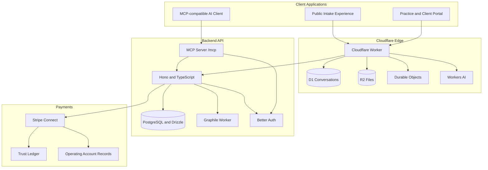

# Blawby — Product Overview

> **A modern, AI-native legal practice management platform.**
> Intake to invoice, with compliance and automation built into the workflow.

---

## Document Purpose

This document describes Blawby's product scope, major user journeys, current feature state, and roadmap.

Status labels used below:

- **Implemented** — supported by the current backend or integrated platform.
- **Partial** — core capability exists, but the complete product workflow is not finished.
- **Planned** — intended product behavior that is not currently complete.

Detailed API behavior is defined by the generated OpenAPI document at `/doc`. Technical architecture and local setup are documented in `README.md`. Change-specific design history lives under `docs/plans/`.

---

## What Blawby Is

Blawby is a legal practice management SaaS for intake, client management, engagements, matters, time and expense tracking, billing, payments, and trust accounting.

Blawby uses AI as a workflow layer rather than as a separate add-on. Current AI-backed capabilities include conversational intake, intake enrichment, engagement drafting, and access to practice data through an authenticated MCP server.

**Target users:** Solo practitioners and small-to-mid-size law firms that want modern practice-management tooling without enterprise complexity.

---

## Product Positioning

| Category | Blawby |
|---|---|
| Subscription | $40/month flat¹ |
| Payment processing fee | Approximately 1.337% of payments processed through the platform¹ |
| Trust accounting | Per-client and per-matter trust ledger with audit history |
| AI integration | Conversational intake, intake enrichment, engagement drafting, MCP tools |
| Client onboarding | Invitation-based organization onboarding |
| Billing | Invoice creation, line items, payment links, refunds, and transaction records |

> ¹ Pricing and payment-fee values must be verified against the active Stripe configuration and commercial policy before external publication.

---

## Current Product Journeys

### 1. Practice Signup and Onboarding

**Status: Partial**

A practice owner creates an account and organization, selects a subscription, and completes Stripe Connect onboarding. The backend supports subscription management, Stripe Connect onboarding, cancellation, and access to a billing portal.

Practice configuration, service pricing, team invitations, and intake publishing form the broader onboarding experience. A fully conversational AI onboarding assistant should be treated as planned unless its user-facing workflow is separately verified.

### 2. Prospective Client Intake

**Status: Implemented across the backend and intake platform**

Prospective clients enter through a public intake experience. The intake workflow supports conversational information gathering, structured intake data, optional payment collection, staff review, and AI enrichment.

Enrichment can include:

- Case-strength assessment
- Urgency classification
- Key facts and dates
- Practice-area classification
- Contact information

AI-assisted intake-template generation and intake analytics remain planned.

### 3. Intake Triage and Client Invitation

**Status: Implemented**

Practice staff can review an intake and accept or decline it. Accepted clients can be invited into the practice organization through Better Auth. The backend supports invitation-based onboarding and organization-scoped client access.

Client-facing matter routes and client matter queries are implemented. The exact portal presentation is owned by the client application and should not be inferred solely from this backend document.

### 4. Engagements

**Status: Partial**

The engagement workflow supports structured proposal data, reusable templates, AI-assisted drafting, lifecycle state management, client review, acceptance recording, and matter creation from an accepted engagement.

Implemented capabilities include:

- Engagement creation and persistence
- Scope, fee, client-summary, and risk-review data
- Practice templates by practice area and fee type
- AI placeholder resolution and professional text polishing
- Draft, sent, accepted, and declined lifecycle handling
- Acceptance timestamp and IP recording
- Matter creation after acceptance

Remaining product gaps include:

- Cryptographically verifiable e-signatures
- Signed engagement PDF generation
- Payment-method collection during acceptance

A canvas-drawn signature is an internal acceptance record and must not be represented as a court-admissible electronic-signature system.

### 5. Matter Management

**Status: Implemented, with automation gaps**

Matters are the operational record for legal work. The backend supports:

- Matter creation, retrieval, update, and status tracking
- Team assignments
- Time entries and billing rates
- Expenses
- Notes
- Milestones and ordering
- Tasks
- File attachments
- Activity history
- Unbilled-work aggregation
- Paginated client and staff queries for matter activity, notes, and tasks

Automated deadline reminders, AI-generated matter roadmaps, workload-based assignment suggestions, and proactive alerts remain planned unless separately implemented and verified.

### 6. Billing and Payments

**Status: Implemented, with automation gaps**

The backend supports invoice creation from billable work, invoice line items, payment links, refund requests, billing transactions, and Stripe Connect payment processing.

The following remain planned:

- Saved-payment-method auto-billing
- Milestone-triggered or threshold-triggered invoicing
- Automated retainer-replenishment requests

### 7. Trust Accounting

**Status: Implemented, with automation gaps**

The trust-accounting domain supports deposits, withdrawals, per-client and per-matter balances, transaction history, client balance summaries, and IOLTA-oriented reporting.

Automated transfer from trust to operating accounts on invoice approval remains planned.

### 8. MCP and External AI Access

**Status: Implemented in the backend**

Blawby exposes an authenticated Model Context Protocol server at `/mcp`.

The current MCP implementation includes:

- MCP SDK server using Streamable HTTP transport
- Better Auth OAuth/JWT verification
- JWKS, issuer, and audience validation
- Practice-scoped service context
- Scope enforcement per tool
- Tool registration generated from MCP-annotated routes
- Input schemas derived from route definitions or explicit MCP schemas
- User approval prompts for tools that require confirmation before mutation
- MCP-specific unit tests and local integration testing support

MCP provides structured access to registered practice-data tools. It should not be described as a general natural-language intelligence layer by itself. Natural-language reasoning depends on the connected AI client and the completeness of the registered tools.

Matter-wide intelligence, proactive recommendations, and guaranteed coverage of every practice-data domain remain product-development work.

---

## Platform Architecture

```mermaid
flowchart TB
    subgraph ClientApps["Client Applications"]
        Intake[Public Intake Experience]
        Portal[Practice and Client Portal]
        AIClient[MCP-compatible AI Client]
    end

    subgraph Edge["Cloudflare Edge"]
        Worker[Cloudflare Worker]
        D1[(D1 Conversations)]
        R2[(R2 Files)]
        DO[Durable Objects]
        WAI[Workers AI]
        Worker --> D1
        Worker --> R2
        Worker --> DO
        Worker --> WAI
    end

    subgraph Backend["Backend API"]
        API[Hono and TypeScript]
        MCP[MCP Server /mcp]
        DB[(PostgreSQL and Drizzle)]
        Queue[Graphile Worker]
        Auth[Better Auth]
        API --> DB
        API --> Queue
        API --> Auth
        MCP --> API
        MCP --> Auth
    end

    subgraph Payments["Payments"]
        Stripe[Stripe Connect]
        Trust[Trust Ledger]
        Operating[Operating Account Records]
        API --> Stripe
        Stripe --> Trust
        Stripe --> Operating
    end

    Intake --> Worker
    Portal --> Worker
    Worker --> API
    AIClient --> MCP
```

### Responsibility Split

| Layer | Primary responsibility |
|---|---|
| Cloudflare Worker | Conversational experiences, edge storage, presence, and selected AI workflows |
| Node.js / Hono backend | Authenticated business APIs, matters, billing, trust, engagements, subscriptions, and MCP |
| PostgreSQL / Drizzle | Relational business records |
| Better Auth | Authentication, organizations, invitations, OAuth/JWT infrastructure |
| Stripe Connect | Payment processing and connected-account onboarding |
| Graphile Worker | Asynchronous jobs and event processing |
| MCP server | Authenticated, scoped AI-tool access to registered backend operations |

---

## Feature Inventory

### Intake

- [x] Conversational public intake
- [x] Custom intake templates
- [x] Optional intake payment collection
- [x] Staff accept/decline triage
- [x] AI intake enrichment
- [x] Intake conversion into downstream client or matter workflows
- [ ] AI-assisted intake-template builder
- [ ] Intake conversion and trend analytics

### Client Management

- [x] Client profiles linked to authenticated users
- [x] Invitation-based organization onboarding
- [x] Client-scoped matter access and queries
- [x] Client memos
- [x] Conflict-checking support
- [ ] Native mobile client application

### Engagements

- [x] Structured engagement proposal data
- [x] Reusable engagement templates
- [x] AI-assisted engagement drafting
- [x] Engagement lifecycle management
- [x] Client review and acceptance records
- [x] Acceptance timestamp and IP capture
- [x] Matter creation after acceptance
- [ ] Court-admissible electronic-signature integration
- [ ] Signed engagement PDF generation
- [ ] Payment-method collection during acceptance

### Matter Management

- [x] Matter CRUD and status tracking
- [x] Assignees
- [x] Time entries
- [x] Expenses
- [x] Notes
- [x] Milestones
- [x] Tasks
- [x] Attachments
- [x] Activity history
- [x] Unbilled-work aggregation
- [x] Paginated matter activity, note, and task queries
- [ ] Automated deadline reminders
- [ ] AI-suggested matter roadmap
- [ ] Proactive workload recommendations

### Billing and Invoicing

- [x] Invoice creation from billable work
- [x] Invoice line items
- [x] Payment links
- [x] Refund requests
- [x] Billing transaction records
- [x] Stripe Connect payment processing
- [ ] Saved-payment-method auto-billing
- [ ] Automated billing triggers
- [ ] Automated retainer replenishment

### Trust Accounting

- [x] Trust deposits and withdrawals
- [x] Client and matter balance tracking
- [x] Transaction audit history
- [x] IOLTA-oriented reporting
- [x] Client balance summaries
- [ ] Automated trust-to-operating transfer

### Subscriptions and Operations

- [x] Subscription management
- [x] Stripe Connect onboarding
- [x] Subscription cancellation and billing portal
- [x] Platform-fee collection support
- [x] Internal operations APIs and staff-role authorization
- [x] Dashboard-origin sign-in guard
- [ ] Practice-facing usage dashboard

### AI and MCP

- [x] Conversational AI intake
- [x] AI-enriched intake triage
- [x] AI-assisted engagement drafting
- [x] Authenticated MCP server
- [x] Generated MCP tools from annotated routes
- [x] MCP scopes and mutation approvals
- [ ] Complete natural-language matter intelligence coverage
- [ ] AI-generated time-entry suggestions
- [ ] Proactive deadline and workload alerts

---

## Roadmap Themes

1. **Complete engagements** — Verifiable e-signatures, signed PDFs, and payment-method collection.
2. **Automate billing** — Saved payment methods, billing triggers, and retainer replenishment.
3. **Expand MCP coverage and intelligence** — Register additional safe tools and build richer matter-level reasoning workflows.
4. **Improve intake configuration and analytics** — AI-assisted template creation and conversion reporting.
5. **Add proactive practice operations** — Deadline, workload, and billing alerts.
6. **Improve mobile workflows** — Client access and time entry optimized for mobile use.

---

## Documentation Boundaries

`PRODUCT.md` is the high-level product source of truth. It should explain what each major capability is, its user value, and whether it is implemented, partial, or planned.

It should not contain every endpoint, database field, permission rule, state transition, or failure case. Those details belong in maintained feature specifications under `docs/features/`, linked back to this document.

Implementation plans under `docs/plans/` are historical design records. They are not authoritative descriptions of current behavior after the relevant work has shipped.

---

## Glossary

| Term | Definition |
|---|---|
| **Practice** | A law firm or solo-practitioner organization in Blawby |
| **Intake** | A prospective client's initial submission |
| **Triage** | Staff review resulting in acceptance, decline, or follow-up |
| **Engagement** | The agreement defining representation scope, fees, and related terms |
| **Matter** | An active legal case or work record |
| **Trust / IOLTA** | Client funds held separately under applicable professional-accounting rules |
| **Retainer** | Advance client funds held or applied according to the engagement terms |
| **Milestone** | A matter checkpoint or deadline |
| **Stripe Connect** | Connected-account payment infrastructure |
| **MCP** | Model Context Protocol, used to expose authenticated tools and data to compatible AI clients |
