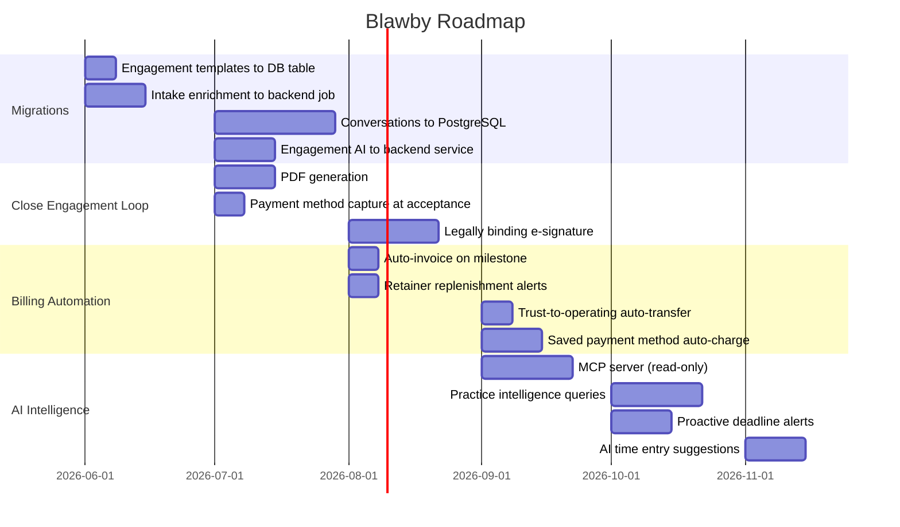

# Blawby — Roadmap & Migration Plan

> This document tracks: (1) features not yet built, (2) which Worker responsibilities should migrate to the backend and why, and (3) what should stay at the edge permanently.

---

## Worker → Backend Migration Rationale

The Cloudflare Worker was the right call for fast iteration. The trade-off is that several pieces of stateful, queryable business data now live outside PostgreSQL — which makes it hard to build the AI intelligence layer, run cross-data queries, and maintain a single audit trail. The migrations below are ordered by leverage: highest first.

---

### 1. Conversations → PostgreSQL (Highest Priority)

**Currently:** Conversation messages stored in Cloudflare D1 (SQLite at the edge). Engagement, matter, and intake linkages are foreign keys that reference backend data but the messages themselves live in a separate system.

**Why migrate:**
- AI intelligence features ("summarize this client's history", "what happened on this matter") require joining conversation data with matters, invoices, time entries, and intakes. Cross-system joins don't exist — the Worker has to make N round-trips.
- The MCP server will need to query conversation history as part of practice data. It can't reach D1.
- A single audit trail (activity log) per matter/client currently has a gap: the conversation record lives elsewhere.
- D1's SQLite query surface is limited. PostgreSQL full-text search, JSONB, and window functions are needed for future analytics.

**Migration plan:**
- Add a `conversations` table and `conversation_messages` table to the backend schema
- Worker continues to handle real-time message streaming (keep Durable Objects for presence/WebSocket)
- Worker writes completed messages to the backend API (`POST /api/conversations/:id/messages`) — already partially true
- Worker reads conversation history from the backend API
- D1 becomes a write-through cache for in-flight conversations only, not the source of truth

---

### 2. Engagement AI Generation → Backend Service

**Currently:** `POST /api/ai/generate-engagement` runs in the Worker using Cloudflare Workers AI (GLM-4 Flash). It does placeholder resolution + a polish pass and returns a `contractBody` string.

**Why migrate:**
- Workers AI (GLM-4 Flash) is a small model. Engagement letters need to be accurate, legally coherent, and personalized — this is a high-stakes generation task. Claude should be doing this.
- Generation logic needs access to: practice history, similar past matters, current rates, and enriched intake data. The Worker can only pass what the frontend sends it. The backend can query all of it directly.
- Engagement generation should be an async job (Graphile Worker), not a synchronous edge request. Long generations shouldn't time out.
- Template management currently stores templates as a JSON blob in `practice.metadata`. Moving templates to a proper table enables AI to query them, staff to manage them via API, and analytics on template usage.

**Migration plan:**
- Add `engagement_letter_templates` table (name, practice_area, fee_type, scope_template, body, placeholders as JSONB)
- Add `POST /api/engagement-contracts/:practiceId/generate` endpoint in the backend
- Service: pull intake enriched data + matching template + practice history → Claude API → return draft body
- Worker route `/api/ai/generate-engagement` becomes a thin proxy to the backend endpoint (or is removed entirely once frontend is updated)
- Keep Worker as entry point for the frontend call; backend does the heavy lifting

---

### 3. Intake AI Enrichment → Backend Job

**Currently:** Intake enrichment (case strength, urgency, key facts, practice area classification) happens in the Worker at conversation time.

**Why migrate:**
- Enrichment results need to be stored, re-run, and versioned. Storing in `conversation.custom_fields._enriched_data` (a JSONB blob on the conversation record in D1) means it's not queryable from the backend.
- Staff triage UI needs to sort/filter intakes by case strength and urgency. That requires indexed columns on the `practice_client_intakes` table, not a JSON blob in another system.
- Re-enrichment (triggered by staff or on new message) should be a Graphile Worker job, not a synchronous request.

**Migration plan:**
- Add structured columns to `practice_client_intakes`: `case_strength`, `urgency`, `practice_area`, `ai_summary`, `enriched_at`
- Add `enrich-intake` Graphile Worker job type
- Job runs after intake submission (or after each new message): calls Claude, writes structured results to the intake row
- Worker sends the raw conversation to the backend; backend enriches asynchronously
- Triage list endpoint gains filter/sort on the new columns

---

### 4. Engagement Templates → Proper Table

**Currently:** Templates stored as a JSON string in `practice.metadata.engagementLetterTemplates`.

**Why migrate:**
- No queryable index. Finding "all practices using hourly templates" or "which template is most used" is impossible.
- AI can't reference templates directly without the frontend fetching and forwarding them.
- No change history or audit trail on template edits.
- Scaling to shared/marketplace templates (e.g., Blawby-provided starter templates) requires a real table.

**Migration plan:**
- New table: `engagement_letter_templates` with `organization_id`, `name`, `practice_area`, `fee_type`, `body`, `scope_template`, fee columns, `is_default`, `created_at`, `updated_at`
- Migration script to parse existing `practice.metadata.engagementLetterTemplates` JSON and insert rows
- CRUD endpoints under `/api/engagement-contracts/:practiceId/templates`
- Frontend settings page reads from API instead of practice metadata

---

## What Stays in the Worker (Permanently)

These are genuinely edge-appropriate and should not move:

| Responsibility | Reason to keep at edge |
|---|---|
| Real-time message streaming (WebSocket / SSE) | Durable Objects are the right primitive for stateful real-time connections |
| Presence indicators (typing, online status) | Latency-sensitive; Durable Objects handle fan-out well |
| File uploads and downloads (R2) | Bandwidth and CDN — don't route large files through the backend |
| Presigned upload URL generation | Should stay co-located with R2 |
| Intake chatbot routing and UI | Anonymous public traffic; edge performance matters for conversion |
| Static asset serving | Obvious |

---

## Feature Gaps by Area

### Engagement

| Feature | Notes |
|---|---|
| Legally binding e-signature | Canvas signature is UX-only. Need cryptographic binding + audit trail. Consider HelloSign/DocuSign API or open-source alternative. |
| PDF generation of signed letter | `signed_pdf_s3_key` field exists in schema — generation not implemented. Puppeteer or a PDF service (e.g., Gotenberg) via a Graphile Worker job. |
| Payment method capture at acceptance | Stripe `SetupIntent` flow on the client acceptance page. Save `stripe_payment_method_id` to the client or matter record for auto-billing. |

---

### Billing Automation

| Feature | Notes |
|---|---|
| Auto-invoice on milestone completion | Milestone marked complete → Graphile job → aggregate unbilled → create invoice → send. Infrastructure exists; trigger logic not wired. |
| Auto-invoice on time threshold | When unbilled hours for a matter exceed a configured threshold (e.g., 10 hours), auto-generate invoice. Needs `auto_billing_threshold_hours` on matter. |
| Retainer replenishment alerts | When trust balance falls below a configured floor, notify client and/or auto-charge saved payment method. |
| Trust-to-operating transfer on invoice approval | When a practice approves an invoice paid from trust, auto-record the withdrawal and transfer. Currently manual. |
| Saved payment method charge | Depends on payment method capture (above). Once on file, all invoice payments and retainer replenishments can be automatic. |

---

### AI & MCP

| Feature | Notes |
|---|---|
| MCP server | Expose practice data (matters, invoices, time entries, clients, intakes) via Model Context Protocol so AI can query it directly. Start with read-only tools; add write tools (create note, log time) later. |
| Practice intelligence queries | Natural language queries powered by MCP: "What do I need to do today?", "Who should I assign to this?", "Suggest a payment plan for this client." |
| AI-suggested matter roadmap | On matter creation, AI generates a suggested milestone plan based on practice area and historical matters. |
| Proactive deadline alerts | Daily digest: upcoming milestones, unbilled time over threshold, retainers below floor, unanswered intakes. Delivered via email and in-app. |
| AI time entry suggestions | When a lawyer adds a note to a matter, AI suggests a corresponding time entry (description + estimated hours). |

---

### Matter Management

| Feature | Notes |
|---|---|
| Automated deadline reminders | Matter milestones with a due date should trigger notifications N days before. Graphile Worker cron + notification service. |
| Matter-level conflict check on creation | Currently conflict check is on practice level. Should also run on matter creation and flag if client or opposing party matches an existing matter. |

---

### Client Experience

| Feature | Notes |
|---|---|
| Client mobile app | Current portal is responsive but not native. PWA would be the lowest-effort first step. |
| Client payment portal | Client-facing view of outstanding invoices with one-click payment. Currently invoices are sent as links — no persistent portal. |
| Intake status notifications | Client should receive push/email when their intake moves through triage (submitted → under review → accepted/declined). |

---

### Practice Operations

| Feature | Notes |
|---|---|
| Intake conversion analytics | What % of intakes convert to matters? What practice areas have highest conversion? Needs event tracking on intake lifecycle. |
| Billing efficiency reports | Revenue per matter, realization rate (billed vs. collected), average matter duration. Data exists; reports not surfaced. |
| Team workload view | Which attorney has the most open matters / unbilled hours? Currently requires per-matter inspection. |

---

## Suggested Phase Order

---

## Decision Log

| Decision | Rationale |
|---|---|
| Keep Worker for real-time / file serving | Edge latency and Durable Objects are genuinely better than a Node.js server for these |
| Migrate conversations to PostgreSQL before building MCP | MCP with a split data store would require two query layers; consolidate first |
| Use Graphile Worker for AI jobs, not Workers AI | Claude is significantly more capable for legal drafting; async jobs handle long generations without timeouts |
| Engagement templates as a proper table before AI expansion | AI can't reference what it can't query; templates need to be first-class data |
