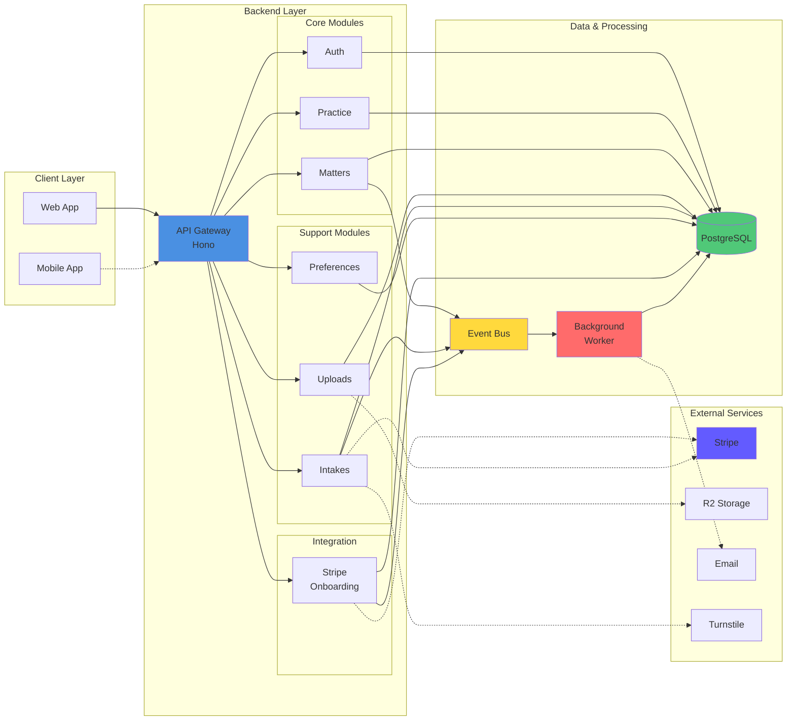
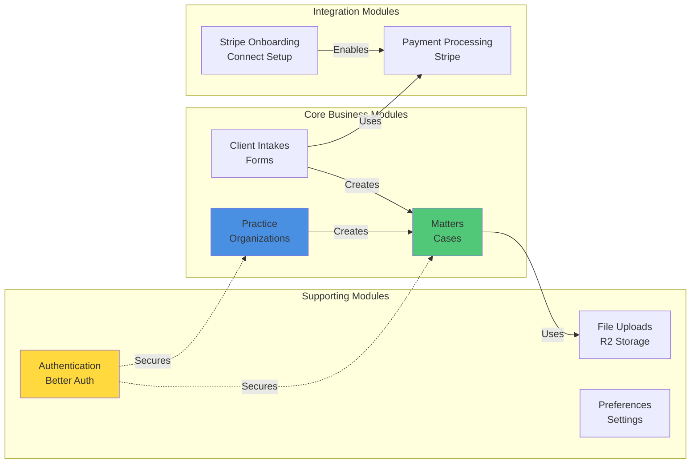
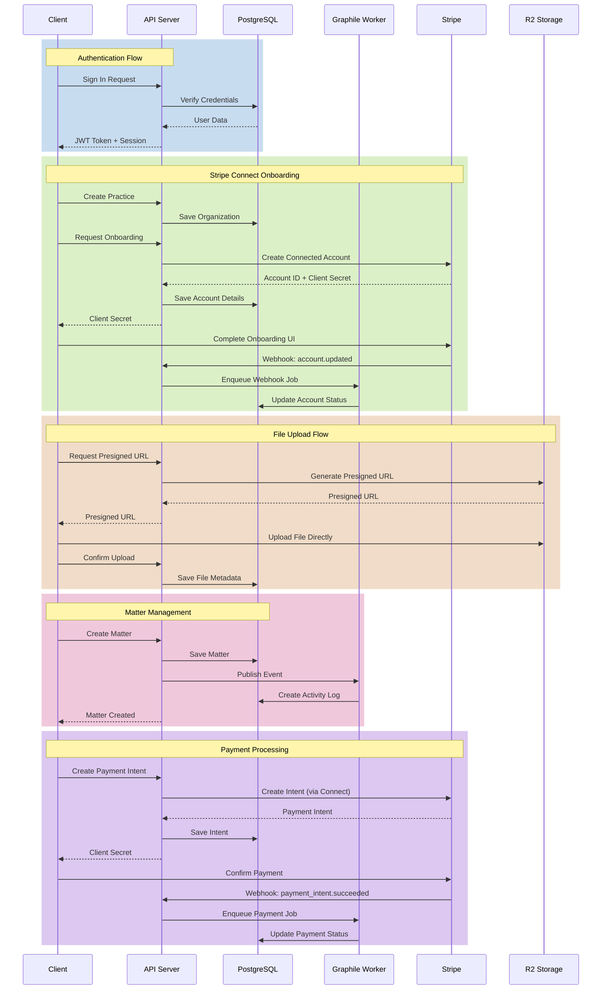
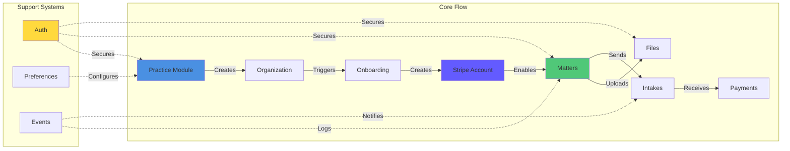
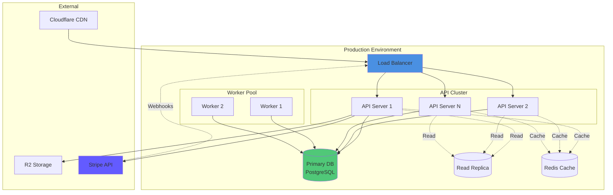
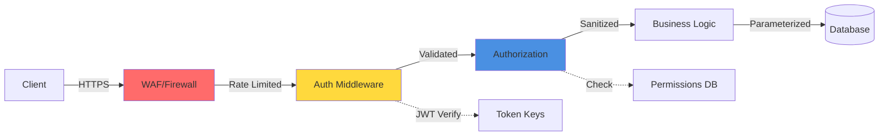

# Blawby System Architecture

## High-Level System Diagram

## Detailed Module Architecture

## Data Flow Patterns

## System Components

### Frontend
- **Web App**: React/Preact SPA
- **Auth**: Better Auth client with Bearer tokens
- **State**: Local state + API calls
- **Storage**: IndexedDB for tokens

### API Server (Hono)
- **Runtime**: Node.js with TypeScript
- **Framework**: Hono (lightweight, fast)
- **Architecture**: Modular (each feature = module)
- **Middleware**: Auth, validation, CORS, rate limiting
- **ORM**: Drizzle (type-safe SQL)

### Background Processing
- **Queue**: Graphile Worker (PostgreSQL-based)
- **Jobs**: Webhooks, emails, event handlers
- **Concurrency**: Configurable workers
- **Retry**: Automatic with exponential backoff

### Database
- **Primary**: PostgreSQL
- **Schema Management**: Drizzle Kit migrations
- **Features**: JSONB columns, UUID/ULID primary keys
- **Indexes**: Optimized for queries

### External Services
- **Stripe**: Connect accounts + Platform billing
- **R2**: Cloudflare object storage
- **Email**: Transactional email service
- **CAPTCHA**: Cloudflare Turnstile

## Module Interactions

## Deployment Architecture

## Security Layers

---

**Last Updated**: January 21, 2026
