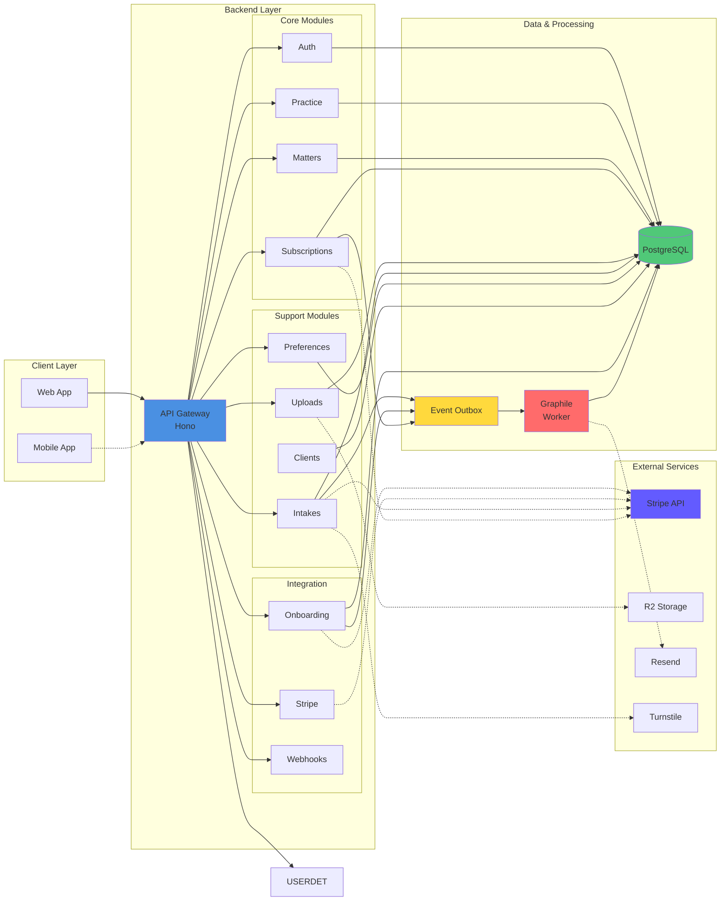
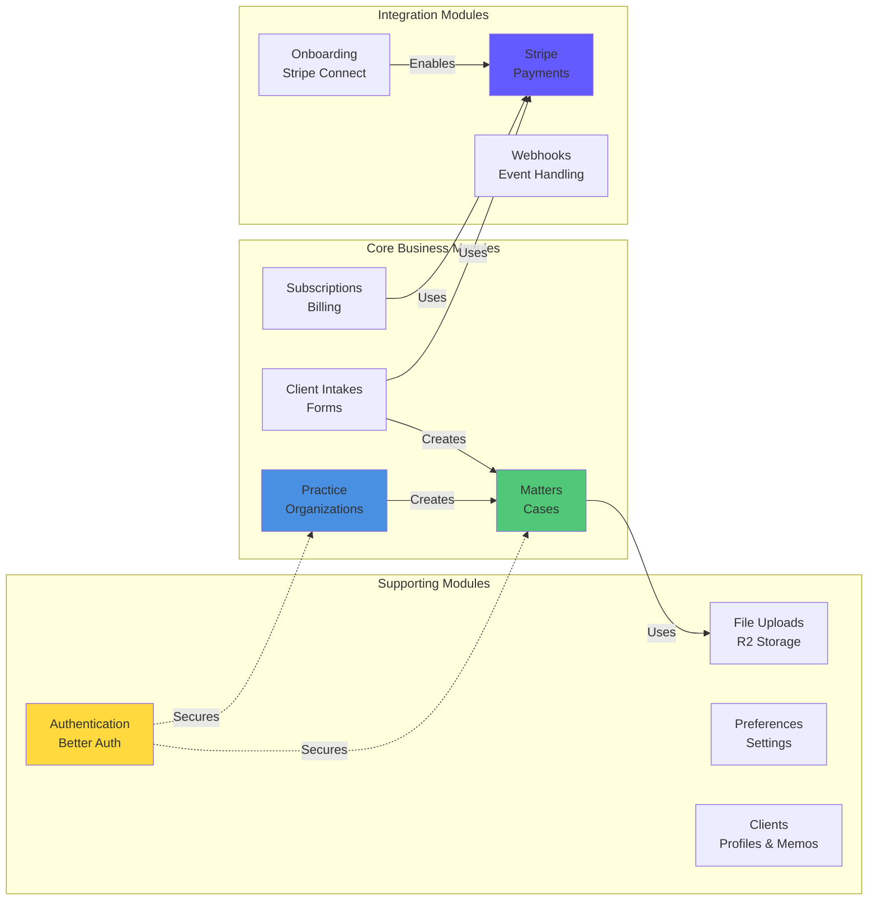
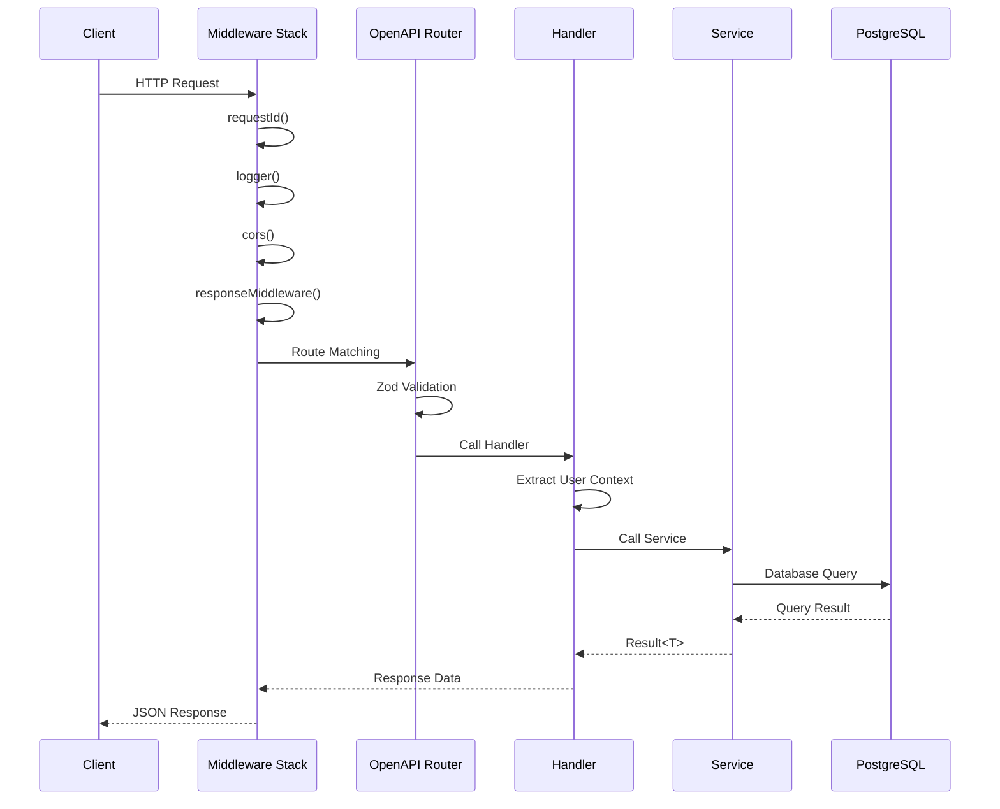
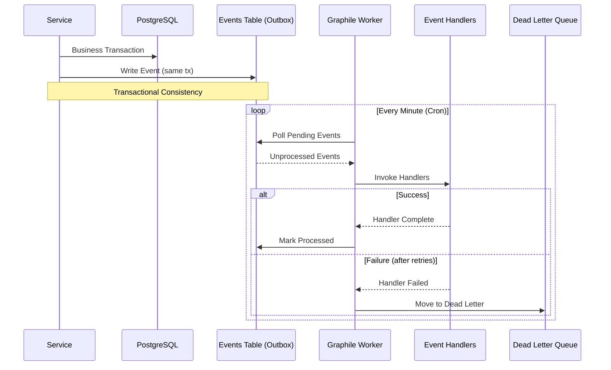
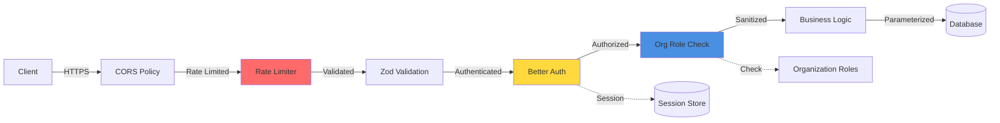
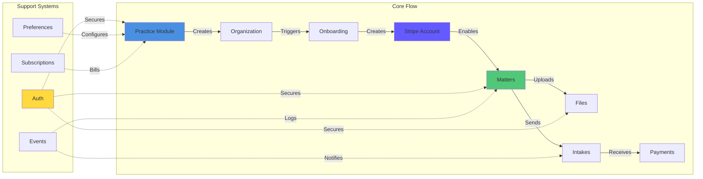
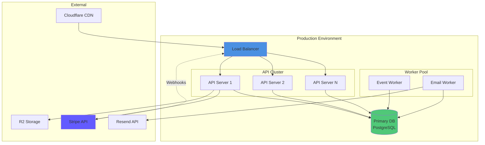

# Blawby System Architecture

## Overview

Blawby is a **modular monolith API backend** for a legal practice management and client intake platform. Built with TypeScript and Hono, it manages law firm organizations, case/matter tracking, client intake forms, billing via Stripe, and document uploads.

---

## Technology Stack

| Layer | Technology | Version |
|-------|------------|---------|
| Runtime | Node.js | 18.17+ |
| Language | TypeScript (strict mode) | 5.9 |
| HTTP Framework | Hono | 4.10 |
| ORM | Drizzle ORM | 0.45 |
| Database | PostgreSQL | - |
| Authentication | Better Auth | 1.4 |
| Validation | Zod | 4.1 |
| Job Queue | Graphile Worker | 0.16 |
| API Documentation | @hono/zod-openapi + Scalar | 1.1 |
| Logging | Logtape | 2.0 |
| Rate Limiting | rate-limiter-flexible | 9.0 |
| Payments | Stripe (Connect) | 20.2 |
| File Storage | AWS S3 / Cloudflare R2 | - |
| Email | Resend + MJML | 6.8 |
| CAPTCHA | Cloudflare Turnstile | - |

---

## High-Level System Diagram



---

## Module Architecture

### Module Structure Pattern

Each module follows a consistent layered architecture:

```
src/modules/{module-name}/
├── http.ts              # HTTP routing layer (Hono router)
├── routes.ts            # OpenAPI route definitions
├── handlers.ts          # Request handlers
├── routes.config.ts     # Middleware configuration
├── listeners.ts         # Event listeners
├── services/            # Business logic layer
├── database/
│   ├── queries/         # Reusable database queries
│   └── schema/          # Drizzle ORM schemas
├── validations/         # Zod input validation schemas
└── types/               # TypeScript types
```

### Module Overview



### Module Descriptions

| Module | Responsibility | Key Entities |
|--------|---------------|--------------|
| **auth** | Authentication & RBAC | users, sessions, organizations |
| **clients** | Client management | clients, practice_client_memos |
| **practice** | Law firm management | practice, practice_services, addresses |
| **matters** | Case/matter tracking | matters, assignees, notes, time_entries, expenses, milestones |
| **invoices** | Invoice management | invoices, invoice_line_items, billing_transactions |
| **subscriptions** | Billing management | subscription_plans, subscription_events |
| **trust** | Trust accounting | trust_transactions |
| **uploads** | File management | uploads, upload_audit_logs |
| **practice-client-intakes** | Client intake forms | practice_client_intakes |
| **preferences** | User preferences | preferences |
| **stripe** | Payment integration | Connected accounts |
| **onboarding** | Stripe Connect flow | connected_accounts, onboarding sessions |
| **webhooks** | External webhooks | Stripe/onboarding events |
| **public** | Public endpoints | Health checks |

---

## Request Flow



---

## Error Handling Pattern

The system uses a **Result type pattern** for explicit error handling:

```typescript
type Result<T> =
  | { success: true; data: T }
  | { success: false; error: AppError }

interface AppError {
  status: number;      // HTTP status code
  code: string;        // Error code (e.g., "VALIDATION_ERROR")
  message: string;     // Human-readable message
  details?: unknown;   // Additional error details
}
```

**Response Format:**
```json
// Success
{ "data": { ... }, "meta": { "timestamp": "..." } }

// Error
{ "error": { "status": 400, "code": "VALIDATION_ERROR", "message": "..." } }
```

---

## Event-Driven Architecture

The system uses a **PostgreSQL-based outbox pattern** for reliable event processing:



**Event Flow:**
1. `Event.dispatch(EventClass, payload)` writes to `events` table
2. Graphile Worker polls every minute via cron
3. Registered handlers invoked via `Event.listen()`
4. Failed events (after 5 retries) move to dead letter queue

---

## Data Flow Patterns


---

## System Components

### Entry Points

| File | Purpose |
|------|---------|
| `src/hono-server.ts` | Main server entry point |
| `src/hono-app.ts` | App assembly & middleware registration |
| `src/boot/index.ts` | Boot orchestration (logging, services, workers) |
| `src/workers/event.worker.ts` | Background event worker |
| `src/workers/email.worker.ts` | Email delivery worker |

### API Server (Hono)
- **Runtime**: Node.js with TypeScript
- **Framework**: Hono (lightweight, fast)
- **Architecture**: Modular monolith (each feature = module)
- **Middleware**: Auth, validation, CORS, rate limiting
- **ORM**: Drizzle (type-safe SQL)
- **API Docs**: OpenAPI 3.0 via Scalar UI at `/docs`

### Background Processing

| Worker | Tasks |
|--------|-------|
| **Event Worker** | Stripe webhooks, onboarding webhooks, outbox events (cron) |
| **Email Worker** | Transactional email via Resend |

- **Queue**: Graphile Worker (PostgreSQL-based)
- **Retry**: Up to 5 attempts with exponential backoff
- **Dead Letter**: Failed events tracked for investigation

### Database
- **Primary**: PostgreSQL
- **Schema Management**: Drizzle Kit migrations
- **Features**: JSONB columns, ULID primary keys
- **Multi-tenant**: Organization-scoped data isolation
- **Soft Deletes**: `deleted_at` timestamp pattern

### Shared Infrastructure

```
src/shared/
├── auth/              # Better Auth setup & plugins
├── database/          # Connection pool & migrations
├── middleware/        # Middleware stack
├── events/            # Event system & outbox
├── queue/             # Graphile Worker config
├── router/            # Module discovery & OpenAPI
├── types/             # Result<T>, Hono context
├── validations/       # Shared Zod schemas
└── utils/             # Helpers (Stripe client, logging)
```

---

## Security Architecture

### Security Layers



### Authentication
- **Framework**: Better Auth with plugins (organization, admin, anonymous, stripe)
- **Session**: Database-backed session storage
- **OAuth**: Google OAuth integration
- **Cookies**: Secure, HTTP-only (HTTPS in production)

### Authorization
- **Model**: Role-Based Access Control (RBAC)
- **Roles**: `owner`, `admin`, `member` per organization
- **Middleware**: `requireAuth()`, `requireAdmin()`

### Rate Limiting
- **Storage**: PostgreSQL table-based (not in-memory)
- **Rules**:
  - Sign-in: 5 requests/minute
  - Sign-up: 3 requests/minute
  - Password reset: 3 requests/5 minutes

### Input Validation
- **Schema**: Zod for all request inputs
- **Integration**: `@hono/zod-validator` middleware
- **OpenAPI**: Validation schemas double as API docs

### CAPTCHA
- **Provider**: Cloudflare Turnstile
- **Usage**: Public forms (client intake)

---

## Module Interactions



---

## Deployment Architecture



### Process Management
- **API Server**: Node process on PORT 3000
- **Event Worker**: Separate Node process
- **Email Worker**: Separate Node process
- **Graceful Shutdown**: `close-with-grace` (500ms drain)

### Build & Run

```bash
pnpm run build       # Compile TypeScript → dist/
pnpm run dev         # Watch mode development
pnpm start           # Run compiled API server
pnpm start:all       # API + event worker + email worker
```

---

## API Documentation

- **OpenAPI UI**: Available at `/docs` (Scalar) and `/scalar`
- **OpenAPI JSON**: Available at `/openapi.json`
- **LLM-friendly**: Markdown export at `/llms.txt`

---

## Key File Locations

```
src/
├── hono-app.ts                    # App assembly
├── hono-server.ts                 # Server entry point
├── boot/
│   ├── index.ts                   # Boot orchestration
│   ├── services.ts                # Service initialization
│   └── event-handlers.ts          # Event listener registration
├── modules/
│   ├── auth/                      # Authentication
│   ├── clients/                   # Client management
│   ├── practice/                  # Practice management
│   ├── matters/                   # Matter/case management
│   ├── invoices/                  # Invoice management
│   ├── subscriptions/             # Billing
│   ├── trust/                     # Trust accounting
│   ├── uploads/                   # File uploads
│   ├── practice-client-intakes/   # Intake forms
│   ├── preferences/               # User preferences
│   ├── webhooks/                  # Webhook handling
│   ├── stripe/                    # Stripe integration
│   ├── onboarding/                # Stripe Connect onboarding
│   └── public/                    # Public endpoints
├── shared/
│   ├── auth/                      # Better Auth setup
│   ├── database/                  # DB connection
│   ├── middleware/                # Middleware stack
│   ├── events/                    # Event system
│   ├── queue/                     # Graphile Worker
│   ├── router/                    # Module registration
│   ├── types/                     # Result<T>, context types
│   └── utils/                     # Helpers
├── schema/                        # Database schemas
└── workers/                       # Background workers
```

---

**Last Updated**: March 27, 2026
