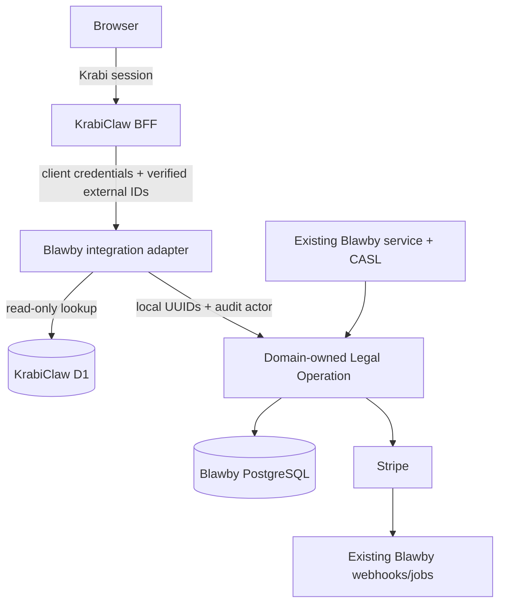

# KrabiClaw-Authenticated Blawby Legal Facade - Plan

## Goal Capsule

- **Goal:** Let KrabiClaw use selected Blawby legal operations without changing either product's current human authentication.
- **Authority:** KrabiClaw owns sessions, organizations, memberships, roles, subscriptions, entitlements, and anonymous identity. Blawby owns legal data, transactions, events, jobs, Stripe operations, and webhooks.
- **Shape:** KrabiClaw calls a versioned Blawby microservice facade with a fixed machine OAuth token and external organization/actor IDs.
- **Compatibility:** Existing Blawby routes, CASL checks, service signatures, payment behavior, and webhook processing remain unchanged.
- **Stop conditions:** Do not enable traffic if service-token isolation, identity-link concurrency, D1 capacity, mutation recovery, or both Stripe webhook destinations are unverified.

---

## Product Contract

### Summary

This is a temporary integration seam, not an auth migration. KrabiClaw authenticates and authorizes the browser. Blawby authenticates KrabiClaw as one service, maps external IDs to minimal local UUID anchors, and invokes the same domain-owned Legal Operations as existing Blawby routes.

### Requirements

**Authority and identity**

- R1. KrabiClaw remains authoritative for human and anonymous auth, organizations, memberships, roles, subscriptions, and entitlements.
- R2. Blawby's existing Better Auth instance authenticates exactly one fixed KrabiClaw confidential client; Blawby does not accept KrabiClaw cookies or create a second human-auth instance.
- R7. KrabiClaw removes browser-supplied auth and identity headers, then sends its verified external organization ID, actor ID, and actor kind.
- R9. Blawby stores external organization and user links in separate one-to-one tables with restrictive foreign keys.
- R12. A local user anchor is created only when an existing Blawby foreign key requires it; anonymous actors never get one.

**D1 and execution**

- R14. Blawby reads only organization `id,name,slug` and user `id,name,email` using the official `cloudflare` SDK and a D1 read-only token.
- R17. Missing, duplicate, malformed, unauthorized, rate-limited, or timed-out D1 reads fail before PostgreSQL or Stripe mutation.
- R20. Existing routes authorize with their current Better Auth/CASL `ServiceContext`; the facade constructs an auth-independent `LegalOperationContext`.
- R24. Data needed after the request is stored as immutable operation snapshots; jobs and webhooks never query D1.

**Facade and payments**

- R25. The facade is mounted at `/api/integrations/krabiclaw/v1` and exposes only selected practice, Connect, intake, and engagement operations.
- R28. Verified anonymous or human actors may use public intake operations; staff intake and engagement operations require a verified human.
- R32. Existing destination-charge Checkout behavior and automatic payment fulfillment remain unchanged; invoices are out of scope.
- R33. Preserve both Stripe endpoints and secrets: connected-account events use `STRIPE_CONNECT_WEBHOOK_SECRET`, while platform payment events use `STRIPE_WEBHOOK_SECRET`.
- R37. Public intake creation uses a durable KrabiClaw request reference and a Blawby idempotency binding so response loss cannot create a second intake.
- R39. Initial authenticated facade access is owner/admin-only; broader roles require a later authorization review.
- R40. Connect return and refresh URLs must match exact per-environment KrabiClaw HTTPS origin-and-path allowlists in both services.
- R42. Retry only stable service-auth refresh, same-key intake recovery, and persisted same-operation Connect recovery.
- R43. Browser auth failures map to 401, Krabi authorization failures to 403, reviewed legal 4xx responses pass through, and service/dependency failures become sanitized 502/503 responses.
- R44. KrabiClaw limits public traffic by hashed IP, actor, site, and operation before calling Blawby; Blawby limits verified organizations by route family before D1, PostgreSQL, or Stripe work.
- R46. External links, request references, snapshots, and immutable actor attribution follow the legal-record retention policy; changes to export, erasure, or pseudonymization require legal/privacy review.
- R47. Every route family is default-off in KrabiClaw, and the entire Blawby facade has a default-off kill switch.
- R48. Review the temporary seam within 90 days of enablement and quarterly afterward.

### Route Scope

All paths are relative to `/api/integrations/krabiclaw/v1`.

| Scope               | Actor              | Methods and paths                                                                                                                                                                                         |
| ------------------- | ------------------ | --------------------------------------------------------------------------------------------------------------------------------------------------------------------------------------------------------- |
| `legal:practice`    | human              | `GET/POST/PATCH /practice/details`                                                                                                                                                                        |
| `legal:connect`     | human              | `POST /connect/connected-accounts`, `GET /connect/status`, `POST /connect/account-session`, `GET /connect/account`                                                                                        |
| `legal:intakes`     | human or anonymous | `GET /intakes/settings`, `POST /intakes`, `GET /intakes/requests/{request_id}`, `POST /intakes/{uuid}/checkout-session`, `GET /intakes/{uuid}/status`, `GET /intakes/{uuid}/post-pay/status?session_id=…` |
| `legal:intakes`     | human              | `GET /intakes`, `GET /intakes/{uuid}`, `PATCH /intakes/{uuid}/triage`                                                                                                                                     |
| `legal:engagements` | human              | `POST/GET /engagement-contracts`, `GET/PATCH /engagement-contracts/{contract_id}`, `PATCH /engagement-contracts/{contract_id}/status`                                                                     |

The post-pay route requires KrabiClaw to authorize the intake reference and Blawby to verify that `session_id`, intake UUID, and organization match. Caller-controlled organization, user, slug, practice, and email fields are excluded. Invoices, files, invitations, enrichment, conversion, subscriptions, auth migration, and new payment behavior remain out of scope.

---

## Planning Contract

### Architecture

### Key Technical Decisions

- KTD1. **Use official Better Auth OAuth on the existing Blawby auth server.** Require `client_credentials`, resource/audience `urn:blawby:legal-api`, route scopes, issuer, expiry, no `sub`, and the fixed client `azp`. The `azp` check is required while Better Auth 1.6.23 remains installed.
- KTD5. **Keep external IDs out of legal foreign keys.** Separate external organization and user link tables map to minimal local UUID anchors and create no memberships, credentials, sessions, roles, or subscriptions.
- KTD7. **Use the official Cloudflare SDK behind one narrow read-only adapter.** Direct D1 REST must pass a production-shaped capacity gate; otherwise replace its transport with a D1-bound Worker.
- KTD9. **Extract only facade-selected Legal Operations below existing authorization.** Unselected services stay untouched. (session-settled: user-directed — chosen over a broad refactor: the short-term goal must preserve existing behavior.)
- KTD10. **Snapshot D1 presentation facts before mutation.** Intake and Connect async work uses stored snapshots, not D1.
- KTD13. **Preserve both existing Stripe webhook paths.** The facade adds no payment endpoint or state machine.
- KTD17. **Keep every Legal Operation in its current domain module.** The integration module owns only authentication, identity translation, D1 access, and HTTP adaptation.
- KTD19. **A Legal Operation owns the complete use case.** It owns tenant checks, repositories, transactions, state transitions, events, jobs, and Stripe ordering/idempotency.
- KTD20. **Keep existing service contracts unchanged.** Existing services authorize, translate `ServiceContext` to `LegalOperationContext`, and delegate. (session-settled: user-approved — chosen over changing callers: existing routes must remain stable.)
- KTD21. **Use one operation per business use case.** Do not create a generic CRUD layer, command bus, or integration-wide legal service.
- KTD22. **Keep Legal Operations auth-independent.** They cannot accept Better Auth users, sessions, CASL abilities, roles, permission claims, Hono contexts, D1 clients, external IDs, or mapping repositories. (session-settled: user-directed — chosen over auth-aware domain services: auth and legal work are separate concerns.)
- KTD24. **Move workflows; never copy them.** Existing and integration adapters call one implementation. (session-settled: user-approved — chosen over integration-specific copies: duplicated legal and payment behavior would drift.)
- KTD25. **Verify extraction before exposure.** Characterize behavior, move the workflow, prove the existing route is unchanged, then enable the corresponding facade route.

See `docs/adr/0001-keep-legal-operations-independent-of-auth.md` for the durable boundary.

### Key Risks

- **OAuth claim confusion:** reject every client except the configured KrabiClaw `azp`, even if another token has the legal audience/scope.
- **D1 REST limits:** measure account-token-wide load and keep projected peak plus retry amplification below 50% of the Cloudflare limit.
- **Cross-system response loss:** persist intake request keys and Connect operation IDs before retryable side effects.
- **Service credential compromise:** isolate credentials by environment, alert on anomalous use, and document emergency revocation and bounded replacement-client overlap.
- **Placeholder leakage:** never use technical anchor names/emails as customer-facing facts.
- **Behavior drift:** block facade exposure until existing-route parity tests pass for that operation.

---

## Implementation Units

### U1. Establish machine OAuth

- **Requirements:** R2, R25, R47; KTD1.
- **Files:** `src/shared/auth/better-auth.ts`, `src/shared/config/index.ts`, `scripts/`, auth tests, environment/runbook docs.
- **Approach:** Configure the legal audience/scopes and one-hour tokens. Provision one client through Better Auth's admin API. Store credentials per environment and document one-time capture, bounded replacement overlap, cache invalidation, emergency revocation, and audit ownership.
- **Tests:** Valid token; opaque/wrong-client/wrong-scope/expired token; legal scopes unavailable through dynamic registration; rotation/revocation; existing MCP/OIDC behavior unchanged.

### U2. Add the read-only KrabiClaw directory adapter

- **Requirements:** R14, R17, R24; KTD7, KTD10.
- **Files:** `src/modules/krabiclaw-integration/services/krabiclaw-directory.service.ts`, its validation and test files, config, `package.json`, `pnpm-lock.yaml`.
- **Approach:** Add the official `cloudflare` SDK. Allow only fixed parameterized organization/user queries. Disable SDK retries and enforce one three-second application budget with at most one classified retry.
- **Tests:** Valid, missing, duplicate, malformed, unauthorized, 429/5xx, deadline, unexpected-write metadata, sanitized telemetry, and capacity-gate scenarios.

### U11. Add the conditional D1 Worker fallback

- **Requirements:** R14, R17; KTD7. Run only if U2 fails its capacity gate, and complete before U3.
- **Files in the KrabiClaw repository:** a D1-bound Worker, deployment configuration, typed endpoint tests, and adapter parity/load tests. **Blawby files:** U2 transport configuration and tests.
- **Approach:** Expose only fixed typed organization/user lookups. Authenticate Blawby with a dedicated per-environment server credential. Enforce request-size and rate limits, sanitized audit telemetry, and fail-closed behavior.
- **Tests:** Authentication, malformed/replayed/oversized requests, lookup parity, rate isolation, D1 failure, deployment order, and the repeated production-shaped capacity gate.

### U3. Add identity links and recovery records

- **Requirements:** R9, R12, R24, R37, R42; KTD5.
- **Files:** integration-owned identity link/anchor schema and resolver files; intake-owned request-key persistence; onboarding-owned Connect operation snapshots; generated schema/migrations and PostgreSQL-backed tests.
- **Approach:** Keep identity mappings in the integration module. Keep request-key and Connect recovery state with their domain operations. Use transaction advisory locks to prevent mapping races and orphan anchors.
- **Tests:** First/repeated/concurrent resolution; reverse collision; rollback; anonymous no-user behavior; same-key intake replay; cross-tenant rejection; Connect recovery.

### U4. Build the trusted integration adapter

- **Requirements:** R7, R20, R39, R47; KTD17, KTD22.
- **Files:** `src/modules/krabiclaw-integration/http.ts`, middleware/types, shared event metadata files, focused middleware/event tests.
- **Approach:** Verify OAuth before parsing strict single-value identity headers. Resolve external IDs to local UUIDs, create `LegalOperationContext`, and persist immutable external actor attribution. Apply route scope, actor policy, rate limits, and the facade kill switch.
- **Tests:** Spoofed/duplicate/malformed headers; wrong actor type; scope isolation; audit persistence; ordinary routes receive no integration context.

### U5. Extract practice and Connect operations

- **Requirements:** R20, R24, R25, R42; KTD9, KTD19, KTD20, KTD21, KTD22, KTD24, KTD25.
- **Files:** practice/onboarding service and new operation files, Connect handlers/metadata, existing practice tests, new onboarding tests.
- **Approach:** Extract one use case at a time. Existing wrappers retain CASL and public contracts. Connect creation stores/resumes its snapshot and Stripe idempotency key before the external side effect.
- **Tests:** Existing authorization and DTO parity; no adapter orchestration; one account under concurrent/retried creation; webhook-before-finalization recovery; D1 unavailable during async work.

### U6. Extract intake operations

- **Requirements:** R20, R24, R28, R32, R33, R37, R42; KTD9, KTD19, KTD20, KTD21, KTD22, KTD24, KTD25.
- **Files:** intake service and new operation files, intake metadata/schema, webhook/listener code, existing and integration intake tests.
- **Approach:** Extract settings, create, Checkout, status, list, get, and triage. The facade bypasses only Blawby's local subscription check. Preserve destination charges and final fulfillment through existing webhooks/jobs.
- **Tests:** Human/anonymous access; anonymous no-user row; same-key recovery; tenant/session mismatch; old-route subscription behavior; duplicate/out-of-order Stripe events; snapshot use with D1 unavailable.

### U7. Extract engagement operations

- **Requirements:** R20, R24, R25, R28; KTD9, KTD19, KTD20, KTD21, KTD22, KTD24, KTD25.
- **Files:** engagement service and new operation file, related serializers, matter/note call sites, engagement and integration tests.
- **Approach:** Extract the selected human-only lifecycle. Preserve transitions, PDFs/events, and exactly-once matter/note creation on acceptance.
- **Tests:** Existing CASL parity; anonymous and cross-tenant rejection; lifecycle transitions; snapshot rendering; single matter/note creation.

### U8. Expose the Blawby facade

- **Requirements:** R20, R25, R28, R39, R47; KTD17, KTD20.
- **Files:** integration routes/handlers/services, generated router registry, facade contract tests.
- **Approach:** Mount only the route scope above under `/api/integrations/krabiclaw/v1`. Keep handlers thin and derive every identity field server-side.
- **Tests:** Route/method allowlist; actor and scope matrix; identity-field rejection; kill switch; dependency failures before mutation; existing response/pagination contracts.

### U9. Add KrabiClaw BFF routes

- **Requirements:** R1, R7, R25, R28, R37, R39, R42, R47.
- **Files in the sibling KrabiClaw repository:** `server/utils/blawby-client.ts`, legal context helpers, dashboard/public legal routes, intake-reference schema/migration, config and tests.
- **Approach:** Reuse current Krabi session, organization, entitlement, and anonymous-auth helpers. Cache/coalesce the service token. Strip caller identity fields. Enforce R40, R43, and R44. Prepare intake references before calls and expose only server routes.
- **Tests:** Token caching/renewal; header stripping; owner/admin policy; entitled public intake; actor isolation; safe retry rules; HTTPS config; feature gates; sanitized error mapping.

### U10. Roll out in vertical slices

- **Requirements:** R17, R32, R33, R47, R48; KTD25.
- **Files:** deployment config, secrets documentation, monitoring, operator runbook, end-to-end tests.
- **Approach:** Deploy dormant infrastructure first. Enable practice read, practice mutation, Connect, intake without payment, test/live payment, then engagement. Disable Krabi family flags first during rollback; retained legal/payment/audit records are never deleted.
- **Tests:** Production-shaped D1 capacity; fixed-client isolation; both Stripe destinations/secrets; test-mode automatic payment; response-loss recovery; monitored canary and rollback rehearsal.

---

## Verification Contract

- Run focused tests after each extraction checkpoint and prove the existing route before enabling its facade route.
- For schema changes, run `pnpm run db:generate`, inspect generated migrations, and run PostgreSQL-backed concurrency tests.
- Before merge, run `pnpm run typecheck`, `pnpm run format:check`, `pnpm run lint`, `pnpm run build`, and `pnpm run test`.
- Run the corresponding KrabiClaw typecheck, lint, test, and build commands.
- In staging, verify the D1 capacity budget, the fixed OAuth client, both Stripe webhook destinations, automatic payment completion, and rollback.

---

## Definition of Done

- Existing Blawby routes retain their signatures, CASL behavior, DTOs, errors, persistence, events, Stripe calls, and tests.
- Both adapters call one auth-independent implementation for every selected use case.
- External mappings are separate, one-to-one, concurrency-safe, and create no auth state.
- D1 access is official-SDK, read-only, allowlisted, bounded, and absent from jobs/webhooks.
- Only the fixed OAuth client and correct route scope can reach the facade.
- Real intake payments still complete through the existing two-webhook architecture.
- Intake and Connect retries cannot duplicate legal or Stripe records.
- Route flags, monitoring, credential handling, rollback, and the 90-day retirement review are documented and verified.
- The final diff contains no copied workflows, unrelated refactors, abandoned experiments, unsafe assertions, secrets, or PII logs.
