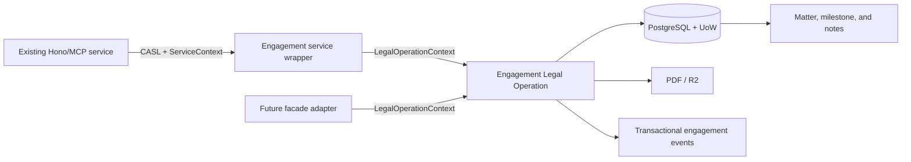
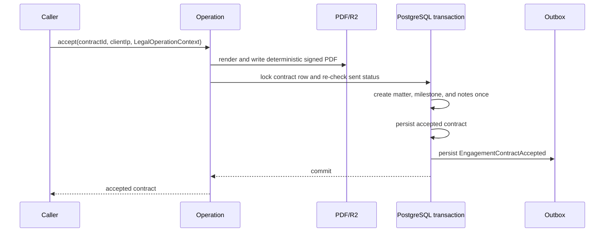

# Extract Engagement Contract Legal Operations

## Summary

Move the existing engagement-contract lifecycle behind domain-owned, auth-independent Legal Operations. The current HTTP/MCP service must retain its Better Auth/CASL checks and public behavior, then delegate to those operations. This prepares the selected human-only lifecycle for the later KrabiClaw facade without mounting any facade route in this work.

---

## Problem Frame

`src/modules/engagement-contracts/services/engagement-contract.service.ts` currently owns both authorization and the full workflow: tenant checks, persistence, lifecycle transitions, PDF upload, transactional events, and acceptance-side matter/note creation. That prevents the existing adapter and the future facade from sharing one workflow.

The operation boundary must preserve the existing route matrix:

| Use case | Existing route behavior | Required operation behavior |
| --- | --- | --- |
| Create | accepted intake → draft contract | validate tenant and accepted intake; create the default source snapshot and event |
| List / get | practice-scoped contract reads | enforce the resolved tenant on every row/query |
| Update | draft-only body, notes, and proposal updates | preserve draft-only transition guard |
| Send | draft → sent | require non-empty body; persist billing facts and emit the existing sent event |
| Accept | sent → accepted | render/upload the signed PDF; create exactly one matter and its intake-derived notes; persist and emit transactionally |
| Decline | sent → declined | persist the transition and emit the existing declined event |

---

## Requirements

- Preserve the U7 requirements from the legal-facade master plan: R20, R24, R25, and R28; follow KTD9, KTD19–KTD22, KTD24, and KTD25.
- Legal Operations accept only domain inputs plus `LegalOperationContext`; they must not receive `ServiceContext`, CASL abilities, Hono objects, external IDs, or integration repositories.
- Engagement operations require a human actor (`ctx.userId`); a `null` actor must fail before mutations.
- The operation, not a caller, verifies that the context organization matches every requested organization/loaded row.
- Existing routes and MCP handlers retain their current authorization, response shapes, HTTP errors, and `clientIp` extraction.
- Keep PDF generation/upload, event payload fields/order, matter creation, milestones, and notes behaviorally equivalent. Current acceptance renders and uploads before its database transaction and uses a deterministic R2 key; this extraction must not silently redesign that external-side-effect behavior.
- Acceptance must be concurrency-safe: duplicate/retried acceptance must create at most one matter, note set, accepted-event record, and accepted contract transition.

---

## Key Technical Decisions

1. **Keep operations in `engagement-contracts`.** Follow the U5/U6 pattern: each selected use case lives in the owning domain and existing services translate `ServiceContext` with `toLegalOperationContext`. The integration module remains an adapter only.
2. **Use `emitLegalEvent` from operations.** It derives actor and organization attribution from `LegalOperationContext` and preserves transactional outbox dispatch when called inside `uow.transaction(...)`; do not pass the service-layer `emit` callback through the operation boundary.
3. **Lock acceptance at the engagement-contract row.** Add a query-level `FOR UPDATE` lookup and re-check the status after acquiring it inside the acceptance transaction. Do not rely on the partial accepted-index for exactly-once creation: it protects accepted contracts per intake but does not protect duplicate matter/note side effects from concurrent calls.
4. **Do not add a facade route, idempotency table, generic command bus, new lifecycle status, or rendering-snapshot schema in this extraction.** The selected use case is the existing six-operation lifecycle. Current code snapshots billing facts at send time but derives PDF presentation facts live at acceptance. If strict immutable rendering facts or exactly-once external PDF upload are required, stop and surface a separately authorized durability/schema design rather than disguising it as a refactor.

---

## Scope Boundaries

### In scope

- Extract create, list, get, update, send, accept, and decline workflows into engagement-domain Legal Operations.
- Convert the current CASL-bound service into authorization/delegation wrappers.
- Add focused PostgreSQL-backed coverage for tenant isolation, human-only enforcement, transitions, event persistence, PDF integration seam, and concurrent acceptance.

### Out of scope

- Mounting `/api/integrations/krabiclaw/v1` routes or changing OAuth, identity mapping, D1 access, or feature flags (U8).
- New engagement features, invitation/file flows, rendering redesign, payment/invoice changes, or a generic CRUD/command abstraction.
- Changing the existing public route contract, validation schema, serializer shape, or CASL policy.

### Deferred to Follow-Up Work

- Update the KrabiClaw status handoff only after the implementation is merged and its current-code/GitHub evidence is verified.

---

## High-Level Technical Design

Acceptance sequence:

---

## Implementation Units

### U1. Add engagement operation foundations

**Goal:** Establish the auth-independent context guards and query capability required by every engagement use case.

**Requirements:** R20, R25, R28; KTD17, KTD19, KTD22.

**Dependencies:** None.

**Files:**

- `src/modules/engagement-contracts/operations/engagement-contract-access.helpers.ts` (new, only if shared row/human checks remain meaningful after extraction)
- `src/modules/engagement-contracts/database/queries/engagement-contracts.queries.ts`
- `test/modules/engagement-contracts/engagement-contract-operations.test.ts` (new)

**Approach:**

1. Add a query that locks an engagement contract row with `FOR UPDATE` for use only inside an active UoW transaction.
2. Define a small local helper for the repeated human-actor requirement and a tenant/row check based on `assertLegalOperationTenant`.
3. Keep query functions data-only; do not move authorization or facade adaptation into the repository.

**Patterns to follow:** `src/modules/practice-client-intakes/database/queries/practice-client-intakes.repository.ts` (`findByIdForUpdate`); `src/shared/types/legal-operation-context.ts`; `src/modules/practice-client-intakes/operations/intake-actor-context.ts`.

**Execution note:** Start with a failing PostgreSQL-backed test for a mismatched `LegalOperationContext` and a `null` user before adding operation code.

**Test scenarios:**

- A context for a different organization is rejected before a contract row is returned or mutated.
- A `null` `userId` is rejected for every selected operation.
- The lock-capable query returns the same row shape as the ordinary lookup when called in a UoW transaction.

**Verification:** The foundation exposes no `ServiceContext`, CASL type, Hono type, or integration dependency, and its focused tests pass.

### U2. Extract draft and read operations

**Goal:** Move create, list, get, and draft update behavior into engagement-owned Legal Operations.

**Requirements:** R20, R24, R25, R28; KTD9, KTD19–KTD22, KTD24, KTD25.

**Dependencies:** U1.

**Files:**

- `src/modules/engagement-contracts/operations/create-engagement-contract.operation.ts` (new)
- `src/modules/engagement-contracts/operations/list-engagement-contracts.operation.ts` (new)
- `src/modules/engagement-contracts/operations/get-engagement-contract.operation.ts` (new)
- `src/modules/engagement-contracts/operations/update-engagement-contract.operation.ts` (new)
- `src/modules/engagement-contracts/services/engagement-contract.service.ts`
- `test/modules/engagement-contracts/engagement-contract-operations.test.ts`
- Existing engagement route/MCP tests if present or added as the smallest service-parity coverage.

**Approach:**

1. Move current persistence, default proposal source snapshot, pagination, draft-only validation, structured logging, and created event behavior without changing payload fields.
2. Emit `EngagementContractCreated` with `emitLegalEvent` inside the same UoW transaction as the insert.
3. Leave `ForbiddenError` checks in the service wrappers, then call the corresponding operation with `toLegalOperationContext(ctx)`.
4. Preserve the current 404/409 behavior, including the accepted-contract conflict handling, unless a characterization test proves a current inconsistency that must be retained.

**Patterns to follow:** `src/modules/practice-client-intakes/services/intake-lifecycle.service.ts`; `src/modules/practice-client-intakes/operations/list-intakes.operation.ts`; `src/shared/events/emit-legal-event.ts`.

**Test scenarios:**

- An accepted intake creates a draft contract with the same default snapshot facts and created event.
- A non-accepted intake is rejected and produces no contract.
- Cross-tenant get, list, and update attempts are rejected; list returns only the context organization’s contracts.
- A draft can be updated, while sent/accepted/declined contracts return the existing draft-only conflict.
- Existing service calls retain their CASL failure before the operation is reached and retain the operation’s success DTO.

**Verification:** Existing service callers delegate to operations, direct operation tests prove tenant/human boundaries, and legacy HTTP/MCP DTOs remain unchanged.

### U3. Extract send and decline transitions

**Goal:** Move the non-acceptance lifecycle transitions into operations while preserving immutable send facts and notifications.

**Requirements:** R20, R24, R25, R28; KTD19–KTD22, KTD24, KTD25.

**Dependencies:** U1, U2.

**Files:**

- `src/modules/engagement-contracts/operations/send-engagement-contract.operation.ts` (new)
- `src/modules/engagement-contracts/operations/decline-engagement-contract.operation.ts` (new)
- `src/modules/engagement-contracts/services/engagement-contract.service.ts`
- `src/modules/engagement-contracts/listeners.ts` (inspect only unless an event-payload mismatch requires a minimal correction)
- `test/modules/engagement-contracts/engagement-contract-operations.test.ts`

**Approach:**

1. Preserve the draft → sent and sent → declined guards.
2. Load intake and organization presentation facts before constructing the existing event payloads; persist each state change and its event in one UoW transaction.
3. Preserve `billing_snapshot`, review URL, matter-title fallback, and all sent/declined event fields; do not move listener/email work into operations.

**Patterns to follow:** `src/modules/practice-client-intakes/operations/update-intake-triage-status.operation.ts`; `src/modules/engagement-contracts/listeners.ts`.

**Test scenarios:**

- Sending a draft with a body changes status, records send timestamp and billing snapshot, and persists exactly one sent event with the expected facts.
- Sending an empty-body draft fails with the current 400 response and does not write an event.
- Declining a sent contract records the existing fields and event; draft, accepted, and declined contracts reject invalid transitions.
- A different organization cannot send or decline a contract and leaves its state unchanged.

**Verification:** Transition and event tests prove state/event ordering, while the existing route remains a thin CASL wrapper.

### U4. Extract concurrency-safe acceptance

**Goal:** Move PDF-backed acceptance into a single operation that atomically creates the related legal records once.

**Requirements:** R20, R24, R25, R28; KTD19–KTD22, KTD24, KTD25.

**Dependencies:** U1, U2.

**Files:**

- `src/modules/engagement-contracts/operations/accept-engagement-contract.operation.ts` (new)
- `src/modules/engagement-contracts/services/engagement-contract.service.ts`
- `src/modules/engagement-contracts/services/engagement-contract-pdf.service.ts` (inspect; modify only for a verified operation-boundary need)
- `src/modules/engagement-contracts/database/queries/engagement-contracts.queries.ts`
- `src/modules/matters/database/queries/matters.queries.ts` (inspect only unless a minimal transaction-safe query is required)
- `src/modules/matters/database/schema/matter-milestones.schema.ts`
- `src/modules/matters/database/schema/matter-notes.schema.ts`
- `src/shared/events/definitions/engagement-contracts.ts` (inspect only unless a payload parity defect is verified)
- `test/modules/engagement-contracts/engagement-contract-operations.test.ts`

**Approach:**

1. Keep PDF rendering/upload before the database transaction and the deterministic R2 key behavior; pass `clientIp` as an explicit domain input, not a request object.
2. After successful PDF preparation, inside one UoW transaction lock and reload the contract, re-check that it is still `sent`, create the matter/milestone/notes, update the contract with the matter, acceptance facts, and PDF key, then emit `EngagementContractAccepted` transactionally.
3. Keep all matter title, client lookup, intake-metadata, court-date, desired-outcome, case-strength, and event payload fallbacks identical to current behavior.
4. Do not catch-and-swallow PDF, R2, database, or event failures; failed acceptance must not leave a committed matter/note set without an accepted contract.
5. If a concurrent caller observes the accepted status after waiting on the lock, return the existing invalid-transition conflict and prove no second matter/note/event was created.

**Patterns to follow:** `src/modules/invoices/services/refund-requests.service.ts` (row lock inside UoW); `src/modules/practice-client-intakes/services/intake-lifecycle.service.ts` (matter, milestone, and note persistence); `src/shared/events/emit-legal-event.ts`.

**Execution note:** Characterize the current acceptance payload and record counts before moving it; acceptance crosses PDF/R2, database, and outbox boundaries, so use real PostgreSQL-backed tests with only the PDF/R2 seam mocked.

**Test scenarios:**

- A sent contract produces the same accepted record, matter fields, court-date milestone, desired-outcome/case-strength notes, PDF key, and accepted-event payload.
- An R2/PDF failure prevents the database acceptance transaction from committing a matter, notes, contract transition, or accepted event.
- A cross-tenant or anonymous caller is rejected before PDF/R2 work.
- Two concurrent acceptance attempts for one sent contract produce one committed accepted contract, matter, instance of each expected note/milestone, and accepted event; the loser receives the normal transition conflict. Do not assert one PDF upload—the current pre-transaction upload can run twice against the same fixed key.
- A repeated acceptance after commit produces no new side effects.

**Verification:** Database-backed concurrency coverage demonstrates exactly-once legal-record creation, and event/PDF metadata matches the pre-extraction characterization.

### U5. Prove adapter parity and finish the extraction

**Goal:** Verify the refactored service, routes, and MCP handlers still expose the same human-authenticated contract and leave no duplicate workflow.

**Requirements:** R20, R25, R28; KTD20, KTD24, KTD25.

**Dependencies:** U2, U3, U4.

**Files:**

- `src/modules/engagement-contracts/services/engagement-contract.service.ts`
- `src/modules/engagement-contracts/handlers.ts` (inspect; change only if required to preserve explicit `clientIp` input)
- `src/modules/engagement-contracts/routes/core.routes.ts` (inspect only)
- `src/modules/engagement-contracts/http.ts` (inspect only)
- `test/modules/engagement-contracts/engagement-contract-operations.test.ts`
- Route/MCP test file(s) added or extended during U2–U4.

**Approach:**

1. Remove workflow duplication from the service, leaving only CASL authorization, `ServiceContext` conversion, and error/logging conventions demonstrated by U5/U6.
2. Search all service, route, handler, MCP, listener, and matter/note call sites to confirm each selected workflow has one operation implementation.
3. Review every changed line for unsafe assertions, relative imports, response wrappers, and swallowed retry-relevant errors; retain intentional existing behavior only when covered by a characterization/parity test.

**Patterns to follow:** `src/modules/practice-client-intakes/services/intake-lifecycle.service.ts`; `src/modules/practice/services/practice-queries.service.ts`; `docs/CODING_STANDARDS.md`.

**Test scenarios:**

- Each legacy service method authorizes with its existing CASL action before delegating to the matching operation.
- Existing route status and body contracts for create/list/get/update/send/accept/decline remain unchanged.
- The operations directory contains the selected workflows and the service no longer owns a parallel database/PDF/event implementation.

**Verification:** Focused tests pass, touched files are lint-clean, typecheck/format/lint/build/test meet the repository contract, and the final diff contains no facade route or unrelated migration.

---

## System-Wide Impact

- **Existing Blawby users:** no route, authorization, DTO, or notification change is intended; characterization and adapter-parity tests are the regression guard.
- **Future KrabiClaw facade:** gains a safe, auth-independent domain seam but remains inaccessible until U8.
- **Operations:** accepted events remain transactional and listeners retain ownership of email work; the plan deliberately avoids a new job or retry layer.

---

## Risks and Mitigations

| Risk | Mitigation |
| --- | --- |
| Concurrent acceptance creates duplicate legal records | Lock the contract row and re-check `sent` status in the same transaction as matter/note/event writes; prove with concurrent PostgreSQL-backed tests. |
| Extraction shifts public behavior | Characterize lifecycle DTOs, errors, event payloads, and side-effect records before replacing the service workflow. |
| PDF/R2 failure leaves partial persistence | Perform no matter/note/contract commit unless PDF preparation succeeds; propagate failures and verify rollback behavior. |
| Facade concerns leak into the domain | Restrict operation inputs to local IDs, domain data, explicit client IP, and `LegalOperationContext`; do not touch integration routes or mappings. |

---

## Deferred Implementation Questions

- Whether the existing PDF/R2 call should be performed before acquiring the database row lock or requires a narrowly scoped in-progress guard must be decided from the current transactional/R2 failure behavior during implementation. The chosen solution must preserve the no-new-status/no-new-recovery-record boundary unless evidence shows that boundary cannot meet the exactly-once requirement.
- Place shared engagement helpers only after extraction reveals genuine reuse across at least two operations; otherwise keep the logic local to the owning operation.

---

## Verification Contract

- Start U1/U2/U4 with failing or characterization coverage; do not move acceptance behavior without observing current record/event outputs.
- Run the smallest relevant Vitest command after each unit; add a real PostgreSQL-backed concurrency test for acceptance rather than mocking repository locks.
- Run `pnpm run typecheck`, `pnpm run format:check`, `pnpm run lint`, `pnpm run build`, and `pnpm run test` before merge. If repository-wide lint has unrelated failures, run focused lint over every changed lintable file and report the baseline separately.
- Inspect the final diff and grep call sites to prove the service delegates to operations and no new facade route, schema migration, or generic abstraction entered scope.

---

## Definition of Done

- Every selected engagement use case has one domain-owned, auth-independent operation and the existing service delegates to it after unchanged CASL authorization.
- Each operation rejects tenant mismatch and anonymous actors before mutation.
- Draft, sent, accepted, and declined transitions preserve current records, PDF metadata, events, and listener inputs.
- Acceptance is proven to create exactly one matter, milestone/note set, contract transition, and accepted event under concurrent/retried calls.
- Existing routes and MCP handlers retain their contracts, and no KrabiClaw facade route is mounted.
- Focused tests plus the repository validation contract pass, or any unrelated baseline failure is precisely reported.
