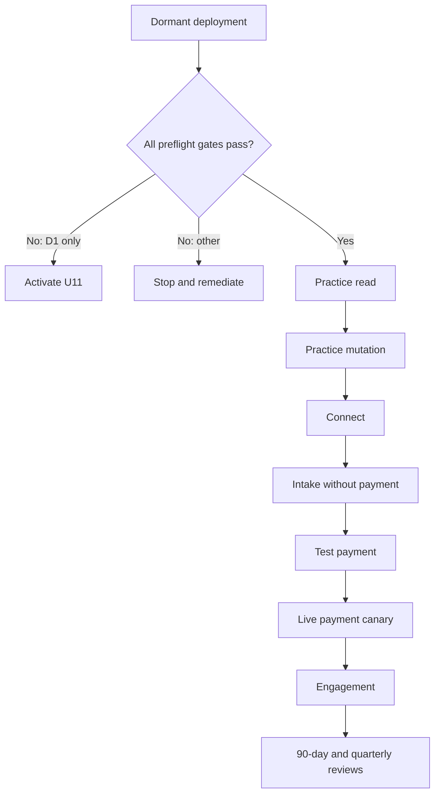
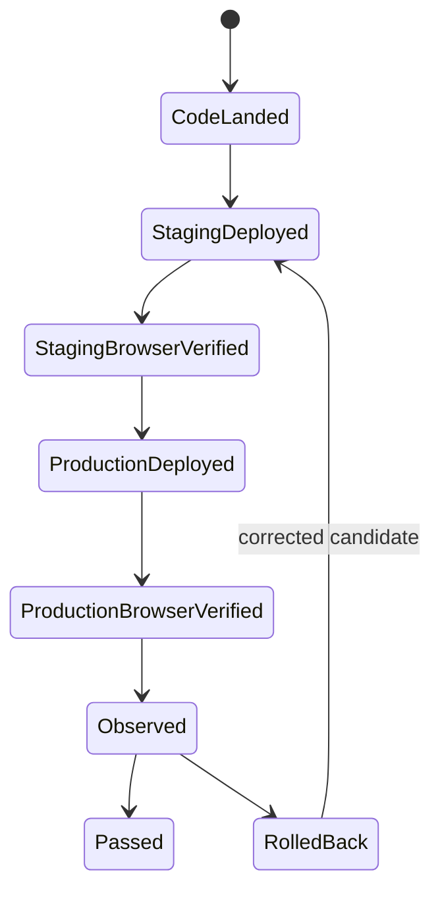
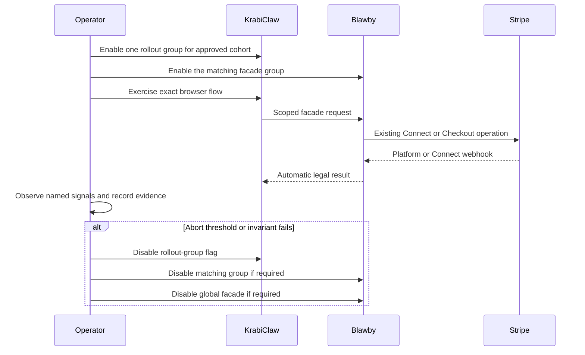

# U10 KrabiClaw Legal Vertical Rollout - Plan

**Target repositories:** Blawby and KrabiClaw

Paths are labeled by repository and are relative to that repository. This artifact remains `requirements-only` because the subscription-tier mapping and the production-only cohort, rate-budget, privacy-lifecycle, and anonymous-canary decisions are intentionally unresolved. They block real traffic, not dormant deployment or gate preparation.

## Goal Capsule

- **Objective:** Legal traffic reaches the new seam in controlled vertical slices with evidence that identity, recovery, payments, and rollback work on the exact deployed revisions.
- **Means:** Deploy both sides dormant, clear fixed operational gates, enable one independently reversible rollout group at a time, and retain a dated evidence record for each environment and slice (KTD1-KTD4).
- **Authority:** Current deployment state and provider evidence override plan text, green CI, branch state, and earlier status notes. The origin plan governs route order and security behavior.
- **Execution profile:** Cross-repository operational work and durable evidence. Application changes are allowed only when a gate exposes a defect or missing canary control and must return through normal implementation review.
- **Stop conditions:** Dormant deployment, runbook work, and controlled staging may continue while commercial questions remain open. Stop production traffic when the entitlement decision is unresolved, the eligible cohort is broader than the approved canary, public limits or legal-reference lifecycle are unapproved, anonymous traffic is not bounded, the D1 gate fails, exact deployed revisions are unknown, OAuth isolation is unproven, recovery fails, or either Stripe webhook destination is unhealthy.
- **Tail ownership:** Operators own rollout and rollback. Legal/privacy owners approve retention-sensitive changes. The integration seam is reviewed within 90 days of first production traffic and quarterly afterward.

### AI Execution Brief (RGCCOV)

- **Role:** Act as the cross-repository release coordinator for Blawby and KrabiClaw. Coordinate product, security, legal/privacy, database recovery, and Stripe owners without inventing their approvals.
- **Goal:** Resolve the blocking decisions and prepare the evidence-driven rollout described above. Execute production slices only after this artifact is upgraded to `implementation-ready` and the applicable gates have passed.
- **Context:** U8 and U9 own the dormant code contracts. This plan remains `requirements-only` because tier eligibility, the production cohort, public rate budgets, the legal-reference lifecycle, and the anonymous canary boundary are unresolved; U11 exists only if the D1 gate fails.
- **Constraints:** Follow R1-R34 and KTD1-KTD8 exactly. Preparation, dormant deployment, and controlled staging may proceed, but no production group may be enabled until every blocking question and applicable operational gate is resolved with named-owner evidence.
- **Output:** Produce the permitted preparation, controlled-staging, and blocker-resolution artifacts from Implementation Units U1-U10. After the plan becomes `implementation-ready`, also produce the per-slice production evidence and rollback records; until then, record a no-go instead of claiming production readiness.
- **Verification:** Complete the Verification Contract against exact deployed revisions and satisfy the Definition of Done. A complete plan document or green CI result is not evidence that production traffic is safe to enable.

---

## Product Contract

### Summary

Roll out the KrabiClaw-to-Blawby legal integration in the fixed order: dormant infrastructure, practice read, practice mutation, Connect, intake without payment, test payment, live payment, and engagement. Each slice advances only after separate deployment, browser, telemetry, recovery, and rollback evidence is recorded.

### Problem Frame

U8 and U9 can prove code contracts but cannot prove the production boundary. No current artifact records a production-shaped D1 capacity result, provisioned staging OAuth client, dual Stripe webhook verification, or the exact deployed candidates. Enabling all rollout groups together would hide which boundary failed and would couple legal and payment rollback.

### Key Decisions

- **Choose subscription-tier eligibility later.** No production family may be enabled until `legal_operations` maps to a reviewed tier and the actual eligible-site cohort matches the approved canary. Governs R1-R3. (session-settled: user-directed — chosen over guessing a plan mapping: commercial eligibility will be decided later.)
- **Roll out by vertical slice.** Practice read precedes every mutation, and payment precedes engagement only after non-payment intake is proven. Governs R8-R12.
- **Disable traffic before changing data.** Rollback starts with the active KrabiClaw rollout-group flag, then the matching Blawby group or global kill switch as needed; records are retained. Governs R16-R18 and R29.

### Actors

- A1. The release operator deploys, configures flags and credentials, watches telemetry, and executes rollback.
- A2. An approved KrabiClaw owner/admin canary exercises staff routes.
- A3. An approved human or anonymous visitor canary exercises public intake routes.
- A4. Stripe sends independent platform and connected-account webhook events.
- A5. Legal/privacy and product owners approve entitlement, cohort, and retention-sensitive decisions.

### Requirements

**Preflight and product gates**

- R1. Before real traffic, product ownership records which subscription tiers receive `legal_operations`; until then every tier remains false.
- R2. Before production, the operator enumerates the sites made eligible by that mapping and proceeds only when the set equals the approved canary cohort.
- R3. A legal-enabled site with unresolved multi-site organization or transfer semantics remains ineligible.
- R4. Both repositories deploy the U8 and U9 candidates dormant before any rollout group is enabled.
- R5. Every environment uses its own fixed confidential OAuth client and secret, and KrabiClaw alone stores the client secret in its Cloudflare secret binding; neither repository, build output, configuration file, nor log contains it.
- R6. The D1 gate records sustained projected peak including retry amplification, p50/p95/p99, overloaded responses, deadline failures, current account-wide API usage, and the explicit cohort and traffic assumptions used for the projection.
- R7. The D1 gate passes only with zero overload or deadline failures and projected use below 50% of the current account API limit. The evidence states the current limit, other account consumers, assumed cohort, and reserved headroom supporting that threshold; failure activates U11 and blocks traffic.

**Ordered rollout**

- R8. Practice read is the first enabled route and must pass staging and production canary evidence before practice mutation.
- R9. Practice mutation must pass tenant isolation, idempotent retry expectations, audit attribution, and rollback evidence before Connect.
- R10. Connect must pass exact callback allowlists, account creation/status/session retrieval, response-loss recovery, and connected-account webhook verification before intake.
- R11. Intake without payment must pass human and anonymous actor continuity, same-key response-loss recovery, staff triage, and rate limiting before payment.
- R12. Payment proof runs in staging with Stripe test credentials only. Production never receives test credentials or a test-payment slice; its intake-payment group advances directly from off to one bounded live canary only after both staging webhook destinations, automatic fulfillment, duplicate/out-of-order handling, and reconciliation are proven.
- R13. Engagement is enabled last and must pass create, send, decline, accept, concurrency, attribution, and audit evidence.

**Evidence, monitoring, and rollback**

- R14. Every slice records `code landed`, `staging deployed`, `staging browser verified`, `production deployed`, and `production browser verified` separately with exact SHAs and provider deployment IDs.
- R15. Before each canary, the evidence record names its cohort, expected signals, baseline-derived abort thresholds, owner, observation window, and rollback decision-maker.
- R16. Rollback disables the active KrabiClaw rollout-group flag first, disables the matching Blawby group when required, and uses the Blawby global kill switch only when group isolation is insufficient or the facade boundary is unsafe. Each slice declares a maximum traffic-stop time and passes only when rehearsal meets it.
- R17. Rollback never deletes or reseeds external mappings, request references, snapshots, idempotency records, legal records, payments, webhook events, or audit history.
- R18. OAuth rotation or revocation is not an immediate kill switch because issued JWTs can remain valid; flags must stop traffic during an emergency.
- R19. The first-production-traffic date schedules a seam review within 90 days and quarterly reviews thereafter.
- R20. A later successful slice never compensates for missing or failed evidence in an earlier slice.
- R21. Production traffic requires current durable-recovery evidence for PostgreSQL PITR and R2 retention, including measured RPO at most 15 minutes, RTO at most 4 hours, cross-tenant and financial integrity checks, and sanitized evidence retained for 90 days.
- R22. Deployment provenance records relevant PR ancestry, migration state, fixture or seed state, and configuration identity in addition to SHA and provider deployment ID.
- R23. Every slice predeclares applicable BFF/facade request and latency metrics, auth and token failures, D1 capacity failures, identity conflicts, rate-limit rejections, recovery divergence, worker lag/failures, and Stripe delivery/fulfillment signals.
- R24. Before preflight, named people or on-call roles own final go/no, each deployment and flag, OAuth, D1 capacity, recovery, monitoring/abort, Stripe/refund/reconciliation, entitlement/cohort approval, legal/privacy review, and independent evidence review.
- R25. Before each mutation slice, read-only baselines record the canary mapping, eligible-site set, duplicate or orphan identity/recovery state, queue and webhook backlog, and non-PII counts needed for reconciliation.
- R26. Browser evidence uses a fresh context against the exact deployed candidate and records final URL, tenant identity, visible result, route-local actions, failed first-party requests, console or hydration errors, and narrow/mobile behavior for public intake.
- R27. D1 capacity evidence records projected-peak derivation, assumed cohort size and composition, route/query mix, retry injection, sustained duration, staging data shape, adapter revision, and concurrent account REST usage; material changes to any of these make the result stale.
- R28. Enabling a real tier requires a reviewed `billing-entitlements.ts` code change and normal deployment evidence; flags alone cannot create eligibility.
- R29. U8 and U9 expose the same six default-off rollout groups: practice read, practice mutation, Connect, intake without payment, intake payment, and engagement. A slice enables only its group on both sides and proves all later groups still fail closed.
- R30. Each OAuth client is granted only the legal scopes needed by currently enabled groups, has audience `urn:blawby:legal-api`, and has no platform-admin or `super_admin` grant. A reviewed Blawby `super_admin` may provision or rotate the client but that administrative role is not granted to the client.
- R31. Before public intake production traffic, product and security owners approve positive limits and windows for every U9 public budget plus the U8 client/family and organization/family ceilings; missing or invalid values remain fail closed.
- R32. Before public intake production traffic, legal/privacy ownership assigns `legal_intake_references` to a reviewed retention, export, erasure or pseudonymization, user-deletion, and audit-attribution policy.
- R33. Before anonymous production intake, the canary uses a reviewed temporary access boundary or a non-public production canary site; site eligibility and rate limiting alone do not define an approved visitor cohort.
- R34. Slice order is enforced independently per environment: a later staging slice requires the prior staging slice, while a later production slice requires the prior production slice. Staging work does not wait for unrelated production promotion.

### Key Flows

- F1. **Slice promotion**
  - **Trigger:** The previous slice has complete evidence in the environment being promoted; production also has every global production gate.
  - **Actors:** A1, A2 or A3.
  - **Steps:** Confirm exact revisions and gates; enable only the next matching rollout group on both services; prove later groups still deny; exercise the real browser path; observe the named window; record pass or roll back.
  - **Outcome:** One additional capability receives traffic with attributable evidence.
  - **Covered by:** R4-R15, R20.
- F2. **Payment proof**
  - **Trigger:** Non-payment intake has passed.
  - **Actors:** A1, A3, A4.
  - **Steps:** Prove test Checkout and both webhook endpoints; replay duplicates and out-of-order events; verify automatic fulfillment and reconciliation; then repeat with a bounded live canary.
  - **Outcome:** Payment success does not depend on browser polling or manual fulfillment.
  - **Covered by:** R10-R12, R14-R15.
- F3. **Abort and rollback**
  - **Trigger:** An abort threshold, security invariant, recovery test, or dependency gate fails.
  - **Actors:** A1.
  - **Steps:** Disable the active KrabiClaw group; disable the matching Blawby group or escalate to the global kill switch when required; preserve records; verify traffic stopped within its declared bound; record the failure and next corrective action.
  - **Outcome:** New traffic stops without destroying recovery or legal evidence.
  - **Covered by:** R15-R18.

### Acceptance Examples

- AE1. **Covers R1-R2.** Given no tier mapping, when an operator reaches the first traffic step, then rollout stops even if both deployments and flags are otherwise ready.
- AE2. **Covers R6-R7.** Given a D1 run with one deadline failure or projected use at or above half of the account API limit, when the gate is evaluated, then U11 is required and no rollout group is enabled.
- AE3. **Covers R10.** Given a Connect create response is lost, when the same operation reference is retried, then the existing connected account is recovered without starting a different operation.
- AE4. **Covers R11.** Given an anonymous visitor retries an intake after response loss, when the original request reference and actor session are used, then one intake is recovered; a different actor is denied.
- AE5. **Covers R12.** Given a test payment succeeds in the browser but either webhook destination is unverified, when live payment is considered, then rollout stops.
- AE6. **Covers R14 and R20.** Given CI is green but the exact staging candidate has not been opened in a real browser, when a slice is reviewed, then `staging browser verified` remains incomplete and the slice cannot advance.
- AE7. **Covers R16-R18.** Given a live intake abort threshold fires, when rollback begins, then the active intake rollout-group flag is disabled before any credential or data change and all records remain available for reconciliation.
- AE8. **Covers R21.** Given route tests pass but the current PITR or R2 recovery rehearsal is absent or outside its RPO/RTO bound, when production traffic is considered, then rollout stops.
- AE9. **Covers R23-R24.** Given a canary has no named abort owner or threshold for an applicable signal, when enablement is reviewed, then the slice remains no-go.
- AE10. **Covers R29.** Given practice read is enabled, when practice mutation is called with otherwise valid authorization, then both services deny it until the practice-mutation slice begins.
- AE11. **Covers R31-R33.** Given public intake code is deployed but rate budgets, reference lifecycle, or the anonymous canary boundary is unapproved, when production enablement is considered, then intake remains off.

### Success Criteria

- Every enabled slice has a complete, dated evidence chain tied to exact deployed revisions.
- No traffic is enabled without a current D1 pass, environment-isolated OAuth client, explicit entitlement mapping, and bounded eligible cohort.
- Test and live payment evidence proves both webhook destinations and automatic fulfillment independently.
- Rollback rehearsal stops new traffic while preserving all legal, payment, recovery, and audit records.
- Every promoted capability is isolated by matching U8/U9 rollout groups, and later route subsets remain demonstrably disabled.
- The first seam review and recurring quarterly reviews have named dates and owners.

### Scope Boundaries

**In scope**

- Cross-repository rollout runbook, dated evidence, environment configuration, canaries, observation, Stripe verification, recovery drills, rollback, and seam-review scheduling.

**Deferred to Follow-Up Work**

- Selecting the subscription tiers that receive `legal_operations`; this must be resolved before this artifact becomes implementation-ready.
- Multi-site and site-transfer ownership policy for legal-enabled organizations.
- A reviewed site-level cohort control if the selected tier makes more sites eligible than the approved canary.
- Final numeric public and facade rate budgets, the `legal_intake_references` privacy lifecycle, and the anonymous-production canary boundary.
- U11 only when the D1 capacity gate fails.
- Permanent removal of the integration seam after the native ownership review chooses a replacement.

**Out of scope**

- Broad application refactors, new invoice behavior, manual payment fulfillment as a release path, destructive rollback, or treating CI as deployed-browser evidence.

### Blocking Questions

- Which current subscription tiers receive `legal_operations`?
- If the resulting production cohort contains more than the approved canary site, what reviewed site-level cohort control will constrain first traffic?
- What limits and windows will apply to each public intake budget and both Blawby facade ceilings?
- Which legal/privacy lifecycle applies to KrabiClaw's `legal_intake_references` records?
- What mechanism will bound anonymous production canary access before the public route is discoverable?

These questions do not block dormant deployment, runbook preparation, or staging tests with controlled fixtures. D1 testing may proceed only against a recorded cohort-and-traffic assumption and becomes stale when that assumption changes. The questions block production traffic and therefore keep `artifact_readiness` at `requirements-only`.

### Sources

- Blawby: `docs/plans/2026-08-08-001-feat-krabiclaw-legal-facade-plan.md`
- Blawby: `docs/runbooks/krabiclaw-d1-capacity-gate.md`
- Blawby: `docs/runbooks/krabiclaw-oauth-client.md`
- Blawby: `docs/DURABLE_RECOVERY.md`
- Blawby: `src/modules/webhooks/http.ts`
- Blawby: `src/modules/webhooks/services/onboarding-webhooks.service.ts`
- KrabiClaw: `docs/operations/release-and-outage-prevention.md`
- KrabiClaw: `wrangler.toml`
- Cloudflare D1 limits: `https://developers.cloudflare.com/d1/platform/limits/`
- Stripe Connect webhooks: `https://docs.stripe.com/connect/webhooks`
- Stripe webhook best practices: `https://docs.stripe.com/webhooks`

---

## Planning Contract

### Key Technical Decisions

- KTD1. **Use one cross-repository operator runbook with per-environment evidence records.** The runbook owns gates and procedure; dated records own observed facts and exact revisions.
- KTD2. **Separate state claims.** Code landed, staging deployed, staging browser verified, production deployed, and production browser verified are independent fields and cannot be inferred from one another.
- KTD3. **Use the smallest independently reversible slice.** Practice read, practice mutation, Connect, intake without payment, staging test-payment proof, production live-payment canary, and engagement each have their own environment-specific gate and rollback evidence. Test and live payment never coexist in one environment.
- KTD4. **Treat bilateral group flags as the primary traffic control.** KrabiClaw stops browser entry first, the matching Blawby group protects the machine boundary, the Blawby global flag stops the whole facade, and credential rotation is a containment action rather than the first rollback step.
- KTD5. **Use a mandatory signal catalog with observed baselines.** Each slice selects every applicable R23 signal and records numeric thresholds, owners, dashboards, and observation checkpoints before enablement; the plan does not invent universal values.
- KTD6. **Keep payment evidence endpoint-specific.** Platform Checkout and connected-account lifecycle events are signed, observed, and replayed against their own endpoints and secrets.
- KTD7. **Do not broaden the cohort implicitly.** If the tier decision makes more sites eligible than the approved canary, rollout stops until product owners approve and implementation provides a bounded cohort mechanism.
- KTD8. **Treat durable recovery as production infrastructure.** Application rollback uses flags and exact known-good deployments, while PITR and R2 recovery are separately rehearsed last-resort capabilities and never routine slice rollback.

### High-Level Technical Design

### Evidence Model

Create one reusable runbook and one dated evidence record per environment or rollout event:

- Blawby — `docs/runbooks/krabiclaw-legal-facade-rollout.md`
- Blawby — `docs/operations/krabiclaw-legal-facade/YYYY-MM-DD-<environment>-rollout.md`
- KrabiClaw — update `docs/operations/release-and-outage-prevention.md` only when the reusable legal route matrix adds a lasting release rule.

Each record contains exact Blawby and KrabiClaw SHAs, provider deployment IDs, configuration presence without secret values, OAuth client reference, D1 gate evidence, eligible cohort, slice status fields, test identities, timestamps, browser evidence links, telemetry, abort thresholds, decisions, rollback outcome, and unresolved work.

Before U2, the record also names the operational owner for each R24 responsibility. A role may own more than one responsibility only when on-call coverage remains satisfied, but the operator executing a slice cannot approve the same slice's independent evidence. If no qualified second reviewer is available, the slice is no-go.

### Monitoring Signal Catalog

Every slice marks each signal as applicable or not applicable and records a reason. Binary safety invariants—cross-tenant access, signature failure, D1 overload/deadline failure, ownership conflict, or recovery divergence—abort on any occurrence. Volume-dependent signals require a baseline, minimum sample size, numeric threshold, evidence location, active observer, and post-promotion checkpoints:

- BFF and facade request counts, latency, and 401/403/429/502/503 rates.
- OAuth issuance, cache/refresh failures, and audience, scope, or client rejection.
- D1 overload, deadline failure, and account-limit consumption.
- Identity-link conflicts, cross-tenant denials, and rate-limit rejection by operation.
- Same-operation recovery, duplicate suppression, and reconciliation divergence.
- Graphile retry/failure counts and fulfillment lag.
- Stripe signature failure, delivery and processing lag, duplicate or out-of-order events, unmatched events, and automatic-fulfillment failure.

### Operational Constraints

- Resolve deployed revisions from Railway and Cloudflare deployment state, not `.github/workflows/deploy.txt` or branch HEAD alone.
- Never write OAuth secrets, tokens, Stripe secrets, intake PII, live canary payer identity or payment-instrument details, or full upstream bodies into evidence records. Live payment evidence uses non-identifying Stripe object references plus the approving owner.
- Use test-mode Stripe objects until the live-payment unit.
- Observe automatic jobs, webhook events, failed jobs, and reconciliation; browser polling is not fulfillment evidence.
- Disable flags before rotating credentials because existing OAuth JWTs may remain valid for up to one hour.
- Preserve all mapping, recovery, snapshot, legal, payment, webhook, and audit records during rollback.
- Use the rollback escalation ladder: disable the active KrabiClaw group, disable the matching Blawby group or use the global switch if the boundary is unsafe, restore the smallest exact known-good deployment if flags do not stabilize behavior, verify traffic cessation in a fresh browser context, then reconcile in-flight work from retained records.

### Risks and Dependencies

- U10 cannot become implementation-ready until all Blocking Questions are resolved.
- D1 direct REST may fail the current capacity threshold. Only that result activates U11.
- Environment drift can make a valid SHA behave differently. Evidence records bind revision, deployment ID, flags, URLs, and credential reference together.
- Stripe test success can mask a missing production endpoint or secret. KTD6 requires independent destination proof in both modes.
- A broad entitlement mapping can turn a one-site canary into an uncontrolled launch. KTD7 is a hard stop.

---

## Implementation Units

| Unit | Title                                        | Primary artifacts                 | Depends on                                 |
| ---- | -------------------------------------------- | --------------------------------- | ------------------------------------------ |
| U1   | Create rollout runbook and evidence template | Blawby rollout docs               | U8/U9 contracts                            |
| U2   | Deploy dormant and clear preflight gates     | Environment evidence              | U1                                         |
| U3   | Roll out practice read                       | Slice evidence                    | U2; blocking questions for production only |
| U4   | Roll out practice mutation                   | Slice evidence                    | U3                                         |
| U5   | Roll out Connect                             | Slice and Stripe Connect evidence | U4                                         |
| U6   | Roll out intake without payment              | Intake recovery evidence          | U5                                         |
| U7   | Prove test-mode payment                      | Dual webhook test evidence        | U6                                         |
| U8   | Run live-payment canary                      | Live payment evidence             | U7                                         |
| U9   | Roll out engagement                          | Engagement evidence               | U8                                         |
| U10  | Rehearse rollback and schedule reviews       | Rollback and review records       | U2, repeated after U5/U8/U9                |

Dependencies in this table apply per environment under R34: staging may advance after the prior staging slice even while production remains at an earlier slice; production never skips its own preceding production evidence.

### U1. Create the rollout runbook and evidence template

- **Goal:** Give operators one authoritative procedure and one repeatable evidence shape.
- **Requirements:** R4-R34.
- **Dependencies:** Approved U8 and U9 route contracts.
- **Files:**
  - Blawby — `docs/runbooks/krabiclaw-legal-facade-rollout.md` (new)
  - Blawby — `docs/operations/krabiclaw-legal-facade/` (new evidence directory and template)
- **Approach:**
  1. Bind the existing D1, OAuth, durable recovery, and KrabiClaw release runbooks instead of copying them.
  2. Add the fixed slice order, stop conditions, state fields, route/persona matrix, Monitoring Signal Catalog, durable-recovery gate, and rollback escalation ladder.
  3. Add the R24 ownership roster and independent evidence-review signoff.
  4. Include empty fields for every deferred entitlement, cohort, budget, privacy-lifecycle, and anonymous-canary approval; do not pre-fill them.
- **Test scenarios:** Test expectation: none -- this unit creates operational documentation and no runtime behavior.
- **Verification:** A second operator can identify every required fact, owner, and stop condition without consulting chat history.

### U2. Deploy both sides dormant and clear preflight gates

- **Goal:** Prove the exact U8 and U9 candidates, infrastructure, and credentials without allowing legal traffic.
- **Requirements:** R1-R7, R14-R15, R18, R20-R24, R27-R34.
- **Dependencies:** U1; U8 and U9 code complete.
- **Files:**
  - Blawby — dated evidence record under `docs/operations/krabiclaw-legal-facade/`
- **Approach:**
  1. Deploy and verify staging dormant first, then deploy the exact approved candidate to production dormant and verify it independently.
  2. Record R22 provenance and confirm all six KrabiClaw and Blawby group flags plus the Blawby global switch deny traffic in each environment.
  3. Have a reviewed Blawby `super_admin` provision exactly one fixed OAuth client per environment, configure its client ID immediately, and verify isolation, secret-store placement, rotation, revocation, audience, least-privilege legal scopes, and absence of any administrative grant on the client itself.
  4. Run the reproducible production-shaped D1 gate required by R6-R7 and R27.
  5. Attach current PostgreSQL PITR and R2 recovery evidence required by R21.
  6. Verify exact callback settings, log redaction, alert visibility, and that no current plan has legal access.
  7. If D1 fails, stop and activate U11; if any other gate fails, stop and remediate that owner.
- **Test scenarios:**
  - Staging credentials cannot authenticate to production and production credentials cannot authenticate to staging.
  - Wrong audience, client, and scope tokens fail before D1.
  - Missing flags deny all six rollout groups in both environments.
  - Staging and production each prove dormant behavior independently on their exact deployment.
  - D1 results satisfy R6-R7 under sustained projected peak or explicitly fail into U11.
  - Rotated credentials stop new token issuance while flags stop traffic immediately.
  - PITR and R2 rehearsals meet R21 and preserve an independent healthy recovery chain.
- **Verification:** Dormant deployments and all preflight facts are recorded; no user can reach a legal operation.

### U3. Roll out practice read

- **Goal:** Establish the first end-to-end identity and read-only seam.
- **Requirements:** R1-R8, R14-R15, R20.
- **Dependencies:** U2. Controlled staging verification may proceed with fixtures; production canary requires all Blocking Questions resolved and the reviewed entitlement code change from R28.
- **Files:**
  - Blawby — active environment evidence record
- **Approach:**
  1. Complete controlled staging verification while the production entitlement remains false.
  2. Before production, land the reviewed entitlement mapping, enumerate the actual eligible cohort, and confirm it equals the approved canary.
  3. Capture the R25 read-only mapping and eligible-site baseline.
  4. Rehearse the rollback ladder, then enable only practice read on both services for that cohort and keep mutation and every later group off.
  5. Exercise the exact R26 browser/persona matrix.
  6. Observe every applicable R23 signal through its declared checkpoints and roll back on any threshold or identity invariant failure.
- **Test scenarios:**
  - The canary owner/admin reads only its mapped practice.
  - Editor, anonymous, wrong-org, wrong-scope, and browser-spoofed identity attempts fail.
  - D1, OAuth, identity, rate-limit, request, error, and latency telemetry remain within the recorded thresholds.
- **Verification:** Practice read has complete staging and production browser evidence before mutation is considered.

### U4. Roll out practice mutation

- **Goal:** Prove tenant-safe practice writes and attribution through the same seam.
- **Requirements:** R9, R14-R15, R20.
- **Dependencies:** U3.
- **Files:**
  - Blawby — active environment evidence record
- **Approach:** Capture R25 baselines, complete controlled staging verification after the staging read slice, then enable only the reviewed production practice-mutation group on both services after the production read slice and gates pass. Exercise create/update behavior and failure recovery, verify audit attribution, and observe every applicable R23 signal.
- **Test scenarios:**
  - A canary owner/admin creates or updates the correct practice and reads the result back.
  - A repeated request produces the reviewed idempotent or conflict behavior and no unintended duplicate.
  - Cross-organization mutation and spoofed identity fail before PostgreSQL mutation.
  - Rollback disables further mutations while preserving the completed practice record and audit trail.
- **Verification:** Practice mutation evidence is complete and read behavior remains healthy.

### U5. Roll out Connect

- **Goal:** Prove connected-account onboarding, embedded account access, recovery, and Connect webhook processing.
- **Requirements:** R10, R12, R14-R18, R20.
- **Dependencies:** U4.
- **Files:**
  - Blawby — active environment evidence record
- **Approach:**
  1. Capture R25 baselines and verify exact return and refresh URLs in both services before enabling Connect.
  2. Exercise connected-account creation, status, account-session creation, and account retrieval.
  3. Simulate response loss and recover the same persisted operation.
  4. Deliver and replay connected-account events through `/api/webhooks/stripe/connected-accounts` using `STRIPE_CONNECT_WEBHOOK_SECRET`.
  5. Repeat the rollback rehearsal and observe every applicable R23 signal.
- **Test scenarios:**
  - Non-allowlisted callback variants fail before Stripe.
  - Same-operation retry recovers one connected account.
  - Account session and retrieval cannot cross organization boundaries.
  - Duplicate and out-of-order Connect events remain idempotent and visible in telemetry.
  - Disabling the Connect flag stops new calls without deleting the connected account or recovery record.
- **Verification:** Connect and its webhook destination have independent staging and production evidence.

### U6. Roll out intake without payment

- **Goal:** Prove public intake continuity and staff handling before financial side effects.
- **Requirements:** R11, R14-R17, R20.
- **Dependencies:** U5.
- **Files:**
  - Blawby — active environment evidence record
- **Approach:** Capture R25 baselines, confirm R31-R33, then enable the intake-without-payment group on both services for the reviewed bounded canary while keeping intake payment disabled. Exercise settings, create, request recovery, status, staff list/detail, and triage in fresh desktop and narrow/mobile contexts and observe every applicable R23 signal.
- **Test scenarios:**
  - Human and Better Auth anonymous canaries create one intake each.
  - Response loss plus same request reference recovers one intake.
  - Different actor, site, organization, payload, or request-reference combinations cannot access the intake.
  - Independent IP, actor, site aggregate, and request-reference budgets block abuse before Blawby and match the approved R31 values.
  - Owner/admin staff can list and triage; editors remain denied.
- **Verification:** Non-payment intake has complete continuity, isolation, rate-limit, staff, and rollback evidence.

### U7. Prove test-mode payment

- **Goal:** Prove destination-charge Checkout and automatic fulfillment without live money.
- **Requirements:** R12, R14-R18, R20.
- **Dependencies:** U6.
- **Files:**
  - Blawby — active environment evidence record
- **Approach:**
  1. Confirm R21 recovery evidence remains current and enable the intake-payment group on both staging services only; the production intake-payment group remains off until U8.
  2. Verify `/api/webhooks/stripe/account` with `STRIPE_WEBHOOK_SECRET` separately from the Connect endpoint.
  3. Exercise successful, failed, delayed, duplicate, and out-of-order events.
  4. Verify automatic fulfillment, jobs, reconciliation, and actor-bound post-pay access without manual state edits.
- **Test scenarios:**
  - A test destination charge reaches the correct connected account and intake.
  - Platform and Connect signatures are rejected when sent to the wrong endpoint.
  - Duplicate and out-of-order events do not double-fulfill.
  - Browser response loss and delayed webhook delivery reconcile automatically.
  - Post-pay denies a different actor, intake, organization, request reference, or Checkout session.
- **Verification:** Both webhook destinations and automatic recovery have independent test-mode evidence.

### U8. Run the live-payment canary

- **Goal:** Confirm the proven payment path with bounded real money and immediate rollback authority.
- **Requirements:** R2, R12, R14-R18, R20.
- **Dependencies:** U7.
- **Files:**
  - Blawby — active environment evidence record
- **Approach:** Repeat rollback rehearsal, confirm R21 recovery evidence, and record a non-identifying Stripe payer/object reference, amount boundary, approving owner, refund/reconciliation owner, observation window, and every applicable R23 threshold before enabling one live transaction path.
- **Test scenarios:**
  - One approved live destination charge completes and automatically fulfills the correct intake.
  - Both production webhook destinations verify their own signatures and record processing.
  - Reconciliation matches Stripe, connected account, payment, intake, and request references.
  - The intake-payment group stops new transactions while completed records remain reconcilable.
- **Verification:** The live canary is reconciled, observed for the named window, and signed off before engagement starts.

### U9. Roll out engagement

- **Goal:** Enable the final staff legal rollout group after payment is stable.
- **Requirements:** R13-R15, R20.
- **Dependencies:** U8.
- **Files:**
  - Blawby — active environment evidence record
- **Approach:** Enable engagement for the approved cohort, exercise the full reviewed lifecycle, verify immutable actor attribution and concurrency, then observe the canary.
- **Test scenarios:**
  - Owner/admin creates, reads, updates, sends, declines, and accepts reviewed contract cases.
  - Editors, anonymous actors, and cross-practice callers remain denied.
  - Concurrent acceptance has one winner and no duplicate side effects.
  - Rollback stops new engagement calls while preserving contracts and audit history.
- **Verification:** Engagement completes the route matrix with independent staging and production browser evidence.

### U10. Rehearse rollback and schedule seam reviews

- **Goal:** Prove emergency controls and create the temporary-seam review cadence.
- **Requirements:** R14-R20.
- **Dependencies:** U2 before the first production route; repeat after Connect, before live payment, after engagement, and after material flag, OAuth, routing, or infrastructure changes.
- **Files:**
  - Blawby — rollout runbook and dated evidence record
- **Approach:**
  1. Rehearse the complete rollback escalation ladder against the exact deployed candidates.
  2. Measure traffic-stop time against the slice's declared maximum, reopen affected routes in a fresh browser context, and verify other proven groups remain available after group-only rollback.
  3. Reconcile in-flight Stripe and legal operations from retained idempotency, webhook, recovery, and audit records.
  4. Record first production traffic and schedule the 90-day review and quarterly follow-ups with named owners.
  5. Re-run the D1 gate after material cohort, traffic-shape, query, database, account-caller, retry-amplification, or concurrent REST-usage changes.
- **Test scenarios:**
  - Disabling one rollout group leaves other proven groups available.
  - The global kill switch denies the whole facade when group isolation is insufficient.
  - OAuth rotation alone is not credited as immediate traffic shutdown.
  - Recovery, legal, payment, and audit records remain readable after rollback.
- **Verification:** Rollback evidence and calendar-owned review dates are present in the durable record.

---

## Verification Contract

| Gate                         | Applies to                    | Completion signal                                                                                                         |
| ---------------------------- | ----------------------------- | ------------------------------------------------------------------------------------------------------------------------- |
| Exact deployment identity    | U2-U10                        | R22 provenance, both repository SHAs, and provider deployment IDs are recorded for each environment.                      |
| D1 capacity gate             | U2 and after material changes | R6-R7 pass with attached measurements, or rollout stops for U11.                                                          |
| Durable recovery             | U2, U7-U10                    | Current PITR and R2 evidence meets R21 before production traffic and remains current at financial or artifact boundaries. |
| OAuth isolation and rotation | U2                            | Environment isolation, scope/audience denial, rotation, and emergency flag behavior are recorded.                         |
| Real-browser verification    | U3-U9                         | A fresh browser context records every R26 field for the exact deployed candidate; CI alone is not accepted.               |
| Telemetry observation        | U3-U9                         | Every applicable R23 signal stays within its owned threshold through the predeclared checkpoints.                         |
| Operational ownership        | U1-U10                        | Every R24 responsibility has an available named decision-maker and independent reviewer.                                  |
| Pre-mutation baseline        | U4-U9                         | R25 mapping, eligibility, integrity, backlog, and reconciliation baselines are saved without PII.                         |
| Stripe endpoint proof        | U5, U7, U8                    | Platform and Connect endpoints verify their own secret and idempotent event behavior independently.                       |
| Recovery drills              | U4-U8                         | Same-operation response loss, duplicates, delays, and reconciliation preserve one legal outcome.                          |
| Rollback rehearsal           | U3-U10                        | Flags stop traffic and retained records remain available.                                                                 |
| Evidence review              | Every unit                    | A second operator can reproduce the pass/fail decision from the record without relying on chat or memory.                 |

---

## Definition of Done

- The subscription-tier mapping is implemented through reviewed code, and the bounded production cohort is explicitly approved and recorded.
- Both repositories are tied to exact deployed SHAs and provider deployment IDs in staging and production.
- The current D1 capacity gate passes or U11 replaces the direct transport before traffic.
- Current PostgreSQL PITR and R2 recovery evidence meets R21 before production traffic.
- Deployment provenance, named ownership, mandatory monitoring signals, and pre-mutation baselines are present.
- All six bilateral rollout groups are independently fail-closed, and public budget values, legal-reference lifecycle, and anonymous canary boundary are approved before intake traffic.
- OAuth clients are environment-isolated and their rotation, revocation, and flag-based emergency shutdown are rehearsed.
- Every slice advances in the fixed order within each environment and has separate landed, deployed, browser-verified, observed, and rollback evidence.
- Connect and platform Stripe webhook destinations are independently proven with correct secrets, duplicates, out-of-order events, automatic fulfillment, and reconciliation.
- Anonymous and human intake recovery, cross-tenant isolation, and post-pay authorization are proven on the exact deployed candidates.
- Rollback stops new traffic through the escalation ladder, restores an exact known-good deployment when needed, reconciles in-flight work, and does not delete or reseed any legal, payment, mapping, snapshot, idempotency, webhook, or audit record.
- First-live, 90-day, and quarterly review dates have named owners.
- The final evidence set states unresolved items accurately and does not claim production readiness from CI, branch state, or plan completion alone.
