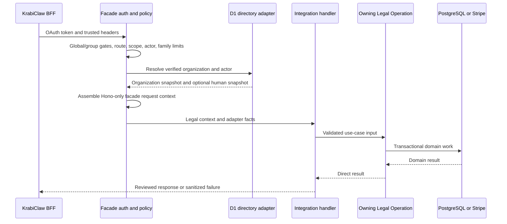
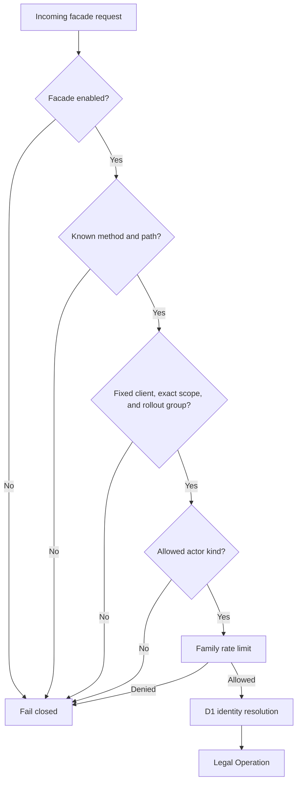
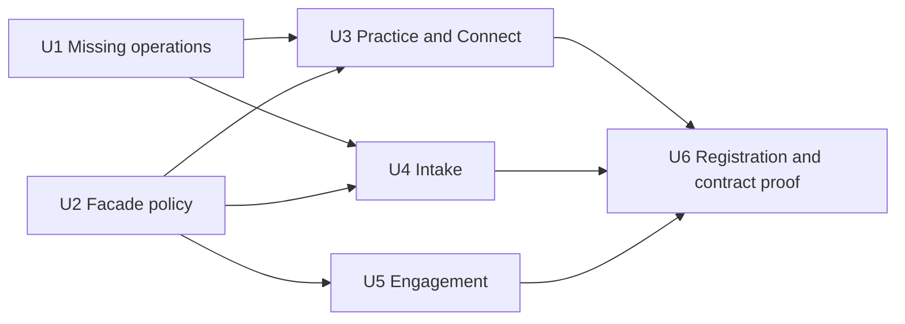

# U8 Blawby Legal Facade - Plan

## Goal Capsule

- **Objective:** KrabiClaw can call the approved Blawby legal operations through a dormant, authenticated facade without weakening existing Blawby authorization or legal workflows.
- **Means:** Mount thin integration routes over auth-independent Legal Operations, with exact route-family scope checks, default-off route-group gates, and trusted identity translation (KTD2, KTD4).
- **Authority:** Current code and tests override historical notes. The origin plan governs product behavior. This plan governs the U8 implementation.
- **Execution profile:** Code changes in the Blawby repository. The facade remains disabled after merge.
- **Stop conditions:** Stop before enabling traffic if the D1 capacity gate has no recorded pass, any selected workflow lacks one Legal Operation, an existing route changes behavior, or U9 has no deployed proof of its staff-role and public-actor eligibility boundary.
- **Tail ownership:** U9 owns the KrabiClaw BFF. U10 owns deployment evidence and traffic enablement. U11 is used only if the D1 gate fails.

### AI Execution Brief (RGCCOV)

- **Role:** Act as a senior Blawby backend engineer with expertise in Hono, Zod OpenAPI, Better Auth OAuth, CASL, Drizzle/PostgreSQL, Stripe, and Vitest.
- **Goal:** Implement the dormant U8 facade to satisfy the Objective and Means above without changing the behavior of existing Blawby routes.
- **Context:** The origin plan's U1-U7 already provide the machine-authentication, identity, recovery, and Legal Operation foundations described in the Product Contract. U9 is the downstream KrabiClaw BFF, and U10 alone owns traffic enablement.
- **Constraints:** Treat the current code and tests as the source of truth. Follow R1-R28 and KTD1-KTD9 exactly, preserve the fixed-client and trusted-identity boundaries, keep every facade group default-off, and stop when a Goal Capsule stop condition applies.
- **Output:** Produce the code, schema, route registration, configuration, OpenAPI, and test changes defined by Implementation Units U1-U6. Do not deploy credentials or enable traffic.
- **Verification:** Complete every applicable check in the Verification Contract and every acceptance condition in the Definition of Done. Record any unrelated repository-wide failure separately from the focused result for each touched file.

---

## Product Contract

### Summary

Expose the selected practice, Stripe Connect, intake, and engagement use cases at `/api/integrations/krabiclaw/v1`. The facade authenticates the one KrabiClaw machine client, derives local identity from trusted external identifiers, and delegates to the same operations used by existing routes. It is mounted but default-off.

### Problem Frame

U1-U7 established machine authentication, D1 identity translation, durable recovery records, and most auth-independent Legal Operations. The integration module still has no routes and is excluded from generated registration. Three selected use cases also lack a Legal Operation: Connect account-session creation, connected-account retrieval, and intake recovery by KrabiClaw request reference.

### Key Decisions

- **Complete missing operation extraction inside U8.** The facade may not bypass the operation boundary merely because earlier extraction units omitted three use cases. Governs R7 and R8. (session-settled: user-directed — chosen over leaving missing details implicit: U8 must be executable from the current repository state.)
- **Use a trusted request reference for anonymous follow-up.** KrabiClaw supplies the original request reference in a server-only header and Blawby verifies it against the intake. Governs R5 and R10. (session-settled: user-approved — chosen over trusting the intake UUID alone: an anonymous intake UUID is not proof of actor continuity.)

### Actors

- A1. The KrabiClaw confidential OAuth client authenticates every facade request.
- A2. A verified KrabiClaw human actor can use practice, Connect, staff intake, and engagement routes.
- A3. A KrabiClaw-verified Better Auth anonymous actor, asserted by the fixed client, can use only public intake routes and only with its bound request reference.
- A4. Existing Blawby users continue to use the ordinary Better Auth and CASL routes without facade behavior changes.

### Requirements

**Facade surface and authentication**

- R1. The facade exposes only the exact method and path allowlist in the Route Contract under `/api/integrations/krabiclaw/v1`.
- R2. Every facade request requires the configured fixed OAuth client, audience `urn:blawby:legal-api`, and the exact scope for its route family.
- R3. Wrong-family scopes, disabled facade or route-group requests, unknown methods, and unknown paths fail before D1, PostgreSQL, Stripe, or audit mutation.
- R4. Blawby requires external organization ID, actor ID, and actor kind from the trusted header contract for human and anonymous actors and rejects duplicate or malformed values.
- R5. Public intake creation receives a browser-generated cryptographically random UUID v4 request reference through the trusted server header, persists it as `krabiclaw_request_key`, and uses equality with that stored value for recovery and anonymous follow-up authorization.

**Legal Operation boundary**

- R6. Facade handlers construct `LegalOperationContext` and call one owning-domain Legal Operation per use case.
- R7. Account-session creation and connected-account retrieval are extracted into auth-independent operations before their facade routes are added.
- R8. Intake recovery by KrabiClaw request reference is extracted into a tenant-checked operation that returns the same recoverable create result.
- R9. Existing services keep their `ServiceContext` and CASL contracts and delegate to the extracted operations.
- R10. Post-pay status performs a non-mutating verification that organization, path intake UUID, Stripe session, and trusted request reference describe the same intake before conditionally attaching any session reference.

**Policy and reliability**

- R11. Practice, Connect, staff intake, and engagement routes require a human actor; public intake routes accept a verified human or anonymous actor.
- R12. Blawby applies a separate verified-organization rate-limit bucket to each route family before D1 identity resolution or domain work.
- R13. Connect return and refresh URLs must exactly match configured per-environment HTTPS origin-and-path values.
- R14. Facade-specific strict schemas reject caller-supplied organization, practice, user, slug, and identity-email fields; a prospective client's contact email remains valid legal payload.
- R15. Reviewed Legal Operation 4xx errors pass through, while integration dependency failures become sanitized 502 or 503 responses with request correlation.
- R16. Offset and cursor lists keep the shared Blawby pagination envelopes, and other facade responses preserve the owning operation contract.
- R17. The module is present in generated runtime and OpenAPI registration while `KRABICLAW_FACADE_ENABLED` remains off by default.
- R18. No facade request may query KrabiClaw D1 from a worker, webhook, or asynchronous job.
- R19. No facade rollout group may receive traffic until the recorded D1 capacity gate passes; a failed gate activates U11 instead of relaxing the threshold.
- R20. An anonymous external actor ID remains trusted attribution and request-binding data but never triggers a D1 user lookup or local user-anchor creation.
- R21. A fixed-client and route-family ceiling plus the claimed-organization and route-family bucket must both pass before D1, so varying organization headers cannot bypass a compromised-client limit. The client ceiling is a containment backstop sized above measured aggregate legitimate traffic, while the organization bucket is the primary fairness control; U10 records and reviews both values before enablement.
- R22. Every facade response, including reads and failures, is marked `Cache-Control: no-store`.
- R23. Trusted headers and request bodies have explicit length, character, and size bounds before D1. External organization and actor IDs accept the bounded canonical text identifiers used by KrabiClaw; request references and local legal resource IDs receive their specific UUID validation. Logs exclude tokens, secrets, cookies, legal payloads, request references, Checkout session IDs, and raw upstream bodies.
- R24. Machine-token failures use a stable reviewed OAuth error discriminator and `WWW-Authenticate` contract so U9 never refreshes on an arbitrary domain 401.
- R25. Only reviewed route-family 4xx status, code, and schema combinations pass through; unknown, malformed, HTML, or oversized 4xx bodies are sanitized as upstream failures.
- R26. Every allowlisted route belongs to one of six default-off rollout groups—practice read, practice mutation, Connect, intake without payment, intake payment, or engagement—and the group gate is enforced after machine authentication but before D1.
- R27. Engagement acceptance alone may receive a dedicated trusted originating-client-IP header; KrabiClaw derives it from its trusted Cloudflare request context, and Blawby validates it as an IP address without accepting browser forwarding headers.
- R28. Connected-account creation requires a strict UUID v4 `request_key` facade field and passes it to the existing organization-bound recovery operation; the ordinary Blawby route remains free to omit that integration-only key.

### Route Contract

| Scope               | Rollout group          | Actor              | Routes                                                                                                                                      |
| ------------------- | ---------------------- | ------------------ | ------------------------------------------------------------------------------------------------------------------------------------------- |
| `legal:practice`    | Practice read          | Human              | `GET /practice/details`                                                                                                                     |
| `legal:practice`    | Practice mutation      | Human              | `POST`, `PATCH /practice/details`                                                                                                           |
| `legal:connect`     | Connect                | Human              | `POST /connect/connected-accounts`; `GET /connect/status`; `POST /connect/account-session`; `GET /connect/account`                          |
| `legal:intakes`     | Intake without payment | Human or anonymous | `GET /intakes/settings`; `POST /intakes`; `GET /intakes/requests/{request_id}`; `GET /intakes/{uuid}/status`                                |
| `legal:intakes`     | Intake payment         | Human or anonymous | `POST /intakes/{uuid}/checkout-session`; `GET /intakes/{uuid}/post-pay/status`                                                              |
| `legal:intakes`     | Intake without payment | Human              | `GET /intakes`; `GET /intakes/{uuid}`; `PATCH /intakes/{uuid}/triage`                                                                       |
| `legal:engagements` | Engagement             | Human              | `POST`, `GET /engagement-contracts`; `GET`, `PATCH /engagement-contracts/{contract_id}`; `PATCH /engagement-contracts/{contract_id}/status` |

### Reviewed Error Contract

Facade errors use a bounded `{ error: { code, message }, request_id }` envelope. Messages are facade-owned text, never raw exception or dependency bodies.

| Family                 | Reviewed browser-visible 4xx contracts                                                                              | Mandatory normalization                                                                                          |
| ---------------------- | ------------------------------------------------------------------------------------------------------------------- | ---------------------------------------------------------------------------------------------------------------- |
| Machine authentication | `401 invalid_token`                                                                                                 | Include the reviewed `WWW-Authenticate` challenge; this is the only response U9 may treat as refreshable.        |
| Facade policy          | `403 facade_forbidden`; `429 rate_limited`                                                                          | Do not disclose which client, scope, actor, rollout group, or limit key failed.                                  |
| Practice               | `400 validation_failed`; `404 resource_not_found`; `409 state_conflict`                                             | Replace tenant-bearing owning-operation messages with stable facade text.                                        |
| Connect                | `400 validation_failed`; `404 resource_not_found`; `409 state_conflict`; `422 prerequisite_failed`                  | Never expose Stripe account identifiers, capability details, or callback values.                                 |
| Public intake          | `400 validation_failed`; `404 resource_not_found`; `409 request_conflict`; `422 prerequisite_failed`                | Ownership, request-reference, intake, and session mismatches all use the same `404 resource_not_found` contract. |
| Staff intake           | `400 validation_failed`; `403 forbidden`; `404 resource_not_found`; `409 state_conflict`; `422 prerequisite_failed` | Preserve only allowlisted triage and lifecycle reason codes.                                                     |
| Engagement             | `400 validation_failed`; `404 resource_not_found`; `409 state_conflict`                                             | Preserve only allowlisted lifecycle reason codes; never expose rendered contract content in an error.            |

An owning operation's status is not sufficient for pass-through. U8 must map it to one table entry and reserialize it. Unknown contract 4xx responses become sanitized `502 invalid_upstream_response`; timeouts or unavailable dependencies become sanitized `503 dependency_unavailable`. U9 never automatically retries either class.

### Acceptance Examples

- AE1. **Covers R2 and R3.** Given a valid token with only `legal:practice`, when it calls a Connect route, then Blawby rejects it before D1 is read.
- AE2. **Covers R5 and R10.** Given an anonymous actor with request reference A, when it follows up intake B, then every route denies access unless B stores A; post-pay additionally requires the Stripe session to resolve to the same organization and intake.
- AE3. **Covers R7-R9.** Given an existing authenticated Blawby route and the equivalent facade route, when both perform the same use case, then both reach one Legal Operation and retain their existing response contracts.
- AE4. **Covers R13 and R14.** Given an allowed Connect request with a caller-supplied identity field or non-allowlisted callback URL, when validation runs, then Blawby rejects the request before Stripe.
- AE5. **Covers R17.** Given a deployment with no enablement variable, when any allowlisted facade route is called, then it fails closed even though the module is registered.
- AE6. **Covers R10.** Given a Stripe session that resolves to the wrong organization, intake UUID, or request reference, when post-pay is called, then Blawby performs no write and returns no resource-existence detail.
- AE7. **Covers R24.** Given a domain or dependency 401 after machine authentication, when U9 receives it, then the response lacks the machine-auth discriminator and is never replayed as token refresh.
- AE8. **Covers R26.** Given practice read is enabled while practice mutation is disabled, when the fixed client calls a practice mutation with a valid `legal:practice` token, then Blawby rejects it before D1.

### Success Criteria

- The complete method, scope, and actor matrix is enforced before identity lookup or mutation.
- Existing practice, Connect, intake, and engagement route tests retain their pre-U8 behavior.
- Anonymous create, recovery, checkout, status, and post-pay flows cannot cross actor, organization, request-reference, intake, or session boundaries.
- The generated router and OpenAPI output contain the facade only once, with the global and all six rollout-group gates still default-off.

### Scope Boundaries

**In scope**

- The Blawby facade, the three missing Legal Operations, strict integration schemas, exact callback allowlists, facade error mapping, and contract tests.

**Deferred to Follow-Up Work**

- U9 KrabiClaw BFF routes, eligibility, entitlement policy, and public rate limiting.
- U10 credential provisioning, D1 load evidence, staged enablement, browser verification, and rollback rehearsal.
- U11 D1-bound Worker transport only when the current capacity gate fails.

**Out of scope**

- New invoice behavior, a new payment state machine, per-person OAuth clients, direct browser access to Blawby, or broader role support.

### Sources

- `docs/plans/2026-08-08-001-feat-krabiclaw-legal-facade-plan.md`
- `docs/plans/2026-08-23-2223-refactor-engagement-legal-operations-plan.md`
- `docs/runbooks/krabiclaw-d1-capacity-gate.md`
- `src/modules/krabiclaw-integration/http.ts`
- `src/modules/krabiclaw-integration/middleware/verify-facade-token.ts`
- `src/modules/practice-client-intakes/operations/intake-actor-context.ts`
- `src/modules/stripe/services/account-session.service.ts`
- `src/modules/onboarding/services/connected-accounts.service.ts`
- Better Auth OAuth Provider documentation: `https://better-auth.com/docs/plugins/oauth-provider`

---

## Planning Contract

### Key Technical Decisions

- KTD1. **Extract before exposure.** Characterize each missing existing route, move its complete workflow into the owning domain operation, and keep the existing handler as an authorization adapter.
- KTD2. **Use one authoritative facade route registry.** Each Hono route definition carries immutable method, path, scope, actor-kind, rate-family, rollout-group, and request-reference policy metadata, and route-scoped middleware enforces the policy on the route Hono actually matched. A catch-all guard handles only the global switch and unknown method/path rejection; no second path matcher may choose security semantics.
- KTD3. **Assemble one Hono-only `KrabiClawFacadeRequestContext`.** It carries verified external IDs, actor kind, optional request reference, optional trusted originating client IP, organization directory snapshot, optional human user snapshot, and `LegalOperationContext`. Legal Operations, jobs, and webhooks cannot receive it.
- KTD4. **Keep handlers thin and domain-specific.** Integration handlers validate facade DTOs, build operation inputs, dispatch the owning operation, and serialize its direct result; they do not call repositories or Stripe services.
- KTD5. **Use strict facade DTOs.** Do not reuse an owning schema when it strips unknown identity fields or exposes fields that KrabiClaw must not control.
- KTD6. **Treat the request reference as anonymous proof.** Add one trusted integration header, persist it during public intake creation, and verify it during recovery and anonymous follow-up operations. (session-settled: user-approved — chosen over intake-UUID-only access: the request reference binds the KrabiClaw actor to the intake.)
- KTD7. **Use bilateral exact callback validation.** U9 sends only its configured return and refresh URLs, and U8 checks exact equality against its own per-environment HTTPS values before the durable Connect claim. The fixed URLs contain no caller-selected tenant or session data in their path or query; U9 restores flow context from its authenticated session. Every other origin or path is rejected.
- KTD8. **Map errors through reviewed per-family contracts.** Reserialize allowlisted domain 4xx errors, emit a stable machine-auth discriminator for token failures, and sanitize every unknown 4xx or dependency failure without changing ordinary routes.
- KTD9. **Generate registration from the established script.** Remove the stale integration exclusion and regenerate the router; do not hand-maintain the generated registry.

### High-Level Technical Design

### Implementation Constraints

- Use `@/` imports, `routeBuilder.build(...)`, Zod v4 through `@hono/zod-openapi`, `ServiceContext`, `LegalOperationContext`, `uow.transaction(...)`, and LogTape conventions from current modules.
- Use `practice_id` in organization-scoped facade path parameters.
- Do not add a general integration service, command bus, retry wrapper, or parallel domain implementation.
- Do not let facade middleware or handlers manufacture owner/admin claims. U9 enforces those roles from KrabiClaw's Better Auth membership.
- Preserve state-dependent events and Stripe calls inside the owning operation and its transaction/recovery boundary.

### Sequencing

### Risks and Dependencies

- A permissive schema can silently discard spoofed identity fields. KTD5 and explicit negative tests prevent this.
- Global identity middleware can perform D1 work for a wrong scope or unknown route. KTD2 makes route policy an earlier boundary.
- Anonymous follow-up can become possession-of-UUID authorization. KTD6 requires request-reference equality.
- Operation extraction can change existing route behavior. U1 starts with characterization and parity tests.
- Direct D1 REST capacity remains an enablement dependency, not a merge dependency. R19 keeps the facade dormant until evidence exists.
- D1 availability is also an enablement dependency. The facade fails closed on directory miss or unavailability; U10 may approve a bounded cache only through a separately reviewed design rather than adding it implicitly in U8.
- A leaked machine credential can assert organizations within its granted scope. Short-lived scoped tokens, U8 route-group gates, server-only storage, redaction, and the fixed-client ceiling bound this accepted trust; U10 owns revocation and emergency shutdown.
- If the D1 capacity gate activates U11, only the directory transport behind `KrabiClawFacadeRequestContext` changes; the route registry, handlers, and owning Legal Operations remain U8-owned.

---

## Implementation Units

### U1. Complete the missing Legal Operations

- **Goal:** Give every selected Connect and request-recovery use case one auth-independent owning-domain operation.
- **Requirements:** R6-R10, R20.
- **Dependencies:** U5-U7 from the origin plan are merged.
- **Files:**
  - `src/modules/stripe/operations/` (new account-session operation)
  - `src/modules/stripe/services/account-session.service.ts`
  - `src/modules/stripe/handlers.ts`
  - `src/modules/onboarding/operations/` (new connected-account retrieval operation)
  - `src/modules/onboarding/services/connected-accounts.service.ts`
  - `src/modules/practice-client-intakes/operations/` (new request-reference recovery operation and post-pay consistency check)
  - `test/modules/stripe/connect.route.test.ts`
  - `test/modules/onboarding/`
  - `test/modules/practice-client-intakes/`
- **Approach:**
  1. Characterize the existing account-session and connected-account responses, authorization outcomes, and Stripe ordering.
  2. Move each complete use case into its owning domain operation and make the existing service or handler translate `ServiceContext` before delegation.
  3. Add tenant-checked request-reference recovery that returns the create operation's recoverable result, including payment-link state.
  4. Split post-pay session resolution from persistence, require every correlation to agree, then attach the session with null-to-value or same-value conditional semantics.
- **Patterns to follow:** `src/modules/onboarding/operations/create-connected-account.operation.ts`, `src/modules/practice-client-intakes/operations/create-intake.operation.ts`, and the U7 engagement operation adapters.
- **Test scenarios:**
  - Existing Connect routes return the same DTOs and status codes before and after extraction.
  - Account-session creation rejects a missing or cross-tenant connected account before Stripe.
  - Request-reference recovery returns the original intake result after simulated response loss.
  - Reusing a request reference in another organization fails.
  - Post-pay rejects a session that belongs to the organization but resolves to a different intake UUID.
  - Wrong-organization, wrong-UUID, and wrong-reference post-pay calls perform zero writes.
  - Concurrent attempts to attach different verified session IDs have one winner and reject the conflicting value.
- **Verification:** All three facade-selected use cases are reachable only through a Legal Operation, and ordinary-route parity tests pass.

### U2. Add route policy and trusted facade context

- **Goal:** Enforce the allowlist, exact scope, actor matrix, trusted headers, and family rate limit before identity resolution.
- **Requirements:** R1-R5, R11-R15, R20-R28.
- **Dependencies:** None.
- **Files:**
  - `src/modules/krabiclaw-integration/http.ts`
  - `src/modules/krabiclaw-integration/middleware/verify-facade-token.ts`
  - `src/modules/krabiclaw-integration/middleware/krabiclaw-facade.middleware.ts`
  - `src/modules/krabiclaw-integration/types/facade-headers.types.ts`
  - `src/modules/krabiclaw-integration/types/` (new route-policy and integration-context types)
  - `src/modules/krabiclaw-integration/validations/` (new strict facade schemas)
  - `src/shared/types/hono.ts`
  - `src/shared/config/index.ts`
  - `test/modules/krabiclaw-integration/verify-facade-token.test.ts`
  - `test/modules/krabiclaw-integration/krabiclaw-facade.middleware.test.ts`
- **Approach:**
  1. Retain normalized granted legal scopes in the verified auth context.
  2. Attach policy metadata to the registered Hono routes, enforce it with route-scoped middleware, and keep the catch-all guard limited to the global switch and unknown method/path rejection.
  3. Apply the default-off rollout-group gate and both family buckets before D1 and assemble `KrabiClawFacadeRequestContext` separately from `LegalOperationContext`.
  4. Add the trusted request-reference header, the engagement-only originating-client-IP header, and exact Connect callback settings.
  5. Make facade schemas strict, bound header/body sizes and characters, and reject caller-controlled identity fields.
  6. Apply a fixed-client/family ceiling and the organization/family bucket before D1.
- **Test scenarios:**
  - A correct fixed-client token with the exact family scope reaches identity resolution.
  - A valid token with a different legal scope fails before the mocked D1 adapter.
  - Unknown methods and paths do not invoke identity, database, or Stripe dependencies.
  - Trailing-slash, duplicate-slash, case, and percent-encoded separator variants cannot select policy different from the route Hono matches.
  - Human-only routes reject anonymous actors; public intake routes accept human and anonymous actors.
  - Duplicate, malformed, and browser-spoofed trusted headers fail closed.
  - An anonymous actor ID is retained for attribution and request binding without a D1 user lookup or local user anchor.
  - Family A traffic does not consume family B's organization rate-limit bucket.
  - Rotating claimed organization IDs cannot bypass the fixed-client/family ceiling.
  - Control characters, whitespace variants, commas, oversized headers, invalid request-reference or local-resource UUIDs, and oversized bodies fail before D1.
  - External organization and actor fixtures using valid non-UUID KrabiClaw IDs pass bounded canonical-text validation.
  - A contact email in intake payload is accepted while identity-email fields are rejected.
  - The originating-client-IP header is rejected outside engagement acceptance and accepts only a canonical IP value supplied by the fixed client.
- **Verification:** Middleware tests prove the required order and the Hono context exposes no role claim or D1 client to Legal Operations.

### U3. Expose practice and Connect routes

- **Goal:** Add thin practice and Connect facade adapters over the owning operations.
- **Requirements:** R1, R6-R9, R11, R13-R16, R22-R28.
- **Dependencies:** U1 and U2.
- **Files:**
  - `src/modules/krabiclaw-integration/handlers.ts`
  - `src/modules/krabiclaw-integration/routes/practice.routes.ts`
  - `src/modules/krabiclaw-integration/routes/connect.routes.ts`
  - `test/modules/krabiclaw-integration/http.test.ts`
  - `test/modules/krabiclaw-integration/practice-connect.contract.test.ts`
- **Approach:**
  1. Reuse safe owning-domain validation fragments and define strict facade inputs for the remaining fields.
  2. Derive organization, local human user, practice, email, name, and slug from verified contexts; anonymous routes receive no local user.
  3. Require the strict Connect `request_key`, map it to `requestKey`, and delegate each route to its corresponding practice, onboarding, or Stripe operation.
  4. Enforce request-key and exact callback validation before the Connect operation performs a durable claim or Stripe call.
- **Test scenarios:**
  - Practice read and mutation use `legal:practice` and reject `legal:connect` tokens.
  - All Connect routes require human actors and `legal:connect`.
  - Caller-supplied practice or user identity is rejected rather than overwritten.
  - Non-allowlisted HTTP, origin, or path variants fail before a Connect mutation.
  - Same-organization and same-key Connect replay recovers the existing operation; malformed keys and cross-organization key reuse fail before a new Stripe account is created.
  - Reviewed domain conflicts and missing-account responses retain their contract.
  - Every success and failure response is `no-store`, and unreviewed 4xx bodies are sanitized.
- **Verification:** Practice and Connect facade contracts pass while existing routes remain unchanged.

### U4. Expose public and staff intake routes

- **Goal:** Add actor-safe intake creation, recovery, payment, status, list, detail, and triage adapters.
- **Requirements:** R1, R5-R12, R14-R16, R18, R22-R26.
- **Dependencies:** U1 and U2.
- **Files:**
  - `src/modules/krabiclaw-integration/handlers.ts`
  - `src/modules/krabiclaw-integration/routes/intakes.routes.ts`
  - `src/modules/krabiclaw-integration/validations/` (intake facade schemas)
  - `test/modules/krabiclaw-integration/intakes.contract.test.ts`
- **Approach:**
  1. Map public routes to an explicit human or anonymous `IntakeActorContext` and staff routes to a verified human context.
  2. Require and compare the trusted request reference for every anonymous follow-up route.
  3. Route create and lost-response recovery through the same durable request-key behavior.
  4. Keep checkout and post-pay as existing destination-charge operations; add no new payment lifecycle.
  5. Preserve shared list pagination shapes and direct operation responses.
- **Test scenarios:**
  - Anonymous create persists its request reference and returns one intake under concurrent same-key requests.
  - Same-key and same-payload recovery returns the original result; same-key and different-payload behavior remains the owning operation's reviewed conflict.
  - Cross-actor and cross-site request-reference reuse fails before intake details are returned.
  - Checkout, status, and post-pay reject a matching intake UUID with the wrong request reference.
  - Staff list, detail, and triage reject anonymous actors and keep pagination envelopes.
  - Webhook or worker paths never invoke the D1 adapter.
  - Public cross-reference failures are indistinguishable and do not disclose whether another actor's intake exists.
- **Verification:** The full intake actor matrix and response-loss recovery flow pass integration tests.

### U5. Expose engagement routes

- **Goal:** Add human-only engagement contract adapters over the U7 operations.
- **Requirements:** R1-R4, R6, R9, R11-R12, R14-R16, R22-R27.
- **Dependencies:** U2 and origin U7.
- **Files:**
  - `src/modules/krabiclaw-integration/handlers.ts`
  - `src/modules/krabiclaw-integration/routes/engagement-contracts.routes.ts`
  - `test/modules/krabiclaw-integration/engagement-contracts.contract.test.ts`
- **Approach:**
  1. Map create, list, get, update, send, accept, and decline to the existing engagement operations.
  2. Mirror the reviewed status-action dispatch and pass only the validated trusted-originating-client-IP value to acceptance.
  3. Preserve optimistic-concurrency and state-transition failures from the owning operations.
- **Test scenarios:**
  - All engagement routes require a human actor, enabled engagement rollout group, and `legal:engagements`.
  - Engagement acceptance rejects malformed or browser-forwarded IP values and preserves the validated Cloudflare-derived actor IP behavior.
  - Cross-practice contract access fails.
  - Send, decline, and accept dispatch only their corresponding operation.
  - Concurrent acceptance preserves the U7 single-winner behavior.
  - An invalid status action produces a reviewed 4xx response rather than a dependency error.
- **Verification:** Facade engagement results match existing route behavior and U7 operation invariants.

### U6. Register the module and prove the facade contract

- **Goal:** Mount the completed facade once, retain the default-off kill switch, and prove the end-to-end contract.
- **Requirements:** R1-R28.
- **Dependencies:** U3-U5.
- **Files:**
  - `src/modules/krabiclaw-integration/routes/index.ts`
  - `src/modules/krabiclaw-integration/http.ts`
  - `scripts/codegen.ts`
  - `src/shared/router/modules.generated.ts` (generated)
  - `test/modules/krabiclaw-integration/http.test.ts`
  - `test/hono-app.rate-limit.test.ts`
  - OpenAPI contract tests under `test/`
- **Approach:**
  1. Remove the stale codegen exclusion and regenerate module registration.
  2. Replace the current all-routes-404 assertions with the exact enabled and disabled contracts.
  3. Add an exhaustive allowlist test that compares the authoritative registry with runtime and OpenAPI output and rejects every unsupported method/path combination.
  4. Exercise the real middleware-to-operation chain with dependency spies to prove ordering.
- **Test scenarios:**
  - The facade is registered exactly once in runtime and OpenAPI output.
  - The absent or false kill switch denies every allowlisted route.
  - Each absent or false rollout-group gate denies only its route subset before D1, including practice mutation and intake payment while their preceding read/core subset is enabled.
  - The enabled facade accepts only the Route Contract.
  - Wrong scope, actor, organization limit, or identity resolution failure produces no PostgreSQL or Stripe call.
  - Unexpected directory and legal dependency failures are sanitized and carry request correlation.
  - Only the stable machine-auth discriminator triggers U9 refresh behavior; domain 401 responses do not.
  - Legal responses are `no-store`, and log capture contains no sensitive correlation values or upstream bodies.
  - Ordinary Blawby routes keep their existing authentication, rate limiting, and responses.
- **Verification:** Generated files are current, all facade contracts pass, and the deployment configuration remains dormant.

---

## Verification Contract

| Gate                                           | Applies to            | Completion signal                                                                              |
| ---------------------------------------------- | --------------------- | ---------------------------------------------------------------------------------------------- |
| Focused Vitest suites                          | U1-U6                 | All changed operations, ordinary-route parity, middleware, and facade contract scenarios pass. |
| `pnpm run codegen`                             | U6                    | Generated router and OpenAPI registration contain the integration module once.                 |
| `pnpm run typecheck`                           | U1-U6                 | No TypeScript errors.                                                                          |
| `pnpm run format:check`                        | U1-U6                 | Every touched lintable file is formatted.                                                      |
| `pnpm run lint` plus focused touched-file lint | U1-U6                 | No new lint errors; touched files are clean or any unsafe-to-fix baseline is reported.         |
| `pnpm run build`                               | U6                    | The generated registration and ESM graph build successfully.                                   |
| D1 capacity evidence                           | Before U10 enablement | The runbook records a current pass; failure routes to U11.                                     |

No live route flag or production credential is changed during U8 implementation.

---

## Definition of Done

- Every Route Contract entry is mounted from one policy registry, uses its exact scope and actor rule, and delegates to one Legal Operation.
- The three previously missing use cases have owning operations and existing-route parity coverage.
- Anonymous follow-up proves request-reference ownership, including intake, organization, and Stripe-session agreement.
- Strict schemas reject caller-controlled identity and non-allowlisted Connect URLs before mutation.
- Connected-account creation requires the UUID-v4 recovery key and proves same-operation replay without weakening the ordinary Blawby route.
- Route-family rate limiting and all authentication failures occur before D1, PostgreSQL, Stripe, or audit mutation.
- Fixed-client ceilings, bounded trusted inputs, reviewed error schemas, machine-auth discrimination, and `no-store` responses are proven.
- Global and six route-group gates remain default-off and are enforced independently of OAuth scope.
- Runtime and OpenAPI registries are generated and current.
- The facade remains default-off and no deployment or traffic enablement is performed.
- Focused tests, typecheck, format, lint, and build meet the Verification Contract.
- Final diff review removes dead code, stale 404 scaffolding, redundant comments, and abandoned implementation attempts.
