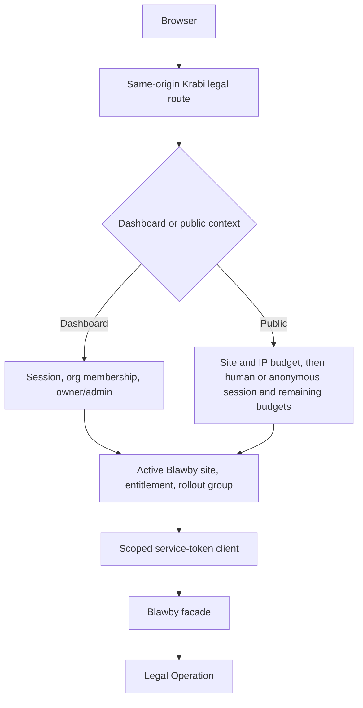
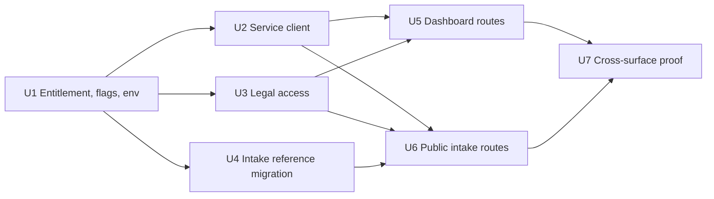

# U9 KrabiClaw Legal BFF - Plan

**Target repository:** KrabiClaw

This coordination artifact is stored in the Blawby repository at the user's request. All paths in this plan are relative to the KrabiClaw repository.

## Goal Capsule

- **Objective:** Eligible KrabiClaw staff and public visitors can use approved legal workflows through same-origin KrabiClaw APIs without receiving Blawby credentials or controlling trusted identity.
- **Means:** Add a server-only Blawby client, Better Auth-backed legal access policy, durable public intake references, and six default-off rollout-group BFF controls (KTD1-KTD5).
- **Authority:** Current KrabiClaw code, tests, `AGENTS.md`, `PRODUCT.md`, and `CONTEXT.md` override historical notes. The origin plan governs the cross-service product contract.
- **Execution profile:** Code and D1 migration changes in the KrabiClaw repository. All rollout-group flags and the new entitlement remain off after merge.
- **Stop conditions:** Stop before enabling any group if `legal_operations` has no reviewed plan mapping, U8 is not deployed for that group, exact credentials or callback URLs are absent, public rate budgets are unset, the new reference table has no reviewed legal/privacy lifecycle, or deployed-browser verification cannot be performed.
- **Tail ownership:** U10 owns environment provisioning, tier activation, rollout, browser evidence, and rollback. U11 remains conditional on the Blawby D1 capacity gate.

### AI Execution Brief (RGCCOV)

- **Role:** Act as a senior KrabiClaw backend engineer with expertise in Cloudflare, Nuxt server APIs, Better Auth, D1, OAuth service clients, and browser-level testing.
- **Goal:** Implement the dormant same-origin U9 BFF so eligible KrabiClaw actors can use the approved U8 facade without exposing Blawby credentials or trusted identity controls to the browser.
- **Context:** This plan is stored in Blawby, but every path and implementation unit targets the KrabiClaw repository. U8 owns the fixed upstream contract, one KrabiClaw backend OAuth client authenticates service calls, and KrabiClaw authorizes each human or anonymous actor.
- **Constraints:** Verify current KrabiClaw code and tests before editing. Follow R1-R31 and KTD1-KTD10 exactly, reuse established identity and site-access models, keep `legal_operations` and all six groups off, and stop when a Goal Capsule stop condition applies.
- **Output:** Produce the service client, policy composition, D1 migration and repository, same-origin routes, minimum caller changes, configuration, and tests defined by Implementation Units U1-U7. Do not map an eligible tier, provision production credentials, or enable traffic.
- **Verification:** Complete every applicable check in the Verification Contract and every acceptance condition in the Definition of Done, including migration, browser-boundary, idempotency, and secret-exposure evidence.

---

## Product Contract

### Summary

Add same-origin dashboard and public legal APIs in KrabiClaw. Staff routes derive an owner/admin actor from Better Auth membership. Public intake routes derive a human or anonymous Better Auth actor, rate-limit it, bind a stable request reference in D1, and call the Blawby facade with a scoped machine token and rebuilt trusted headers.

### Problem Frame

KrabiClaw currently has no legal BFF, Blawby service-token client, legal entitlement, legal rollout-group flags, or durable intake-reference table. Browser requests cannot safely carry Blawby OAuth credentials or trusted external identity headers. The BFF must make the browser user eligible first, then use the one machine credential to call Blawby on that user's behalf.

### Key Decisions

- **Use one machine OAuth client, not one OAuth token relationship per person.** Human and anonymous eligibility remains a KrabiClaw authorization decision. Governs R1-R6. (session-settled: user-approved — chosen over per-person OAuth tokens: the backend authenticates to Blawby while KrabiClaw authenticates each browser actor.)
- **Introduce `legal_operations` but map it to no subscription tier yet.** Every real route fails closed until a later product decision enables at least one tier. Governs R8-R10. (session-settled: user-directed — chosen over guessing an eligible tier: subscription eligibility will be decided later.)
- **Bind anonymous follow-up to a trusted request reference.** KrabiClaw persists the browser's stable request ID and sends it to Blawby only as a rebuilt server header. Governs R14-R18. (session-settled: user-approved — chosen over using the intake UUID as proof: the request binding proves actor continuity.)

### Actors

- A1. A signed-in organization owner or admin uses staff legal operations for an eligible professional-service site.
- A2. A signed-in public visitor uses public intake operations for an eligible site.
- A3. A Better Auth anonymous user uses public intake operations and later follows up only its own bound request.
- A4. The fixed KrabiClaw backend client obtains scoped Blawby tokens and forwards verified tenant and actor facts.
- A5. An editor, unrelated organization member, unbound anonymous visitor, or ineligible site is denied before Blawby.

### Requirements

**Service authentication and trust boundary**

- R1. Browser code calls only same-origin KrabiClaw APIs and never receives the Blawby client ID, client secret, access token, or trusted headers.
- R2. The BFF requests a `client_credentials` token from Blawby with `client_secret_basic`, resource `urn:blawby:legal-api`, and only the exact route-family scope.
- R3. Tokens are cached and request-coalesced per scope and audience with an expiry skew; only U8's stable machine-auth discriminator may clear and refresh the token once.
- R4. The low-level Blawby transport uses one pinned per-environment HTTPS origin, static route metadata, rejected redirects, one attempt, an explicit central timeout, runtime response validation, and no generic mutation or 5xx retry.
- R5. Every BFF call constructs a fresh outbound header allowlist and never copies browser cookies, authorization, forwarding, or inbound `x-krabiclaw-*` values. It creates the reviewed trusted `x-krabiclaw-*` values only from verified server context; engagement acceptance may additionally include the dedicated originating-client-IP value derived from Cloudflare's trusted request context.
- R6. Outbound identity contains the verified organization ID, actor ID, actor kind, and trusted request reference where required; browser body, query, and forwarding headers cannot override them.
- R7. Upstream response bodies, tokens, client secrets, cookies, legal payloads, request references, Checkout session IDs, callback query data, and directory details are never exposed in browser errors or logs.

**Eligibility and rollout gates**

- R8. Add `legal_operations` to the canonical plan entitlement map with a base value of `false` and enable it for no plan in U9.
- R9. Every legal route checks one of six default-off rollout-group flags—practice read, practice mutation, Connect, intake without payment, intake payment, or engagement—and the site's effective `legal_operations` entitlement before calling Blawby.
- R10. Eligible sites must resolve through the existing active Blawby professional-service site helper; code must not compare only the raw stored vertical.
- R11. Staff routes require a current Better Auth session, current organization membership, the active site, and `owner` or `admin` through the existing organization-access guard.
- R12. Editor, non-member, inactive site, non-Blawby site, disabled rollout group, and missing entitlement cases fail before token acquisition.
- R13. Public mutations resolve only the site facts needed to determine its canonical origin, validate Origin, and then check rollout group, entitlement, and the IP/site budget before establishing or reusing a Better Auth session. They next require a verified human or anonymous actor and apply the actor and request-reference budgets. KrabiClaw creates no parallel guest identity model.

**Durable public intake boundary**

- R14. The browser creates a cryptographically random UUID v4 request reference with `crypto.randomUUID()`, persists it in a site-scoped `sessionStorage` entry before its first intake mutation, reuses it after response loss or same-tab navigation, and clears it only after a terminal outcome.
- R15. Before calling Blawby, KrabiClaw persists a request record bound to organization, site, immutable original actor ID and kind, current authorized user when linked, and a versioned keyed digest of the validated create-intake projection.
- R16. Same-reference and same-payload retries recover the existing result; same-reference and different-payload reuse conflicts; unrelated cross-actor or cross-site reuse is forbidden. The only cross-actor continuation allowed is the current authorized user established by the trusted Better Auth link hook in R27.
- R17. The request record stores one unique validated Blawby intake identifier and the current unique validated Checkout session identifier. Null-to-value and same-value updates are allowed; a checkout response may compare-and-set the expected prior session to a Blawby-validated replacement, while a Payment Link return may attach an unbound session only after U8 verifies request reference, intake UUID, organization, and session together. Concurrent stale or conflicting updates fail without overwrite.
- R18. KrabiClaw sends the bound request reference to Blawby in the trusted server header for public create, recovery, checkout, status, and post-pay calls.
- R19. Public traffic passes independent IP/site/operation, actor/site/operation, site/operation aggregate, and request-reference follow-up budgets before Blawby. Positive limits and windows are typed deployment settings owned and approved in U10; missing, invalid, or failed limiter storage denies traffic.

**BFF surface and error contract**

- R20. Dashboard BFF routes mirror the selected practice, Connect, staff intake, and engagement facade operations under `/api/dashboard/legal/**`.
- R21. Public BFF routes mirror only public intake operations under `/api/public/sites/{siteId}/legal/intakes/**`.
- R22. Connect callback URLs are constructed server-side from exact per-environment HTTPS return and refresh settings and never accepted from the browser.
- R23. Browser authentication failures map to 401, KrabiClaw eligibility failures to 403, local rate limits to 429, and reviewed Blawby 4xx responses pass through.
- R24. Malformed or failed upstream authentication and invalid upstream responses become sanitized 502; timeouts and dependency unavailability become sanitized 503 with request correlation.
- R25. Existing KrabiClaw API response and HTTP error conventions remain in force, and dependency failures never become null or empty success data.
- R26. Every cookie-authenticated legal mutation validates `Origin` against the exact configured dashboard origin or the resolved site's canonical public origin, and every legal response is `Cache-Control: no-store`. A Payment Link redirects to a non-mutating KrabiClaw page; that page makes a same-origin POST to the BFF, and only that POST may call U8's server-to-server post-pay GET and attach a session.
- R27. Better Auth account linking preserves immutable anonymous attribution and transfers current request authorization through the trusted link hook with replay-safe, collision-safe behavior.
- R28. The BFF parses and reserializes only reviewed route-family 4xx contracts; unknown, HTML, malformed, oversized, or secret-bearing upstream errors are sanitized.
- R29. Eligibility denials, origin failures, rate-limit trips, request-reference ownership conflicts, and payload conflicts emit a structured security event with request correlation, organization, site, actor kind, and stable denial reason, but no token, payload, request reference, session ID, or upstream body.
- R30. Any Blawby-supplied payment or redirect URL is returned to the browser only after HTTPS parsing and exact-origin validation against a reviewed Stripe payment-origin allowlist; failure is an invalid upstream response.
- R31. The payload digest stores a key identifier; new claims use the active server-only key, existing claims verify with the bounded configured key ring, and rotation cannot silently invalidate recovery or log key material.

### Key Flows

- F1. **Staff legal request**
  - **Trigger:** A dashboard owner or admin calls a legal endpoint for the active site.
  - **Actors:** A1, A4.
  - **Steps:** Resolve session, organization, membership, and site; enforce active Blawby site, flag, entitlement, and organization-wide role; obtain the family token; rebuild trusted headers; call Blawby.
  - **Outcome:** The browser receives a reviewed legal response without service credentials.
  - **Covered by:** R1-R12, R20, R22-R26, R28.
- F2. **Anonymous intake with response loss**
  - **Trigger:** An anonymous visitor submits an intake using a stable request reference and loses the response.
  - **Actors:** A3, A4.
  - **Steps:** Resolve the site origin; validate Origin; check entitlement, rollout group, and IP/site budget; establish or reuse a Better Auth anonymous session; apply actor and request-reference budgets; persist the actor and payload binding; call Blawby; retry using the same request; recover and store the returned intake ID.
  - **Outcome:** One intake exists and only the bound actor can follow it up.
  - **Covered by:** R13-R19, R21, R23-R28.
- F3. **Expired service token**
  - **Trigger:** Blawby returns 401 for a cached token.
  - **Actors:** A4.
  - **Steps:** Verify U8's machine-auth discriminator; clear that scope/audience cache entry; coalesce one new token exchange; retry the same request once; do not retry arbitrary 401 or further failures.
  - **Outcome:** Stable auth refresh succeeds without introducing general mutation retries.
  - **Covered by:** R2-R4.

### Acceptance Examples

- AE1. **Covers R8-R12.** Given any current subscription plan after U9 merges, when a legal route checks eligibility, then it is denied because no tier maps `legal_operations` to true.
- AE2. **Covers R11-R12.** Given an editor who can otherwise access the site, when they call a staff legal route, then KrabiClaw denies it before obtaining a Blawby token.
- AE3. **Covers R14-R18 and R27.** Given an anonymous request reference already bound to actor A and payload X, when an unrelated actor B reuses it or actor A sends payload Y, then KrabiClaw denies the call without creating another intake; a user linked through the trusted hook remains authorized without replacing A's attribution.
- AE4. **Covers R3-R4.** Given concurrent requests for one scope, when no valid token exists, then one token exchange serves all requests; only the reviewed U8 machine-auth discriminator causes one scoped refresh.
- AE5. **Covers R5-R7.** Given browser-supplied service auth and trusted identity headers, when the BFF calls Blawby, then those values are absent and only verified server values are sent.
- AE6. **Covers R22.** Given a browser-provided Connect return URL, when the BFF validates the request, then it ignores or rejects the value and sends only its exact configured callback URLs.
- AE7. **Covers R17.** Given a first Payment Link return with a browser session ID, when the bound request, intake, and organization match, then U8 verifies the session before KrabiClaw attaches it; conflicting reuse never overwrites it.
- AE8. **Covers R19.** Given one IP creates many anonymous actors, when the public limit is evaluated, then the IP and site budgets still stop traffic before Blawby.
- AE9. **Covers R26.** Given a sibling subdomain or missing origin sends a cookie-authenticated mutation, when the BFF checks the request, then it fails before eligibility, token acquisition, or mutation.
- AE10. **Covers R26.** Given a Payment Link redirects to KrabiClaw, when the callback page loads, then page rendering performs no attachment; a missing- or cross-origin post-pay POST fails before D1 lookup or U8 attachment.

### Success Criteria

- Staff authorization proves session, membership, active eligible site, owner/admin role, entitlement, and rollout-group flag before service authentication.
- Anonymous response loss creates one intake and cannot cross actor or site boundaries.
- Token acquisition is scoped, coalesced, bounded, and unavailable to browsers.
- All six legal rollout groups remain inaccessible in deployed code until both their group flag and a reviewed entitlement mapping are enabled.
- Browser network evidence shows no direct request from a browser to the Blawby origin.
- Fresh-origin validation, `no-store` responses, pinned upstream routing, and reviewed error reserialization prevent cross-origin mutation, cache, redirect, and error-body leaks.

### Scope Boundaries

**In scope**

- Server BFF APIs, service-token transport, trusted context construction, eligibility checks, a durable intake-reference migration, and server contract tests.

**Deferred to Follow-Up Work**

- The product decision that maps `legal_operations` to one or more subscription tiers. U9 leaves every tier false.
- Policy for organizations with multiple legal-enabled sites and for transferring a legal-enabled site. U10 must not enable such a site until this policy is reviewed.
- The reviewed retention, export, erasure or pseudonymization, and user-deletion policy for `legal_intake_references`. U10 must not enable public intake until legal/privacy ownership assigns the table to a policy.
- Visitor recovery after total loss of the Better Auth anonymous session. Server-side legal and payment obligations still reconcile from retained records, but visitor access is not restored by request-reference possession alone.
- UI design beyond the minimum caller changes needed to supply and retain stable request references.
- U10 deployment, browser verification, canaries, monitoring, and rollback.
- U11 D1-bound Worker transport if the Blawby capacity gate fails.

**Out of scope**

- Per-person Blawby OAuth, browser-held service tokens, custom role parsing, a second anonymous principal, platform-admin bypass, invoices, and general-purpose upstream retries.

### Sources

- Blawby origin: `docs/plans/2026-08-08-001-feat-krabiclaw-legal-facade-plan.md`
- KrabiClaw: `AGENTS.md`
- KrabiClaw: `PRODUCT.md`
- KrabiClaw: `CONTEXT.md`
- KrabiClaw: `docs/operations/release-and-outage-prevention.md`
- KrabiClaw: `server/utils/auth.ts`
- KrabiClaw: `server/utils/dashboard-context.ts`
- KrabiClaw: `server/utils/member-access.ts`
- KrabiClaw: `server/utils/professional-services.ts`
- KrabiClaw: `server/utils/billing-entitlements.ts`
- KrabiClaw: `server/utils/billing-access.ts`
- KrabiClaw: `server/utils/hourly-rate-limit.ts`
- KrabiClaw: `server/api/public/review-requests/bind-session.post.ts`
- KrabiClaw: `composables/useBookingHandoff.ts`
- Better Auth OAuth Provider documentation: `https://better-auth.com/docs/plugins/oauth-provider`

---

## Planning Contract

### Key Technical Decisions

- KTD1. **Keep the transport small, pinned, and server-only.** `server/utils/blawby-client.ts` owns token exchange, scoped cache and coalescing, pinned-origin static routes, rejected redirects, fresh allowlisted headers, timeout, runtime parsing, and upstream error classification; it does not own route eligibility or domain workflows.
- KTD2. **Reuse Better Auth and site policy.** A legal access helper composes current session, membership, `assertOrganizationAccess`, active Blawby site resolution, effective entitlement, and rollout-group checks without shadow roles or memberships.
- KTD3. **Make entitlement and rollout groups independent.** `legal_operations` expresses product eligibility, while six default-off group flags isolate practice read, practice mutation, Connect, intake without payment, intake payment, and engagement. Both checks must allow a request.
- KTD4. **Claim the public idempotency binding atomically before the network call.** A single atomic upsert-return claim owns the request, immutable actor/site fields, and versioned keyed payload digest. Intake attachment cannot overwrite another value; Checkout replacement requires compare-and-set against the expected current value returned to that caller.
- KTD5. **Treat stable request references as browser-generated claims that gain authority only after server binding.** The BFF validates a UUID, binds it before mutation, and rebuilds it as a trusted outbound header. (session-settled: user-approved — chosen over intake UUID possession: only the bound actor can reuse the claim.)
- KTD6. **Keep low-level retries disabled.** Token refresh, same-key intake recovery, and same-operation Connect recovery are explicit higher-level branches; network errors and 5xx responses are not automatically replayed.
- KTD7. **Use exact server callback settings.** One reviewed return URL and refresh URL per environment are typed and verified during deployment; they carry no caller-selected tenant or session data, browser input cannot select them, and the authenticated KrabiClaw session restores flow context.
- KTD8. **Follow existing route placement.** Staff endpoints live under `server/api/dashboard/legal/`; public intake endpoints live under `server/api/public/sites/[siteId]/legal/intakes/`.
- KTD9. **Preserve anonymous-to-human continuity through Better Auth.** The existing trusted account-link hook may set a separate currently authorized user once while retaining original anonymous ID and kind for audit; collisions fail closed.
- KTD10. **Create Connect recovery keys before mutation.** The dashboard caller creates a cryptographically random UUID v4, keeps it in an organization-and-operation-scoped `sessionStorage` entry, and reuses it after response loss. The BFF validates it and U8 binds it to the authorized organization; no separate KrabiClaw Connect-recovery table is added.

### High-Level Technical Design



```mermaid
sequenceDiagram
  participant B as Browser
  participant K as Krabi BFF
  participant D as Krabi D1
  participant F as Blawby facade
  B->>B: Create and retain request_id
  B->>K: Submit intake with request_id
  K->>K: Resolve site origin and validate Origin
  K->>K: Verify site, entitlement, group, and IP/site budget
  K->>K: Establish or reuse session; verify actor and remaining budgets
  K->>D: Bind actor, site, request_id, payload hash
  K->>F: Create with scoped token and trusted request header
  F-->>K: Intake result
  K->>D: Store Blawby intake ID
  K-->>B: Result
  Note over B,K: Response may be lost
  B->>K: Retry same request_id and payload
  K->>D: Verify existing binding
  K->>F: Recover by request_id
  F-->>K: Original result
  K-->>B: Original result
```

### Output Structure

```text
server/
  api/
    dashboard/legal/
      practice/
      connect/
      intakes/
      engagement-contracts/
    public/sites/[siteId]/legal/intakes/
  utils/
    blawby-client.ts
    legal-access.ts
    legal-intake-references.ts
tests/
  unit/
  e2e/
migrations/
```

The route tree mirrors the U8 operations. Exact leaf filenames follow Nuxt's method-suffix convention during implementation, except that the browser-facing post-pay action is a same-origin POST adapter over U8's server-to-server GET.

### Data Model

`legal_intake_references` is the durable KrabiClaw authorization and recovery record. It contains:

- A unique UUID request reference.
- Original organization and site identifiers.
- A versioned keyed digest and digest-key identifier over a sorted, allowlisted, schema-parsed create-intake projection; array order and legal fact whitespace/case are preserved.
- Separate unique nullable Blawby intake UUID and current Stripe Checkout session ID populated only from validated upstream results. Checkout replacement uses compare-and-set against the expected prior session; first-use Payment Link attachment requires null.
- Immutable original actor ID/kind plus a separate nullable current authorized user set only by the trusted Better Auth link hook.
- Created and updated timestamps plus indexes for site/actor ownership lookup.

The migration must not cascade-delete legal request attribution. Retention, export, erasure, transfer, and pseudonymization behavior remain subject to the legal/privacy policy and the deferred multi-site/transfer decision.

### Implementation Constraints

- Reuse `getAuthSession`, current organization adapters, `assertOrganizationAccess`, `getActiveBlawbySite`, `getEffectiveAccessPlan`, and the canonical entitlement map.
- Use `normalizeVertical()` only when a raw vertical must be inspected; prefer the active Blawby site helper.
- Keep application fetch retry at zero and centralize the timeout.
- Use current `apiErrorResponse`, `rethrowHttpError`, `httpErrorDetails`, and request-correlation conventions.
- Generate the D1 migration from `server/db/schema.ts`; never edit historical migrations or metadata manually.
- Do not add a reusable HTTP platform, token framework, role parser, entitlement table, or anonymous-session model.

### Sequencing



### Risks and Dependencies

- The entitlement maps to no plan by design, so production behavior remains denied until U10 records a product decision and mapping change.
- A browser can lose the first response before learning a server-generated ID. R14 makes the browser establish the stable reference first.
- Isolate-local token caches are not global coordination. That is acceptable because tokens are short-lived credentials, while only requests within an isolate need coalescing.
- Site transfer and multiple legal-enabled sites can change ownership semantics. These configurations remain ineligible until the deferred policy is resolved.
- Real HTTP token exchange behavior must be proven against the installed Better Auth versions and deployed U8 endpoint, not inferred from programmatic unit helpers.
- The U8 route, rollout-group, error, machine-auth, request-reference create/recovery, and originating-client-IP contracts must be merged or frozen before U9 response parsers and route adapters are finalized; deployed end-to-end validation still waits for U8 staging.
- A leaked machine token can assert any organization within its granted family scope. This accepted machine-trust boundary is limited by short token lifetime, six bilateral rollout groups, U8 client/family ceilings, server-only secret storage, and U10 revocation and emergency procedures.
- The public limiters and durable claim share D1. D1 failure therefore denies public legal traffic by design; U10's capacity and availability gates cover the combined query load.
- Digest-key rotation retains only the bounded previous keys needed by stored key identifiers; removing a referenced key is a reviewed migration or retention action, not an ordinary secret replacement.

---

## Implementation Units

### U1. Add fail-closed entitlement, rollout groups, and environment contract

- **Goal:** Define legal eligibility and deployment configuration without enabling any real user.
- **Requirements:** R8-R13, R19, R22, R31.
- **Dependencies:** None.
- **Files:**
  - `server/utils/billing-entitlements.ts`
  - `server/utils/feature-flags.ts`
  - `server/utils/auth.ts`
  - `wrangler.toml`
  - `scripts/check-deploy-env.mjs`
  - `tests/unit/billing-plans.test.ts`
  - `tests/unit/legal-feature-flags.test.ts` (new)
  - deployment workflow files that provision environment-specific secrets
- **Approach:**
  1. Add `legal_operations: false` to the base entitlement and leave every plan override unchanged.
  2. Add separate default-off flags for practice read, practice mutation, Connect, intake without payment, intake payment, and engagement.
  3. Type the pinned Blawby origin, OAuth client credentials, audience, exact callback URLs, timeout, public-limit values/windows, and active plus bounded previous intake-digest keys.
  4. Keep secrets out of `wrangler.toml` plaintext. Dormant deployments with every group off may omit credentials; deployment validation requires credentials, callback URLs, and positive public budgets before their corresponding group can be enabled.
- **Test scenarios:**
  - Free, growth, managed, unknown, inactive, and expired access plans all return `legal_operations: false`.
  - Missing, empty, or unrecognized group flags are false; reviewed true values enable only their own route subset.
  - Dormant deployment validation passes without Blawby credentials, while enabling any group fails on its missing credential or endpoint contract.
  - Deployment validation rejects a missing required secret, userinfo, fragment, unexpected port, non-exact origin, non-HTTPS callback URL, or missing/invalid public budget without printing sensitive values.
- **Verification:** Configuration is typed and validated, but no subscription or rollout group can reach Blawby.

### U2. Build the scoped Blawby service client

- **Goal:** Provide one bounded server transport for U8 with safe token reuse and error handling.
- **Requirements:** R1-R7, R23-R25, R28-R29.
- **Dependencies:** U1 and a merged or frozen U8 route, error, and machine-auth contract.
- **Files:**
  - `server/utils/blawby-client.ts` (new)
  - `server/utils/blawby-contracts.ts` (new only if response schemas are reused across route files)
  - `tests/unit/blawby-client.test.ts` (new)
- **Approach:**
  1. Request tokens using `client_secret_basic`, the exact audience, and one family scope.
  2. Cache successful tokens by scope and audience with renewal skew and coalesce concurrent exchanges.
  3. Construct a fresh header set containing only content type, bearer token, verified identity, optional request reference, correlation ID, and the Cloudflare-derived originating client IP only for engagement acceptance.
  4. Apply one central timeout and runtime-parse every token and facade response.
  5. On U8's machine-auth discriminator, invalidate only that cache key, refresh once, and replay once; classify arbitrary 401 and every other failure without retry.
- **Test scenarios:**
  - Concurrent requests for one scope perform one token exchange.
  - Different scopes never share a token cache entry.
  - Near-expiry tokens renew; valid tokens are reused.
  - One discriminated machine-auth failure refreshes and replays once; a domain 401 and a second auth failure stop.
  - Timeout, network error, 5xx, malformed JSON, and schema mismatch do not trigger a mutation retry.
  - Browser cookies, forwarding headers, `Authorization`, and unrelated headers are absent; inbound `x-krabiclaw-*` values cannot alter the freshly constructed reviewed trusted values.
  - Engagement acceptance forwards the trusted Cloudflare client IP; every other route omits it, and browser-supplied forwarding values never affect it.
  - Absolute and scheme-relative path overrides, encoded host escapes, redirects, wrong hosts, userinfo, fragments, and unexpected ports are rejected without credential forwarding.
  - Errors contain request correlation but no upstream token, secret, or body.
- **Verification:** The unit contract proves scope isolation, coalescing, bounded retry, timeout, parsing, and sanitization.

### U3. Compose legal access and actor context

- **Goal:** Resolve eligible staff and public actors from existing KrabiClaw identity, site, billing, and template policy.
- **Requirements:** R8-R13, R19, R29.
- **Dependencies:** U1.
- **Files:**
  - `server/utils/legal-access.ts` (new)
  - `server/utils/professional-services.ts`
  - `server/utils/hourly-rate-limit.ts` only if a small domain-specific key helper belongs there
  - `tests/unit/legal-access.test.ts` (new)
- **Approach:**
  1. Compose existing session, organization membership, active Blawby site, effective entitlement, and rollout-group flag helpers.
  2. Require `assertOrganizationAccess` for staff; site-wide editor access is insufficient.
  3. For public routes, resolve site, group, entitlement, and the IP/site budget before session creation; then require a verified Better Auth human or anonymous session and derive actor kind from `isAnonymous`.
  4. Apply the remaining actor, site aggregate, and request-reference budgets using the current rate-limit table and increment helper; all applicable checks must pass.
  5. Emit the redacted structured security events required by R29 from this shared boundary and from the durable-claim conflict classifier.
- **Patterns to follow:** `server/utils/dashboard-context.ts`, `server/utils/member-access.ts`, `server/utils/professional-services.ts`, and `server/api/public/review-requests/bind-session.post.ts`.
- **Test scenarios:**
  - An owner and admin pass staff policy when the site, entitlement, and flag pass.
  - An editor, non-member, and user from another organization fail.
  - Inactive, onboarding-incomplete, non-Blawby, disabled, and unentitled sites fail before token acquisition.
  - Verified human and anonymous public sessions produce distinct actor kinds.
  - Missing session and fabricated anonymous identifiers fail.
  - A disabled, unentitled, or IP-limited public request creates no anonymous user or session row.
  - Rotating anonymous actors on one IP, rotating IPs for one actor, site-wide saturation, and repeated request-reference probes each hit their own budget.
  - D1 limiter failure denies the request instead of bypassing the limit.
  - Log capture proves policy, origin, limiter, ownership, and payload-conflict events contain stable diagnostic fields but no request reference, legal payload, session ID, token, or upstream body.
- **Verification:** Policy tests prove KrabiClaw decides human eligibility without custom auth or role parsing.

### U4. Add durable intake-reference persistence

- **Goal:** Bind each public intake request to one site, actor, and immutable payload before calling Blawby.
- **Requirements:** R14-R18, R27, R29, R31.
- **Dependencies:** U1.
- **Files:**
  - `server/db/schema.ts`
  - generated `migrations/` SQL and `migrations/meta/` artifacts
  - `server/utils/legal-intake-references.ts` (new)
  - `server/utils/auth.ts` (trusted account-link hook integration)
  - `tests/unit/legal-intake-references.test.ts` (new)
  - `tests/unit/migration-safety.test.ts`
- **Approach:**
  1. Add the `legal_intake_references` table and indexes described in the Data Model.
  2. Build a versioned keyed digest with its active key identifier from an allowlisted schema-parsed projection before the first network call; verification selects only the bounded configured key identified by the row.
  3. Use one atomic upsert-return claim and then classify same-request recovery, payload conflict, and ownership denial without raw transactions or check-then-insert.
  4. Attach the unique validated Blawby intake with null-to-value or same-value semantics. Attach the current Checkout session the same way for Payment Link, and use expected-prior compare-and-set only for a replacement returned by Blawby's checkout operation.
  5. Extend the trusted Better Auth link hook to set current authorization without changing original actor attribution.
  6. Generate and inspect the migration using the current D1 workflow.
  7. Report ownership and payload conflicts through R29's redacted security-event contract.
- **Test scenarios:**
  - A new request persists its binding before a mocked Blawby call starts.
  - Concurrent same-actor and same-payload claims resolve to one record.
  - Same reference with a different payload conflicts.
  - Another actor, site, or organization cannot load or update the record.
  - Upstream failure leaves the request recoverable with the original immutable binding.
  - Concurrent conflicting intake or Checkout attachments have one winner and never overwrite ownership fields.
  - Two request references cannot bind the same Blawby intake or Checkout session.
  - Different object-key order yields the same digest, array order and legal fact whitespace remain significant, and digest versions do not collide silently.
  - Rotating to a new active digest key preserves recovery for records bearing a configured previous key identifier; an unknown key identifier fails closed without logging key material.
  - Anonymous-to-human linking is replay-safe, rejects a conflicting human binding, and preserves original actor attribution.
- **Verification:** Schema, migration, and repository tests prove durable recovery and cross-tenant isolation.

### U5. Add dashboard legal BFF routes

- **Goal:** Expose owner/admin practice, Connect, staff intake, and engagement operations through same-origin dashboard APIs.
- **Requirements:** R1-R12, R20, R22-R26, R28-R30.
- **Dependencies:** U2, U3, and the frozen U8 route contract.
- **Files:**
  - new route files under `server/api/dashboard/legal/practice/`
  - new route files under `server/api/dashboard/legal/connect/`
  - new route files under `server/api/dashboard/legal/intakes/`
  - new route files under `server/api/dashboard/legal/engagement-contracts/`
  - minimum dashboard caller code that creates, scopes, retains, and clears the Connect `request_key`
  - `tests/unit/dashboard-legal-api.test.ts` (new)
  - focused dashboard Connect browser test under `tests/e2e/`
- **Approach:**
  1. Match the U8 method/path contract with Nuxt method-suffixed route files.
  2. Resolve legal staff access before invoking the scoped client.
  3. Validate mutation origin against the exact dashboard origin before eligibility or token acquisition.
  4. Remove identity and callback fields from browser DTOs; derive identity and Connect URLs server-side.
  5. Parse and reserialize reviewed Blawby 4xx contracts and map every unknown transport response through the sanitized Krabi error contract.
  6. Require the browser to create and retain an organization-and-operation-scoped Connect UUID v4 in `sessionStorage` before mutation; validate and forward it so U8's organization-bound recovery record resumes the same operation after response loss.
- **Test scenarios:**
  - Owner and admin calls produce correct family scope and trusted headers.
  - Editor, cross-org, disabled, and unentitled calls never request a service token.
  - Browser-supplied identity, auth, and callback fields cannot alter the outbound request.
  - Missing, cross-origin, sibling-subdomain, and untrusted custom-domain mutation origins fail; the exact dashboard origin succeeds.
  - A Connect response-loss retry reuses the same request key and does not start a different operation.
  - Reusing a Connect key across organizations fails, and a completed operation clears only its own scoped browser entry.
  - Reviewed Blawby 4xx errors pass through; upstream auth, timeout, and invalid response failures are sanitized.
- **Verification:** Every staff U8 route has one same-origin adapter and no direct browser-to-Blawby path.

### U6. Add public intake BFF routes

- **Goal:** Expose actor-bound public intake creation, recovery, payment, and status routes.
- **Requirements:** R1-R10, R13-R21, R23-R31.
- **Dependencies:** U2-U4 and the frozen U8 route contract.
- **Files:**
  - new route files under `server/api/public/sites/[siteId]/legal/intakes/`
  - minimum public caller code that creates and retains `request_id`
  - `tests/unit/public-legal-intakes-api.test.ts` (new)
  - `tests/e2e/legal-intake.spec.ts` (new)
- **Approach:**
  1. Resolve only the site's canonical-origin facts, validate mutation Origin, then check the active site, entitlement, rollout group, and IP/site budget; denied requests stop without creating an anonymous identity.
  2. Establish or reuse the Better Auth session, require the site-scoped `sessionStorage` request reference, and apply actor, site aggregate, and request-reference budgets.
  3. Bind create payload before calling Blawby, send the request reference on both create and recovery, and recover by request reference after response loss.
  4. For embedded Checkout, attach only the session returned in a validated Blawby response.
  5. For a first Payment Link return, render a non-mutating callback page and have it submit the unbound session through the exact-origin BFF POST with the bound request and intake; attach it only after U8 verifies all correlations.
  6. Store only validated Blawby intake and Checkout session references, exact-origin validate any returned payment URL against the reviewed Stripe allowlist, and return every legal response as `no-store`.
- **Test scenarios:**
  - A human and anonymous visitor can create under an injected entitled state and enabled intake flag.
  - Missing anonymous session, cross-actor request, cross-site request, and payload-hash conflict fail before Blawby.
  - Simulated response loss followed by the same request returns one Blawby intake.
  - Checkout and post-pay require a matching bound intake and Checkout reference.
  - First-use Payment Link return, replay, conflicting session, wrong intake, and wrong request reference follow the two-phase binding contract.
  - A validated replacement Checkout response compare-and-sets the expected prior session; a concurrent stale replacement cannot overwrite it.
  - Exceeding any independent public budget returns the local rate-limit contract.
  - Anonymous signup preserves access through the trusted link hook without changing original audit attribution.
  - The Payment Link callback page performs no lookup or attachment during GET rendering; missing, sibling-subdomain, and cross-origin post-pay POSTs fail, and every success and error response is `no-store`.
  - Non-HTTPS, wrong-origin, userinfo, redirected, or malformed upstream payment URLs become sanitized invalid-upstream responses.
  - Browser network capture contains only KrabiClaw requests and no Blawby origin or OAuth data.
- **Verification:** Unit and focused Playwright coverage prove continuity, isolation, response-loss recovery, and browser boundary.

### U7. Prove the dormant cross-surface contract

- **Goal:** Verify U9 as deployed code while keeping every real legal route inaccessible.
- **Requirements:** R1-R31.
- **Dependencies:** U5 and U6, plus U8 available in a test or staging environment.
- **Files:**
  - `tests/unit/blawby-client.test.ts`
  - `tests/unit/dashboard-legal-api.test.ts`
  - `tests/unit/public-legal-intakes-api.test.ts`
  - `tests/e2e/legal-intake.spec.ts`
  - `docs/operations/release-and-outage-prevention.md` only if the new route matrix needs a reusable release checklist update
- **Approach:**
  1. Exercise the real HTTP token exchange against U8 in a controlled environment.
  2. Prove all real subscription plans deny `legal_operations` after merge.
  3. Use test-only dependency injection or fixtures to exercise entitled route contracts without enabling production policy.
  4. Verify the exact deployed candidate in a real browser and record that this is dormant verification, not traffic approval.
- **Test scenarios:**
  - The installed Better Auth clients successfully perform the expected `client_secret_basic` wire exchange.
  - A real current plan remains denied even if a rollout-group flag is true.
  - Injected entitlement plus the exact group flag reaches only the matching U8 rollout group and scope.
  - The test-only entitlement and flag injection seam is absent from a production build.
  - All six rollout groups remain denied when their flag is missing.
  - The browser shows no direct Blawby request and no upstream secret in failures.
- **Verification:** Code, migration, server contracts, and deployed-browser behavior are proven separately, with no entitlement tier or rollout group enabled for real traffic.

---

## Verification Contract

| Gate                                                   | Applies to | Completion signal                                                                   |
| ------------------------------------------------------ | ---------- | ----------------------------------------------------------------------------------- |
| Focused Node unit tests                                | U1-U7      | Token, policy, persistence, and API contract scenarios pass.                        |
| `yarn db:generate` and migration inspection            | U4         | Generated SQL adds only the intended table and indexes.                             |
| `yarn migrate:check` and local schema application      | U4         | Migration safety and local application pass without editing history.                |
| `yarn typecheck`                                       | U1-U7      | No TypeScript errors.                                                               |
| `yarn lint:better-auth-boundaries`                     | U2-U7      | No custom auth, role, or permission boundary is introduced.                         |
| `yarn lint:data-loading` and `yarn lint:product-model` | U3-U7      | Route data loading and vertical model remain compliant.                             |
| `yarn lint`                                            | U1-U7      | Touched files introduce no lint errors.                                             |
| `yarn build`                                           | U5-U7      | Cloudflare-module build succeeds with typed bindings.                               |
| Focused Playwright legal flow                          | U6-U7      | Exact deployed candidate proves same-origin browser traffic and anonymous recovery. |

Green CI is not deployment approval. U7 records code landed, staging deployed, and staging browser verified as separate facts.

---

## Definition of Done

- The server-only client uses one fixed machine credential, exact scope, coalesced expiry-aware tokens, central timeout, runtime validation, and bounded 401 refresh.
- Browser-controlled auth, trusted headers, tenant identity, and Connect callbacks cannot reach Blawby.
- Staff routes require Better Auth owner/admin membership plus active Blawby site, entitlement, and rollout-group flag.
- Public routes require a verified human or anonymous session, all independent rate-limit budgets, and a durable request binding.
- Cookie-authenticated mutations enforce exact-origin checks, and all legal responses are `no-store`.
- Public abuse control uses independent IP, actor, site, and request-reference budgets that fail closed with the limiter.
- Anonymous create and follow-up cannot cross actor, site, organization, payload, intake, or Checkout-session boundaries.
- Anonymous-to-human account linking preserves original attribution and current authorization without conflicting rebinding.
- `legal_operations` exists but is true for no current plan, and all six rollout-group flags default off.
- D1 schema and generated migration pass the repository's safety workflow.
- Unit, type, lint, build, and focused browser gates meet the Verification Contract.
- No traffic is enabled, no product tier is guessed, and no multi-site or transfer policy is silently assumed.
- Final diff review removes dead code, duplicate auth logic, permissive identity handling, generic retries, and abandoned attempts.
