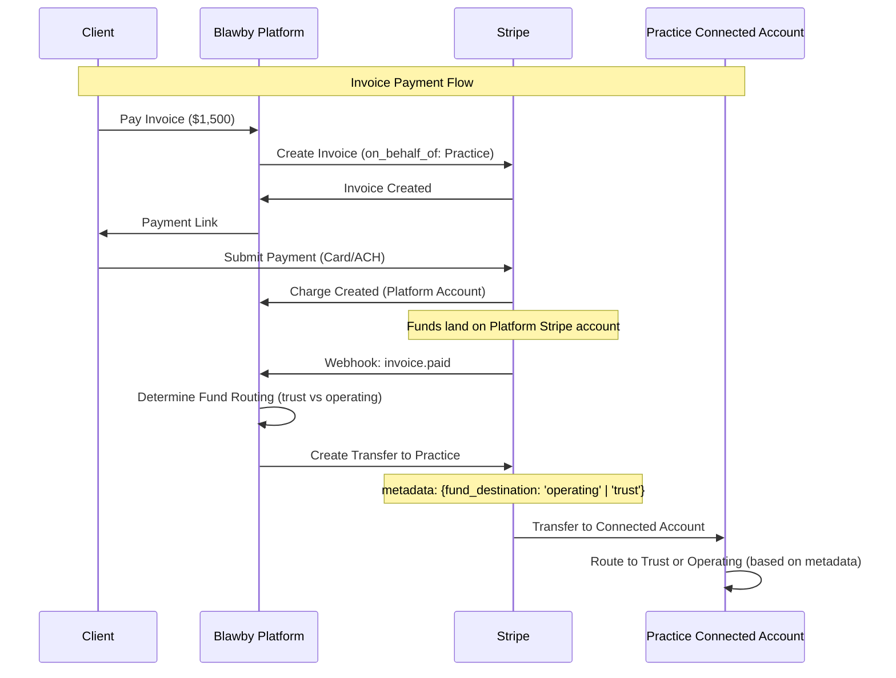
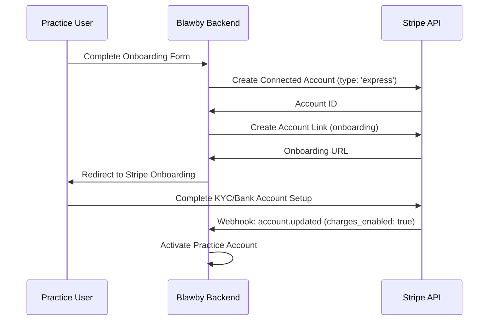

# Stripe Connect Architecture Model

**Document Version**: 1.0
**Last Updated**: 2026-02-13
**Owner**: Blawby Engineering
**Related**: [Issue #74 - Billing/invoicing plan](https://github.com/Blawby/blawby-backend/issues/74)

---

## Overview

Blawby uses **Stripe Connect with Separate Charges and Transfers** to process payments for legal practices. This document defines the architectural decisions, fund flows, liability model, and operational implications of this approach.

---

## Stripe Connect Model: Separate Charges and Transfers

### Model Selection

**Chosen Model**: Separate Charges and Transfers
**Alternative Models Considered**:
- Destination Charges (rejected - less control over fund routing)
- Direct Charges (rejected - Practice would need full Stripe onboarding)

### Why This Model

The Separate Charges and Transfers model gives the Platform maximum control over:
1. **Fund routing** - Critical for legal billing (trust vs operating account routing)
2. **Payment experience** - Unified client experience across all practices
3. **Dispute handling** - Centralized dispute management
4. **Compliance** - Platform can enforce proper fund routing metadata

---

## Payment Flow Architecture

### High-Level Flow

```
Client → Platform (Charge) → Platform (Hold) → Practice Connected Account (Transfer)
```

### Detailed Sequence



---

## Charge Flow

### 1. Charge Creation

**Who Creates the Charge**: Blawby Platform
**Stripe Account**: Platform's Stripe account
**API Method**: `stripe.invoices.create()` with `on_behalf_of` parameter

```typescript
// Example from stripe-invoices.service.ts
const invoice = await stripe.invoices.create({
  customer: stripeCustomerId,
  on_behalf_of: practiceConnectedAccountId, // Links charge to Practice
  collection_method: 'send_invoice',
  auto_advance: true,
});
```

### 2. Statement Descriptor

**What Client Sees on Bank Statement**:
- Primary: "Blawby" or Platform name
- Secondary: Practice name (via `on_behalf_of`)

**Format**: `BLAWBY* [Practice Name]`

**Implication**: Clients know they're paying through Blawby, associated with their Practice.

### 3. Payment Methods Accepted

- Credit/Debit Cards (Visa, Mastercard, Amex, Discover)
- ACH Bank Transfers (US only)
- Future: Wire transfers (manual reconciliation)

---

## Transfer Flow

### 1. Transfer Creation

**When**: Immediately after `invoice.paid` webhook (no escrow holding for legal fees)
**API Method**: `stripe.transfers.create()`

```typescript
// From invoice-webhooks.service.ts:61-72
const transfer = await stripe.transfers.create({
  amount: stripeInvoice.amount_paid,  // Full amount (Platform doesn't keep any)
  currency: 'usd',
  destination: practiceConnectedAccountId,
  metadata: {
    invoice_id: invoice.id,
    invoice_type: invoice.invoice_type,        // flat_fee | retainer_deposit | phase_fee
    fund_destination: invoice.fund_destination, // operating | trust
    matter_id: invoice.matter_id,
  },
});
```

### 2. Transfer Timing

| Invoice Type | Transfer Timing | Hold? |
|--------------|----------------|-------|
| `flat_fee` | Immediate (upon payment cleared) | NO |
| `phase_fee` | Immediate (upon payment cleared) | NO |
| `retainer_deposit` | Immediate (upon payment cleared) | NO |

**No Escrow**: Funds transfer immediately after Stripe confirms payment. Platform does NOT hold funds.

### 3. Transfer Metadata (Critical for Legal Compliance)

The `metadata` object tells the Practice how to route funds:

```typescript
{
  fund_destination: 'operating' | 'trust',
  invoice_type: 'flat_fee' | 'retainer_deposit' | 'phase_fee',
  invoice_id: string,
  matter_id: string,
}
```

**Practice Responsibility**: Practice must configure their bank accounts/systems to route:
- `fund_destination: 'trust'` → IOLTA/Trust Account
- `fund_destination: 'operating'` → Business Operating Account

**Platform Responsibility**: Platform provides metadata; Practice executes routing.

---

## Merchant of Record

### Who is the Merchant of Record?

**Blawby Platform** is the merchant of record for all transactions.

### What This Means

| Aspect | Platform Responsibility | Practice Responsibility |
|--------|------------------------|-------------------------|
| **Chargebacks** | Platform handles disputes | Practice provides case documentation |
| **Refunds** | Platform initiates refunds | Practice approves/requests refunds |
| **Tax Reporting** | Platform issues 1099s (if applicable) | Practice reports income from transfers |
| **PCI Compliance** | Platform maintains PCI DSS compliance | Practice not exposed to card data |
| **Payment Failures** | Platform notifies client + practice | Practice follows up with client |

---

## Dispute Liability

### Dispute Flow

```
Client Dispute → Bank/Card Network → Stripe → Platform → Practice
```

### Liability Model

1. **Initial Liability**: Platform holds initial liability for all chargebacks
2. **Investigation**: Practice provides evidence (engagement letter, work product, communications)
3. **Resolution**:
   - **Dispute Won**: Funds remain with Practice
   - **Dispute Lost**: Platform initiates reversal transfer from Practice

### Reversal Transfer

**API Method**: `stripe.transfers.createReversal()`

```typescript
// If dispute lost and Practice must return funds
const reversal = await stripe.transfers.createReversal(
  originalTransferId,
  {
    amount: disputedAmount,
    metadata: {
      reason: 'chargeback_lost',
      dispute_id: stripeDisputeId,
    },
  }
);
```

**Practice Impact**: Practice must maintain sufficient balance to cover potential reversals.

---

## Refund Origination

### Who Can Initiate Refunds?

**Platform-Side Only**: Refunds must be initiated from the Platform Stripe account, not the Practice Connected Account.

### Refund Flow

```
Practice Request → Platform API → Stripe Refund API → Client
```

### Refund Types

| Refund Type | Requires Transfer Reversal? | API Flow |
|-------------|----------------------------|----------|
| **Full Refund** (before transfer) | NO | `stripe.refunds.create()` only |
| **Full Refund** (after transfer) | YES | `stripe.refunds.create({ reverse_transfer: true, refund_application_fee: true })` |
| **Partial Refund** | YES (if transfer already sent) | `stripe.refunds.create({ amount, reverse_transfer: true, refund_application_fee: true })` |

### Implementation

```typescript
// Preferred implementation: single refund call with implicit transfer reversal.
const refund = await stripe.refunds.create({
  payment_intent: invoice.stripe_payment_intent_id,
  amount: refundAmount,
  reverse_transfer: true,
  refund_application_fee: true,
  metadata: {
    invoice_id: invoice.id,
    reason: 'client_request',
  },
});
```

---

## Platform Fee Model

### Fee Structure

**Platform does NOT deduct from transfers**. Instead, Platform charges Practices monthly via **Stripe Billing with Metered Usage**.

### Why Metered Billing (Not Transfer Fees)?

| Approach | Why NOT Used |
|----------|-------------|
| Application Fee on Transfer | Violates legal ethics - Platform can't "take" from client payments |
| Transfer Destination Charges | Less control over fund routing |

**Chosen Approach**: Platform transfers full client payment → Separately bills Practice monthly

### Metered Event Recording

```typescript
// From invoice-webhooks.service.ts:129-134
await meteredProductsService.reportMeteredUsage(
  tx,
  invoice.organization_id,
  METERED_TYPES.INVOICE_FEE, // Metered event type
  1, // 1 invoice processed
);
```

### Billing Cycle

- **Metered Events**: Recorded in real-time on invoice payment
- **Aggregation**: Monthly (Stripe aggregates events per subscription period)
- **Billing**: Practice charged monthly subscription invoice with metered line items

---

## Connected Account Setup

### Practice Onboarding Flow



### Connected Account Type

**Type**: Express Connect
**Why**: Faster onboarding, Stripe handles compliance, Platform maintains control

**Requirements for Practice**:
- Business information (EIN, business type, address)
- Bank account details (for receiving transfers)
- Identity verification (SSN/EIN, DOB for principals)
- Business documentation (if requested by Stripe)

### Bank Account Configuration

**Standard Setup**: Single bank account (operating account)

**Advanced Setup** (for trust accounting):
- Primary: Operating/Business Account
- Secondary: Trust/IOLTA Account (via Stripe Dashboard or API)

**Metadata-Based Routing**: Platform sends `fund_destination` metadata; Practice routes internally OR configures separate Stripe external accounts.

---

## Security & Compliance

### PCI DSS Compliance

**Responsibility**: Platform (Blawby)
**Implementation**: Stripe handles card data; Platform never touches raw card numbers

### Trust Accounting (IOLTA Compliance)

**Responsibility**: Practice (Attorney)
**Platform Role**: Provide metadata to indicate trust deposits
**Practice Role**: Maintain proper trust accounting records, reconcile transfers

### Data Retention

| Data Type | Retention Period | Location |
|-----------|-----------------|----------|
| Payment Records | 7 years | Platform database + Stripe |
| Invoice History | Indefinite (until deleted) | Platform database |
| Transfer Metadata | 7 years | Platform database |
| Dispute Records | 7 years + 90 days | Stripe + Platform |

---

## Operational Considerations

### Transfer Timing

**Standard ACH**: 2-7 business days
**Instant Payouts** (if enabled): 30 minutes
**Card Payments**: Available for transfer immediately after charge succeeds

### Transfer Failures

**Common Causes**:
- Connected account not fully verified
- Bank account closed/invalid
- Insufficient Platform balance (rare - only if refunds exceed new payments)

**Handling**:
- Webhook: `transfer.failed` (future implementation)
- Retry logic with exponential backoff
- Alert Practice and Platform admin

### Negative Balance Protection

**Platform**: Maintains reserve to cover refunds/disputes
**Practice**: Stripe may hold reserves if high chargeback risk

---

## Future Enhancements

### Planned

1. **Instant Payouts**: Enable for Practices that need same-day access
2. **Multi-Currency**: Support CAD for Canadian practices
3. **Wire Transfer Reconciliation**: Match wire payments to invoices
4. **Automated Reversal Handling**: Auto-reverse on dispute loss

### Under Consideration

1. **Direct Charges Option**: For large firms that want to be merchant of record
2. **Platform-Managed Trust**: Escrow service for retainer deposits (regulatory complexity)

---

## API Reference

### Key Stripe APIs Used

| API | Purpose | File |
|-----|---------|------|
| `stripe.invoices.create()` | Create invoice for client | `stripe-invoices.service.ts` |
| `stripe.transfers.create()` | Transfer to Practice | `invoice-webhooks.service.ts` |
| `stripe.transfers.createReversal()` | Reverse for refund/dispute | (future) |
| `stripe.refunds.create()` | Refund client payment | (future) |
| `stripe.accounts.create()` | Onboard Practice | `stripe-connected-accounts.service.ts` |

### Webhook Events Handled

| Event | Handler | Action |
|-------|---------|--------|
| `invoice.paid` | `handleInvoicePaid` | Transfer to Practice |
| `invoice.payment_failed` | `handleInvoicePaymentFailed` | Update status, notify |
| `invoice.voided` | `handleInvoiceVoided` | Cancel invoice |
| `transfer.failed` | (future) | Retry or alert |
| `charge.dispute.created` | (future) | Notify Practice, request evidence |

---

## Support & Troubleshooting

### Common Issues

**Issue**: Transfer not appearing in Practice bank account
**Resolution**: Check Connected Account status, verify bank account, check transfer status in Stripe Dashboard

**Issue**: Client doesn't see Practice name on statement
**Resolution**: Verify `on_behalf_of` parameter in invoice creation, update statement descriptor

**Issue**: Refund fails
**Resolution**: Ensure sufficient Platform balance, check charge status, verify refund hasn't already been issued

### Monitoring

**Metrics to Track**:
- Transfer success rate
- Average transfer time
- Dispute rate by Practice
- Refund rate
- Failed payment rate

**Alerts**:
- Transfer failure rate > 5%
- Dispute created (immediate notification)
- Connected account disabled
- Platform balance low

---

## Glossary

| Term | Definition |
|------|------------|
| **Connected Account** | Practice's Stripe account linked to Platform |
| **Merchant of Record** | Legal entity responsible for the transaction (Platform) |
| **Transfer** | Movement of funds from Platform to Practice |
| **Reversal** | Return of funds from Practice to Platform |
| **Chargeback** | Client dispute initiated through bank/card network |
| **IOLTA** | Interest on Lawyer Trust Account (trust account for client funds) |
| **Metered Billing** | Usage-based billing charged to Practice monthly |

---

## Document History

| Version | Date | Author | Changes |
|---------|------|--------|---------|
| 1.0 | 2026-02-13 | Blawby Engineering | Initial documentation per Issue #74 |

---

## References

- [Stripe Connect Documentation](https://stripe.com/docs/connect)
- [Stripe Separate Charges and Transfers](https://stripe.com/docs/connect/charges-transfers)
- [Issue #74 - Billing/invoicing plan](https://github.com/Blawby/blawby-backend/issues/74)
- [Blawby Billing Plan](./LEGAL_BILLING_FUND_ROUTING_PLAN.md)
