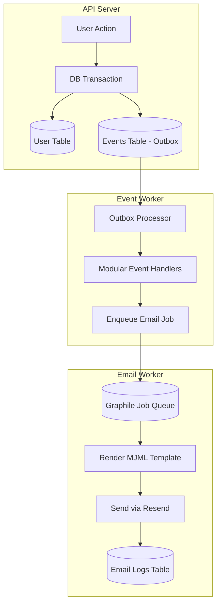

# Email Service

Modern, asynchronous email system built with **Resend**, **MJML**, and **Graphile Worker**.

## Architecture Overview

This system uses the **Transactional Outbox Pattern** to ensure shared reliability between the database and email delivery.



### Key Components

1.  **Shared Logic (`src/shared/services/email/`)**:
    - `email.service.ts`: Core sending logic and local file capture.
    - `templates/`: Responsive MJML templates with a shared base layout.
    - `schemas/`: Drizzle schema for `email_logs`.

2.  **Event Worker (`src/workers/event.worker.ts`)**:
    - Processes the Outbox (`events` table).
    - Triggers modular handlers (e.g., `src/shared/auth/events/user.events.ts`).
    - Handlers enqueue email jobs to avoid blocking event processing.

3.  **Email Worker (`src/workers/email.worker.ts`)**:
    - Dedicated process for rendering and delivery.
    - Handles retries and persistent logging.

## Local Development (Laravel Style)

To speed up iteration and avoid hitting API quotas, the system includes a **Local File Driver**.

### Configuration

- **Automatic Capture**: In development (`NODE_ENV !== 'production'`), every email sent is saved as an HTML file in `storage/emails/`.
- **Skip Resend**: If `RESEND_API_KEY` is missing or set to `fake` in `.env`, the system skips the actual network call but still saves the local file and records "success" in the logs.

### Email Previewer

You can view all locally captured emails in a browser dashboard:

- **URL**: `http://localhost:3000/api/dev/emails`
- **Source**: `src/modules/dev/http.ts`

## Usage

### Enqueueing an Email

Always use `addEmailJob` from any module to ensure the process remains non-blocking:

```typescript
import { addEmailJob } from '@/shared/queue/queue.manager';
import { EMAIL_TEMPLATES } from '@/shared/services/email';

void addEmailJob(EMAIL_TEMPLATES.WELCOME, 'user@example.com', 'Welcome to Blawby!', {
  recipientName: 'Kaze',
  dashboardUrl: 'https://...',
  // ... other template data
});
```

### Adding New Templates

1.  Create your MJML-based template in `src/shared/services/email/templates/`.
2.  Define the data interface and name in `src/shared/services/email/email.types.ts`.
3.  Register the template in `src/shared/services/email/templates/index.ts`.
